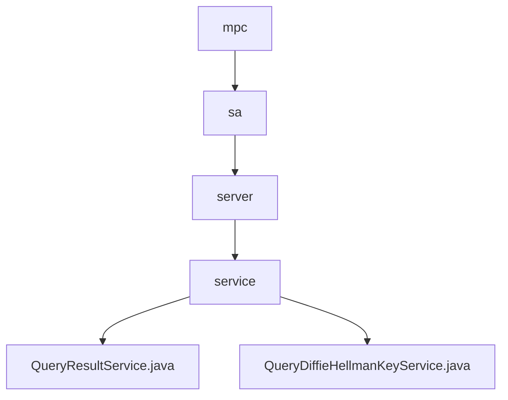

# Basic Information

|      |      |
|------|------|
| Name | mpc |
| Language | .java |
| Code Path | WeFe/mpc/mpc-sa/mpc-sa-server/src/main/java/com/welab/wefe/mpc |
| Package Name | docs.mpc.mpc-sa.mpc-sa-server.src.main.java.com.welab.wefe.mpc |
| Brief Description | The QueryResultService handles query requests, providing two handle methods that involve cache retrieval, encryption computation, and result adjustment, returning processed results and UUID. The QueryDiffieHellmanKeyService processes key exchange requests, generates random keys, performs encryption computation and caching, and returns encrypted results and UUID. |

# Description

## Overview  
The core responsibility of this module is to implement query result processing in secure multi-party computation and Diffie-Hellman key exchange functionality, including cryptographic computations and cache management. The interface specifications encompass two query result processing methods (fixed factor and custom factor) as well as key generation and encryption interfaces. Key data structures involve the DiffieHellman value list, hexadecimal parameters p/g, and UUID response objects. External dependencies primarily include the cache system (e.g., CacheOperationFactory). For instance, QueryResultService achieves differential privacy by skipping the current index item, while QueryDiffieHellmanKeyService ensures security using 1024-bit random keys.  

## Primary Business Scenarios  
The module supports two typical workflows: query result processing resembles an event bus pattern, adjusting signs and accumulating results with random seeds; the key exchange process is similar to a TLS handshake, generating random keys and performing encryption based on p/g parameters. Complete functionalities include cache read/write, parameter validation, cryptographic operations, and response construction. For example, during query processing, the current index is automatically skipped, while key exchange enforces hexadecimal data conversion. API types cover two integration scenarios: result queries (with factor parameters) and key generation (requiring p/g parameters).

### Package Internal Structure View

This flowchart illustrates the server-side code structure of the MPC module in the WeFe project. Starting from the root directory `mpc`, it sequentially expands into three levels of subdirectories: `sa`, `server`, and `service`, ultimately pointing to two specific service class files. The hierarchical relationship clearly presents the complete path from the module's top level to the concrete implementation classes. It comprises 6 nodes, accurately reflecting the organizational structure of the original path data.

# File List

| Name   | Type  | Description |
|-------|------|-------------|
| [sa](sa/_module.md) | package | The QueryResultService handles query requests, providing two handle methods that involve cache retrieval, encryption computation, and result adjustment, returning processed results and a UUID. The QueryDiffieHellmanKeyService handles key exchange requests, generates random keys, performs encryption computation and caching, and returns encrypted results and a UUID. |

