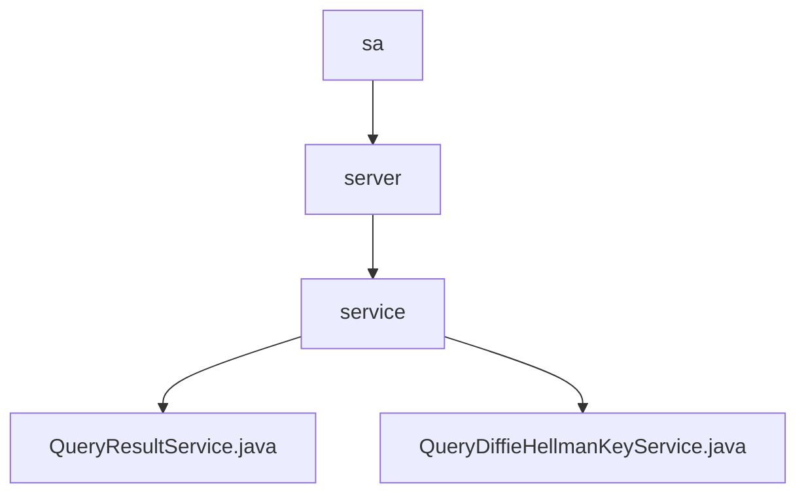

# Basic Information

|      |      |
|------|------|
| Name | sa |
| Language | .java |
| Code Path | WeFe/mpc/mpc-sa/mpc-sa-server/src/main/java/com/welab/wefe/mpc/sa |
| Package Name | docs.mpc.mpc-sa.mpc-sa-server.src.main.java.com.welab.wefe.mpc.sa |
| Brief Description | The QueryResultService handles query requests, providing two handle methods that involve cache retrieval, encryption computation, and result adjustment, returning processed results and a UUID. The QueryDiffieHellmanKeyService handles key exchange requests, generates random keys, performs encryption computation and caching, and returns encrypted results and a UUID. |

# Description

## Overview  
The core responsibility of this module is to implement query result processing in secure multi-party computation and Diffie-Hellman key exchange functionality, including cryptographic computations and cache management. The interface specifications encompass two query result processing methods (fixed factor and custom factor) as well as key generation and encryption interfaces. Key data structures involve DiffieHellman value lists, hexadecimal parameters p/g, and UUID response objects. External dependencies primarily include the cache system (e.g., CacheOperationFactory). For instance, QueryResultService achieves differential privacy by skipping the current index item, while QueryDiffieHellmanKeyService ensures security using 1024-bit random keys.  

## Key Business Scenarios  
The module supports two typical workflows: query result processing resembles an event bus pattern, adjusting signs and accumulating results with random seeds; the key exchange workflow is similar to TLS handshake, generating random keys and performing encryption based on p/g parameters. Complete functionalities include cache read/write, parameter validation, cryptographic operations, and response construction. For example, when processing queries, it automatically skips the current index, and during key exchange, it enforces hexadecimal data conversion. API types cover two integration scenarios: result queries (with factor parameters) and key generation (requiring p/g parameters).

### Package Internal Structure View

This flowchart illustrates the hierarchical structure of the service module in the MPC-SA project. The root node "sa" contains the child node "server", which in turn includes the "service" child node. Under the "service" node, there are two specific service class files: QueryResultService and QueryDiffieHellmanKeyService. This structure clearly reflects the organization of the service layer within the project.

# File List

| Name   | Type  | Description |
|-------|------|-------------|
| [server](server/_module.md) | package | The QueryResultService processes query requests, providing two handle methods that involve cache retrieval, encryption computation, and result adjustment, returning processed results and a UUID. The QueryDiffieHellmanKeyService handles key exchange requests, generates random keys, performs encryption computations and caching, and returns encrypted results along with a UUID. |

