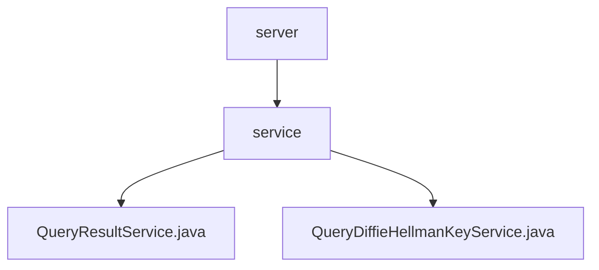

# Basic Information

|      |      |
|------|------|
| Name | server |
| Language | .java |
| Code Path | WeFe/mpc/mpc-sa/mpc-sa-server/src/main/java/com/welab/wefe/mpc/sa/server |
| Package Name | docs.mpc.mpc-sa.mpc-sa-server.src.main.java.com.welab.wefe.mpc.sa.server |
| Brief Description | The QueryResultService processes query requests, providing two handle methods that involve cache retrieval, encryption computation, and result adjustment, returning processed results and a UUID. The QueryDiffieHellmanKeyService handles key exchange requests, generates random keys, performs encryption computations and caching, and returns encrypted results along with a UUID. |

# Description

## Overview  
The core responsibility of this module is to implement query result processing in secure multi-party computation and Diffie-Hellman key exchange functionality, including cryptographic computations and cache management. The interface specifications encompass two query result processing methods (fixed factor and custom factor) as well as key generation and encryption interfaces. Key data structures involve DiffieHellman value lists, hexadecimal parameters p/g, and UUID response objects. External dependencies primarily include the cache system (e.g., CacheOperationFactory). For instance, QueryResultService achieves differential privacy by skipping the current index item, while QueryDiffieHellmanKeyService ensures security using 1024-bit random keys.  

## Key Business Scenarios  
The module supports two typical workflows: query result processing resembles an event bus pattern, adjusting signs and accumulating results with random seeds; the key exchange workflow is similar to a TLS handshake, generating random keys and performing encryption based on p/g parameters. Full functionality includes cache read/write operations, parameter validation, cryptographic operations, and response construction. For example, when processing queries, the current index is automatically skipped, and during key exchange, hexadecimal data is forcibly converted. API types cover two integration scenarios: result queries (with factor parameters) and key generation (requiring p/g parameters).

### Package Internal Structure View

This flowchart illustrates the hierarchical structure of the MPC-SA service module. The root node is the server directory, which contains the service subdirectory. Under service, there are two service class files: QueryResultService and QueryDiffieHellmanKeyService. This structure reflects a typical Java service-layer code organization approach, where service classes are centrally placed in the service package for easier management.

# File List

| Name   | Type  | Description |
|-------|------|-------------|
| [service](service/_module.md) | package | The QueryResultService handles query requests, providing two handle methods that involve cache retrieval, encryption computation, and result adjustment, returning processed results and UUIDs. The QueryDiffieHellmanKeyService processes key exchange requests, generates random keys, performs encryption computation and caching, and returns encrypted results and UUIDs. |

