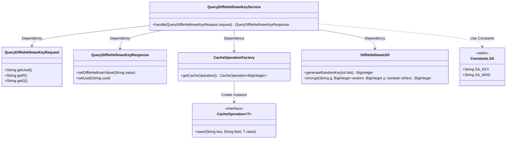
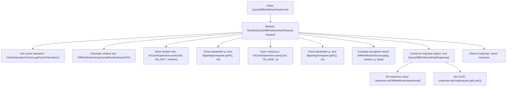

# Basic Information

|      |      |
|------|------|
| Name | QueryDiffieHellmanKeyService |
| Language | .java |
| Code Path | WeFe/mpc/mpc-sa/mpc-sa-server/src/main/java/com/welab/wefe/mpc/sa/server/service/QueryDiffieHellmanKeyService.java |
| Package Name | com.welab.wefe.mpc.sa.server.service |
| Dependencies | ['com.welab.wefe.mpc.cache.intermediate.CacheOperation', 'com.welab.wefe.mpc.cache.intermediate.CacheOperationFactory', 'com.welab.wefe.mpc.commom.Constants', 'com.welab.wefe.mpc.sa.request.QueryDiffieHellmanKeyRequest', 'com.welab.wefe.mpc.sa.request.QueryDiffieHellmanKeyResponse', 'com.welab.wefe.mpc.util.DiffieHellmanUtil', 'java.math.BigInteger'] |
| Brief Description | Processing the Diffie-Hellman key request, generating a random key and encrypting it, then saving it to the cache before returning the response. |

# Description

The `QueryDiffieHellmanKeyService` class handles Diffie-Hellman key exchange requests. It obtains a cache operation instance via `CacheOperationFactory`, generates a 1024-bit random key, and stores it in the cache. It extracts the hexadecimal parameters `p` and `g` from the request and stores `p` in the cache. Using `g`, the random key, and `p`, it performs encryption calculations and converts the result into a hexadecimal string. Finally, it constructs a response object containing the encryption result and the request UUID. The entire process implements core functionalities including key generation, cache storage, and encryption computation.

# Class Summary

| Name   | Type  | Description |
|-------|------|-------------|
| QueryDiffieHellmanKeyService | class | The QueryDiffieHellmanKeyService class handles key requests, generates random keys and caches them, then returns the encrypted response using the Diffie-Hellman algorithm. |

## Class QueryDiffieHellmanKeyService

|      |      |
|------|------|
| Access Modifier | public |
| Type | class |
| Name | QueryDiffieHellmanKeyService |
| Description | The QueryDiffieHellmanKeyService class handles key requests, generates random keys and caches them, then returns the encrypted response using the Diffie-Hellman algorithm. |

### UML Class Diagram

This code implements a Diffie-Hellman key exchange service, primarily handling key generation, cache storage, and encryption computation. The core class QueryDiffieHellmanKeyService obtains cache operation interfaces through dependency on CacheOperationFactory, invokes DiffieHellmanUtil for random number generation and encryption operations, and ultimately returns a response object containing the encrypted result. The entire process involves request parameter parsing, key storage, modular arithmetic, and response encapsulation, demonstrating a typical implementation of a key exchange protocol.

### Internal Method Call Graph

This code implements the Diffie-Hellman key exchange service. The main workflow includes: obtaining a cache operation instance, generating a random key, saving the key and modulus parameters, performing encryption calculations, and constructing and returning a response object. The code ensures secure storage of key materials through cache operations, processes encryption parameters using hexadecimal strings, and ultimately returns a response object containing the encryption result and session identifier. The entire process strictly adheres to the security specifications of the key exchange protocol.

### Field List

| Name  | Type  | Description |
|-------|-------|------|

### Method List

| Name  | Type  | Description |
|-------|-------|------|
| handle | QueryDiffieHellmanKeyResponse | Processing Diffie-Hellman key request: Generate a random key, save it to the cache, compute the encrypted result, and return the response. |

