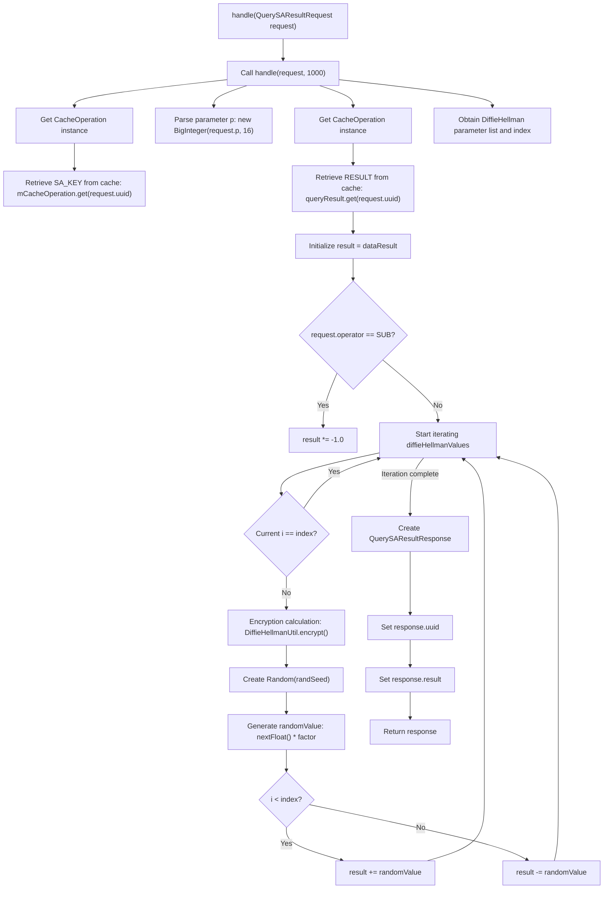

# Basic Information

|      |      |
|------|------|
| Name | QueryResultService |
| Language | .java |
| Code Path | WeFe/mpc/mpc-sa/mpc-sa-server/src/main/java/com/welab/wefe/mpc/sa/server/service/QueryResultService.java |
| Package Name | com.welab.wefe.mpc.sa.server.service |
| Dependencies | ['com.welab.wefe.mpc.cache.intermediate.CacheOperation', 'com.welab.wefe.mpc.cache.intermediate.CacheOperationFactory', 'com.welab.wefe.mpc.commom.Constants', 'com.welab.wefe.mpc.commom.Operator', 'com.welab.wefe.mpc.sa.request.QuerySAResultRequest', 'com.welab.wefe.mpc.sa.request.QuerySAResultResponse', 'com.welab.wefe.mpc.util.DiffieHellmanUtil', 'java.math.BigInteger', 'java.util.List', 'java.util.Random'] |
| Brief Description | The QueryResultService processes query requests, retrieves data through caching, adjusts results using Diffie-Hellman encryption and random numbers, and finally returns the response. It supports both multiplication and subtraction operations. |

# Description

The `QueryResultService` class handles query result requests and provides two `handle` methods. The default method uses a fixed factor of 1000, while the other method accepts a custom factor. The process includes: retrieving the key and result data from the cache, adjusting the result sign based on the operation type, iterating through the Diffie-Hellman value list, skipping the current index item, generating a random seed using the key and parameter `p` for encryption, calculating the random value, and adding or subtracting the result. Finally, it constructs and returns a response object containing the UUID and processed result.

# Class Summary

| Name   | Type  | Description |
|-------|------|-------------|
| QueryResultService | class | The QueryResultService processes query requests, retrieves keys and data results through caching, adjusts the results based on operators and Diffie-Hellman values, and ultimately returns the response. |

## Class QueryResultService

|      |      |
|------|------|
| Access Modifier | public |
| Type | class |
| Name | QueryResultService |
| Description | The QueryResultService processes query requests, retrieves keys and data results through caching, adjusts the results based on operators and Diffie-Hellman values, and ultimately returns the response. |

### UML Class Diagram

```mermaid
classDiagram
    class QueryResultService {
        +QuerySAResultResponse handle(QuerySAResultRequest request)
        +QuerySAResultResponse handle(QuerySAResultRequest request, int factor)
    }

    class QuerySAResultRequest {
        <<Interface>>
        +String getUuid()
        +String getP()
        +List~String~ getDiffieHellmanValues()
        +int getIndex()
        +Operator getOperator()
    }

    class QuerySAResultResponse {
        <<Interface>>
        +void setUuid(String uuid)
        +void setResult(Double result)
    }

    class CacheOperation~T~ {
        <<Interface>>
        +T get(String uuid, String key)
    }

    class CacheOperationFactory {
        <<Interface>>
        +CacheOperation~T~ getCacheOperation()
    }

    class DiffieHellmanUtil {
        <<Interface>>
        +BigInteger encrypt(String value, BigInteger key, BigInteger p, boolean flag)
    }

    class Constants {
        <<Interface>>
        // SA_KEY and RESULT constant definitions
    }

    class Operator {
        <<Enumeration>>
        SUB
        // Other enumeration values
    }

    QueryResultService --> QuerySAResultRequest : Dependency
    QueryResultService --> QuerySAResultResponse : Dependency
    QueryResultService --> CacheOperation~BigInteger~ : Dependency
    QueryResultService --> CacheOperation~Double~ : Dependency
    QueryResultService --> CacheOperationFactory : Dependency
    QueryResultService --> DiffieHellmanUtil : Dependency
    QueryResultService --> Constants : Dependency
    QueryResultService --> Operator : Dependency
```

This code demonstrates a query result service class `QueryResultService`, which processes `QuerySAResultRequest` to generate `QuerySAResultResponse`. The service class depends on multiple interfaces and utility classes, including the cache operation factory `CacheOperationFactory`, Diffie-Hellman encryption utility `DiffieHellmanUtil`, and constant definition class `Constants`. The core logic involves retrieving data from cache, performing encryption operations, executing mathematical computations, and ultimately constructing and returning the response object. The overall design reflects a layered architecture with clearly defined responsibilities for each module.

### Internal Method Call Graph

Flowchart Description: This flowchart illustrates the core logic of QueryResultService for processing query results. The process starts from the entry method, retrieves encryption keys and raw result data through cache operations, then adjusts the result value based on the operator type. It then iterates through the DiffieHellman parameter list, skips the specified index item, performs encryption on each parameter to generate random values, and applies addition/subtraction operations to the result based on positional relationships. Finally, it constructs a response object and returns it. The entire process involves key steps such as conditional judgments, loop processing, and encryption calculations.

### Field List

| Name  | Type  | Description |
|-------|-------|------|

### Method List

| Name  | Type  | Description |
|-------|-------|------|
| handle | QuerySAResultResponse | This method processes the query SA result request by retrieving the key and data result from the cache, adjusts the result value based on the operator, generates a random number using Diffie-Hellman encryption to update the result, and finally returns the response. |
| handle | QuerySAResultResponse | Java method handles query requests with a default timeout of 1000 milliseconds. |

