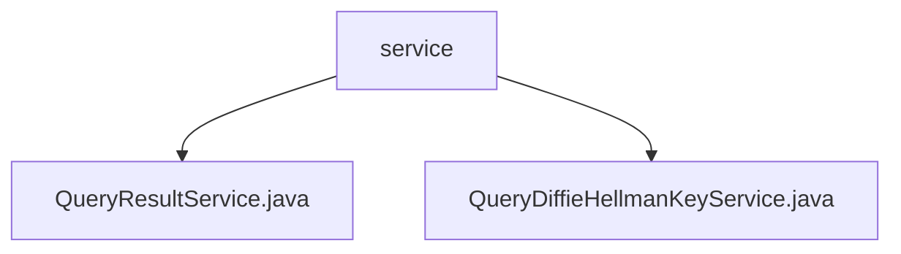

# Basic Information

|      |      |
|------|------|
| Name | service |
| Language | .java |
| Code Path | WeFe/mpc/mpc-sa/mpc-sa-server/src/main/java/com/welab/wefe/mpc/sa/server/service |
| Package Name | docs.mpc.mpc-sa.mpc-sa-server.src.main.java.com.welab.wefe.mpc.sa.server.service |
| Brief Description | The QueryResultService handles query requests, providing two handle methods that involve cache retrieval, encryption computation, and result adjustment, returning processed results and UUIDs. The QueryDiffieHellmanKeyService processes key exchange requests, generates random keys, performs encryption computation and caching, and returns encrypted results and UUIDs. |

# Description

## Overview  
The core responsibility of this module is to implement query result processing in secure multi-party computation and Diffie-Hellman key exchange functionality, encompassing encrypted computation and cache management. The interface specifications include two methods for query result processing (fixed factor and custom factor) as well as key generation and encryption interfaces. Key data structures involve the DiffieHellman value list, hexadecimal parameters p/g, and UUID response objects. External dependencies primarily consist of the cache system (e.g., CacheOperationFactory). For instance, QueryResultService achieves differential privacy by skipping the current index item, while QueryDiffieHellmanKeyService ensures security using 1024-bit random keys.  

## Main Business Scenarios  
The module supports two typical workflows: query result processing resembles an event bus pattern, adjusting signs and accumulating results with random seeds; the key exchange process is similar to a TLS handshake, generating random keys and performing encryption based on p/g parameters. Complete functionalities include cache read/write, parameter validation, encryption operations, and response construction. For example, during query processing, the current index is automatically skipped, while key exchange enforces hexadecimal data conversion. API types cover two integration scenarios: result queries (with factor parameters) and key generation (requiring p/g parameters).

### Package Internal Structure View

This flowchart illustrates two Java service class files under the service folder: QueryResultService.java and QueryDiffieHellmanKeyService.java. Both files are directly subordinate to the service directory without deeper nesting, forming a simple peer-level relationship. The diagram clearly presents the organizational structure of service-layer code files, consisting of 1 parent node and 2 child nodes.

# File List

| Name   | Type  | Description |
|-------|------|-------------|
| [QueryResultService.java](QueryResultService.md) | file | The QueryResultService processes query requests, retrieves data through caching, adjusts the results using Diffie-Hellman encryption and random numbers, and finally returns the response. It supports multiplication and subtraction operations. |
| [QueryDiffieHellmanKeyService.java](QueryDiffieHellmanKeyService.md) | file | Processing the Diffie-Hellman key request, generating a random key and encrypting it, then saving it to the cache before returning the response. |

