# Basic Information

|      |      |
|------|------|
| Name | wefe |
| Language | .java |
| Code Path | WeFe/serving/serving-sdk-java/src/main/java/com/welab/wefe |
| Package Name | docs.serving.serving-sdk-java.src.main.java.com.welab.wefe |
| Brief Description | This module provides a federated learning prediction framework, supporting logistic regression and XGBoost algorithms, covering single/batch processing, parameter validation, and result merging. It defines standardized processes through abstract classes and template methods, leveraging annotations and reflection for dynamic loading. Key components include model processors, algorithm managers, and thread pools, suitable for both real-time and offline prediction scenarios. |

# Description

## Overview  
This module is a standardized prediction framework in federated learning environments, with the core responsibility of uniformly managing the entire model prediction process (single/batch processing, parameter validation, result conversion) and multi-party result merging. It employs the template method pattern through abstract base classes (e.g., AbstractAlgorithm/AbstractBatchModelProcessor), with key data structures including BaseModel, PredictParams, feature mapping, and prediction result models (e.g., LrPredictResultModel). External dependencies involve the XGBoost framework, JObject, multi-threading tools (e.g., CountDownLatch), and federated learning components (e.g., WeFe). For instance, EmptyModelProcessor provides placeholder implementations, while AlgorithmManager dynamically loads algorithm instances via reflection.

## Key Business Scenarios  
The module supports horizontal/vertical federated prediction, with a typical workflow: parameter initialization → local computation → multi-party result merging → desensitized output, resembling a hybrid of MapReduce and distributed decision engines. The interaction model adopts a Promoter-Provider architecture, dynamically assembling components via annotations (e.g., @ModelProcessor) and factory patterns (e.g., AlgorithmManager). Functional completeness is reflected in support for logistic regression (scorecard binning), XGBoost (tree structure merging), and exception handling (StateCode status codes). Examples include XgboostVertPromoterAlgorithm merging remote tree structures in financial risk control or standardizing feature queries via the PredictBehavior interface. APIs cover single/batch prediction, encrypted configuration management, and thread pool task scheduling.

### Package Internal Structure View

```mermaid
graph TD
    serving --> sdk
    sdk --> processor
    sdk --> algorithm
    sdk --> predicter
    sdk --> utils
    sdk --> enums
    sdk --> manager
    sdk --> dto
    sdk --> model
    sdk --> config
    processor --> EmptyModelProcessor.java
    processor --> EmptyBatchModelProcessor.java
    processor --> BatchModelProcessor.java
    processor --> AbstractBatchModelProcessor.java
    processor --> ModelProcessor.java
    processor --> AbstractModelProcessor.java
    algorithm --> lr
    algorithm --> xgboost
    algorithm --> AbstractAlgorithm.java
    algorithm --> AbstractBatchAlgorithm.java
    lr --> single
    lr --> batch
    lr --> LrAlgorithmHelper.java
    single --> AbstractLrAlgorithm.java
    single --> LrHorzPromoterAlgorithm.java
    single --> LrVertProviderAlgorithm.java
    single --> LrVertPromoterAlgorithm.java
    batch --> LrVertPromoterBatchAlgorithm.java
    batch --> LrVertProviderBatchAlgorithm.java
    batch --> LrHorzPromoterBatchAlgorithm.java
    batch --> AbstractLrBatchAlgorithm.java
    xgboost --> single
    xgboost --> batch
    xgboost --> XgboostAlgorithmHelper.java
    single --> XgboostVertPromoterAlgorithm.java
    single --> XgboostVertProviderAlgorithm.java
    single --> AbstractXgboostAlgorithm.java
    single --> XgboostHorzPromoterAlgorithm.java
    batch --> XgboostVertProviderBatchAlgorithm.java
    batch --> XgboostVertPromoterBatchAlgorithm.java
    batch --> XgboostHorzPromoterBatchAlgorithm.java
    batch --> AbstractXgBoostBatchAlgorithm.java
    predicter --> single
    predicter --> batch
    predicter --> PredictBehavior.java
    predicter --> AbstractBasePredictor.java
    single --> AbstractSinglePredictor.java
    single --> AbstractSingleProviderPredictor.java
    batch --> AbstractBatchPredictor.java
    batch --> AbstractBatchProviderPredictor.java
    utils --> AlgorithmThreadPool.java
    enums --> XgboostWorkMode.java
    enums --> StateCode.java
    manager --> AlgorithmManager.java
    manager --> ModelProcessorManager.java
    dto --> PredictParams.java
    dto --> ProviderParams.java
    dto --> BatchPredictParams.java
    dto --> PredictResult.java
    model --> lr
    model --> xgboost
    model --> BaseFeatureResultModel.java
    model --> ModelMeta.java
    model --> BaseAlgorithmModel.java
    model --> FeatureDataModel.java
    model --> BaseModel.java
    model --> ScoreCardInfoModel.java
    model --> PredictModel.java
    lr --> LrPredictResultModel.java
    lr --> LrScoreCardModel.java
    lr --> LrModel.java
    lr --> BaseLrModel.java
    xgboost --> XgboostPredictResultModel.java
    xgboost --> XgboostDecisionTreeModel.java
    xgboost --> XgboostModel.java
    xgboost --> BaseXgboostModel.java
    xgboost --> XgboostNodeModel.java
    xgboost --> XgbProviderPredictResultModel.java
    config --> Config.java
    config --> Launcher.java
```

This flowchart illustrates the complete directory structure of the WeFe Serving SDK Java project, starting from the root directory "serving" and expanding hierarchically to various submodules and files. It primarily includes core modules under "sdk" such as processor, algorithm, predicter, and utils. The algorithm module is further divided into implementations for lr and xgboost algorithms, each containing both single-instance and batch processing versions. The entire structure presents a clear hierarchy, fully demonstrating the code organization of this machine learning service SDK.

# File List

| Name   | Type  | Description |
|-------|------|-------------|
| [serving](serving/_module.md) | package | This module provides a federated learning prediction framework, supporting logistic regression and XGBoost algorithms, covering single/batch processing, parameter validation, and result merging. It defines standardized processes through abstract classes and template methods, leveraging annotations and reflection for dynamic loading. Key components include a model processor, algorithm manager, and thread pool, suitable for both real-time and offline prediction scenarios. |

