# Basic Information

|      |      |
|------|------|
| Name | sdk |
| Language | .java |
| Code Path | WeFe/serving/serving-sdk-java/src/main/java/com/welab/wefe/serving/sdk |
| Package Name | docs.serving.serving-sdk-java.src.main.java.com.welab.wefe.serving.sdk |
| Brief Description | This module provides a federated learning prediction framework, supporting logistic regression and XGBoost algorithms, covering single/batch processing, parameter validation, and result merging. It defines standardized processes through abstract classes and template methods, leveraging annotations and reflection for dynamic loading. Key components include model processors, algorithm managers, and thread pools, suitable for both real-time and offline prediction scenarios. |

# Description

## Overview  
This module is a standardized prediction framework in federated learning environments, with its core responsibility being the unified management of the entire model prediction process (single/batch processing, parameter validation, result conversion) and multi-party result merging. It employs the template method pattern through abstract base classes (e.g., AbstractAlgorithm/AbstractBatchModelProcessor), with key data structures including BaseModel, PredictParams, feature mapping, and prediction result models (e.g., LrPredictResultModel). External dependencies involve the XGBoost framework, JObject, multi-threading tools (e.g., CountDownLatch), and federated learning components (e.g., WeFe). For instance, EmptyModelProcessor provides placeholder implementations, while AlgorithmManager dynamically loads algorithm instances via reflection.

## Key Business Scenarios  
The module supports horizontal/vertical federated prediction, with a typical workflow including: parameter initialization → local computation → multi-party result merging → desensitized output, resembling a hybrid of MapReduce and distributed decision engines. The interaction model adopts a Promoter-Provider architecture, dynamically assembling components via annotations (e.g., @ModelProcessor) and factory patterns (e.g., AlgorithmManager). Functional completeness is demonstrated through support for logistic regression (scorecard binning), XGBoost (tree structure merging), and exception handling (StateCode status codes). For example, in financial risk control, XgboostVertPromoterAlgorithm merges remote tree structures, or the PredictBehavior interface standardizes feature queries. APIs cover single/batch prediction, encrypted configuration management, and thread pool task scheduling.

### Package Internal Structure View

```mermaid
graph TD
    sdk --> processor
    sdk --> algorithm
    sdk --> predicter
    sdk --> utils
    sdk --> enums
    sdk --> manager
    sdk --> dto
    sdk --> model
    sdk --> config
    processor --> EmptyModelProcessor.java
    processor --> EmptyBatchModelProcessor.java
    processor --> BatchModelProcessor.java
    processor --> AbstractBatchModelProcessor.java
    processor --> ModelProcessor.java
    processor --> AbstractModelProcessor.java
    algorithm --> lr
    algorithm --> xgboost
    algorithm --> AbstractAlgorithm.java
    algorithm --> AbstractBatchAlgorithm.java
    lr --> single
    lr --> batch
    lr --> LrAlgorithmHelper.java
    single --> AbstractLrAlgorithm.java
    single --> LrHorzPromoterAlgorithm.java
    single --> LrVertProviderAlgorithm.java
    single --> LrVertPromoterAlgorithm.java
    batch --> LrVertPromoterBatchAlgorithm.java
    batch --> LrVertProviderBatchAlgorithm.java
    batch --> LrHorzPromoterBatchAlgorithm.java
    batch --> AbstractLrBatchAlgorithm.java
    xgboost --> single
    xgboost --> batch
    xgboost --> XgboostAlgorithmHelper.java
    single --> XgboostVertPromoterAlgorithm.java
    single --> XgboostVertProviderAlgorithm.java
    single --> AbstractXgboostAlgorithm.java
    single --> XgboostHorzPromoterAlgorithm.java
    batch --> XgboostVertProviderBatchAlgorithm.java
    batch --> XgboostVertPromoterBatchAlgorithm.java
    batch --> XgboostHorzPromoterBatchAlgorithm.java
    batch --> AbstractXgBoostBatchAlgorithm.java
    predicter --> single
    predicter --> batch
    predicter --> PredictBehavior.java
    predicter --> AbstractBasePredictor.java
    single --> AbstractSinglePredictor.java
    single --> AbstractSingleProviderPredictor.java
    batch --> AbstractBatchPredictor.java
    batch --> AbstractBatchProviderPredictor.java
    utils --> AlgorithmThreadPool.java
    enums --> XgboostWorkMode.java
    enums --> StateCode.java
    manager --> AlgorithmManager.java
    manager --> ModelProcessorManager.java
    dto --> PredictParams.java
    dto --> ProviderParams.java
    dto --> BatchPredictParams.java
    dto --> PredictResult.java
    model --> lr
    model --> xgboost
    model --> BaseFeatureResultModel.java
    model --> ModelMeta.java
    model --> BaseAlgorithmModel.java
    model --> FeatureDataModel.java
    model --> BaseModel.java
    model --> ScoreCardInfoModel.java
    model --> PredictModel.java
    lr --> LrPredictResultModel.java
    lr --> LrScoreCardModel.java
    lr --> LrModel.java
    lr --> BaseLrModel.java
    xgboost --> XgboostPredictResultModel.java
    xgboost --> XgboostDecisionTreeModel.java
    xgboost --> XgboostModel.java
    xgboost --> BaseXgboostModel.java
    xgboost --> XgboostNodeModel.java
    xgboost --> XgbProviderPredictResultModel.java
    config --> Config.java
    config --> Launcher.java
```

This flowchart illustrates the complete directory structure of the WeFe service SDK, starting from the root directory 'sdk' and expanding downwards to include major modules such as processor, algorithm, and predicter. Under the algorithm module, implementations are subdivided into lr and xgboost algorithms, each featuring both single and batch processing modes. The predicter module similarly distinguishes between single-instance and batch prediction. The model module contains definitions for various data models, while the config module provides configuration-related functionalities. The entire structure is clearly hierarchical, reflecting a modular design philosophy.

# File List

| Name   | Type  | Description |
|-------|------|-------------|
| [enums](enums/_module.md) | package | The XgboostWorkMode enumeration defines three working modes: skip, dp, and layered. The StateCode enumeration includes status codes such as SUCCESS (0), system errors (10000-10001), and data errors (20001), providing the code and description attributes along with their corresponding access methods. |
| [algorithm](algorithm/_module.md) | package | The logistic regression module implements the prediction process, supporting both single and batch processing, including local computation, score adjustment, result merging, and desensitization. The XGBoost module integrates decision trees from multiple parties to perform joint predictions, supporting both vertical and horizontal federated learning. Abstract classes provide the prediction framework, while subclasses implement the specific logic. |
| [config](config/_module.md) | package | The Config class stores configuration information, including member ID, RSA public-private key pairs, and key type variables. The Launcher class initializes Config variables via the init method, ensuring it is executed only once. |
| [model](model/_module.md) | package | This module implements logistic regression and XGBoost model prediction functionalities, including parameter storage, result encapsulation, and error handling. Key classes include LrModel, XgboostModel, etc., supporting scenarios such as credit scoring and risk prediction, designed with factory method and layered encapsulation patterns. |
| [dto](dto/_module.md) | package | The PredictParams class encapsulates prediction parameters, including userId and featureDataModel attributes, and provides multiple creation methods. The ProviderParams class stores provider parameters, containing memberId and api fields, and supports factory method creation. The BatchPredictParams class manages batch prediction parameters, including a user ID list and a prediction parameter list, and supports querying. The PredictResult class encapsulates prediction results, containing algorithm type, federated learning type, role, and result attributes. |
| [manager](manager/_module.md) | package | The AlgorithmManager class manages algorithm classes through MAP and BATCH_MAP, supporting logistic regression and XGBoost, covering three federated learning modes and two roles. The ModelProcessorManager class manages model processors by scanning annotated classes via reflection to populate mapping tables, providing methods to obtain processor instances. |
| [utils](utils/_module.md) | package | The `AlgorithmThreadPool` class implements a static thread pool with a core thread count equal to the number of CPU cores and a maximum thread count twice the core count. It provides methods to execute `Runnable` and `Callable` tasks, supports `CountDownLatch` counting, and can retrieve the number of active threads. |
| [predicter](predicter/_module.md) | package | The single prediction module encapsulates the prediction process, supporting model loading and feature processing. The batch prediction framework provides support for both conventional and federated computing scenarios. The PredictBehavior interface defines methods for obtaining models and feature data. AbstractBasePredictor provides a foundational framework for prediction behavior. |
| [processor](processor/_module.md) | package | EmptyModelProcessor and EmptyBatchModelProcessor are model processor classes with empty implementations, designed for single-instance and batch processing respectively. BatchModelProcessor and ModelProcessor are runtime annotations containing an id attribute. AbstractModelProcessor and AbstractBatchModelProcessor are abstract classes that define framework methods for pre-processing and post-processing. |

