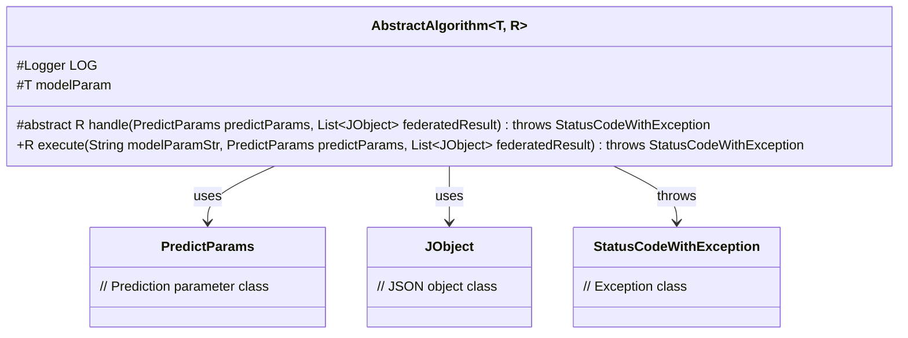
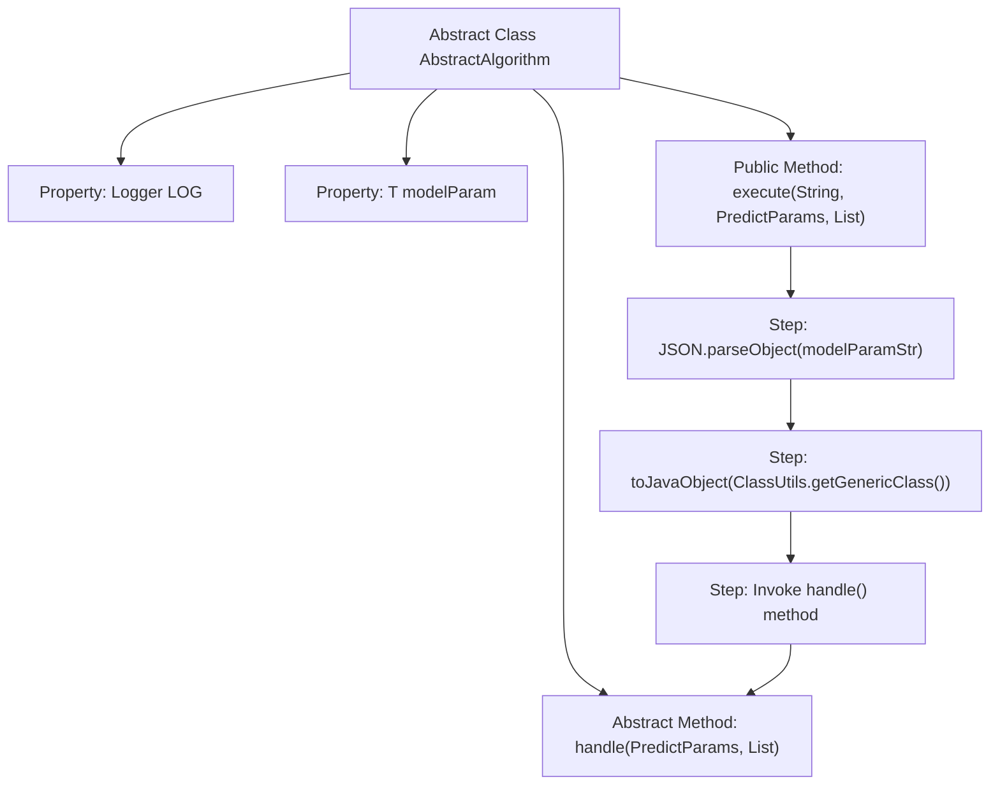

# Basic Information

|      |      |
|------|------|
| Name | AbstractAlgorithm |
| Language | .java |
| Code Path | WeFe/serving/serving-sdk-java/src/main/java/com/welab/wefe/serving/sdk/algorithm/AbstractAlgorithm.java |
| Package Name | com.welab.wefe.serving.sdk.algorithm |
| Dependencies | ['com.alibaba.fastjson.JSON', 'com.welab.wefe.common.exception.StatusCodeWithException', 'com.welab.wefe.common.util.ClassUtils', 'com.welab.wefe.common.util.JObject', 'com.welab.wefe.serving.sdk.dto.PredictParams', 'org.slf4j.Logger', 'org.slf4j.LoggerFactory', 'java.util.List'] |
| Brief Description | The abstract class AbstractAlgorithm defines the algorithm framework, containing logging and model parameters. It provides the execution entry point `execute` and the abstract method `handle` to be implemented by subclasses, which processes prediction parameters and returns results. |

# Description

This is an abstract class named AbstractAlgorithm, which uses generic types T and R to define the model parameter type and return result type. The class contains a protected Logger instance and a model parameter variable modelParam. The core method is the abstract handle method, used to process prediction logic, which accepts PredictParams parameters and a joint result list, and may throw a StatusCodeWithException. The execute method is responsible for converting the model parameters from string format to an entity object and invoking the handle method to perform the prediction. This class provides a foundational framework for algorithm implementation, requiring subclasses to implement specific prediction processing logic.

# Class Summary

| Name   | Type  | Description |
|-------|------|-------------|
| AbstractAlgorithm | class | The abstract class AbstractAlgorithm defines the algorithm framework, including logging and model parameters. It provides the execute method to transform parameters and invoke the abstract method handle for prediction processing, returning the result R. |

## Class AbstractAlgorithm

|      |      |
|------|------|
| Access Modifier | public abstract |
| Type | class |
| Name | AbstractAlgorithm |
| Description | The abstract class AbstractAlgorithm defines the algorithm framework, including logging and model parameters. It provides the execute method to transform parameters and invoke the abstract method handle for prediction processing, returning the result R. |

### UML Class Diagram

This code demonstrates a generic abstract class AbstractAlgorithm, which defines the core structure of an algorithmic framework. The class contains a protected logger object and model parameters, along with an abstract handle method for concrete algorithm implementations. The execute method handles parameter conversion and invokes the handle method. Through generics T and R, the class supports flexible parameter and return types. It maintains dependencies with PredictParams, JObject, and StatusCodeWithException classes, reflecting the characteristics of the Template Method design pattern.

### Internal Method Call Graph

This code describes an abstract algorithm framework class that includes parameter conversion and execution flow. The flowchart illustrates the process starting from the execute method, where string parameters are first converted to Java objects via JSON parsing, followed by invoking the abstract handle method for processing. The class adopts the template method pattern, mandating subclasses to implement specific handle logic while providing generic parameter conversion functionality. The Logger property is used for logging, and modelParam stores the converted model parameters. The entire flow embodies the design philosophy of separating parameter preprocessing from business logic.

### Field List

| Name  | Type  | Description |
|-------|-------|------|
| modelParam | T | Declare a protected generic variable modelParam of type T. |
| LOG = LoggerFactory.getLogger(getClass()) | Logger | Define the logger instance of the current class, using the protected final modifier to ensure it is accessible by subclasses and cannot be modified. |

### Method List

| Name  | Type  | Description |
|-------|-------|------|
| handle | R | Abstract method, processes prediction parameters and combines results, may throw exceptions. |
| execute | R | The method `execute` receives a model parameter string, prediction parameters, and a joint result list. It converts the string parameters into entity objects and then invokes `handle` for processing. It may throw a `StatusCodeWithException` exception. |

