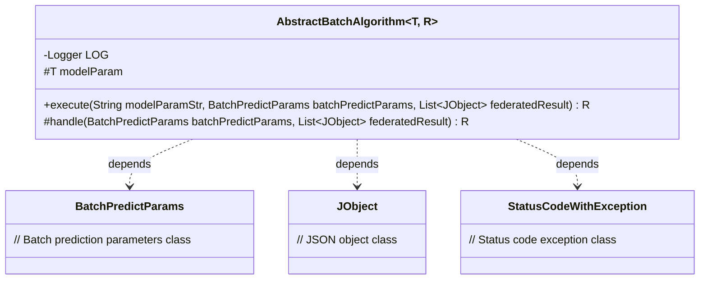
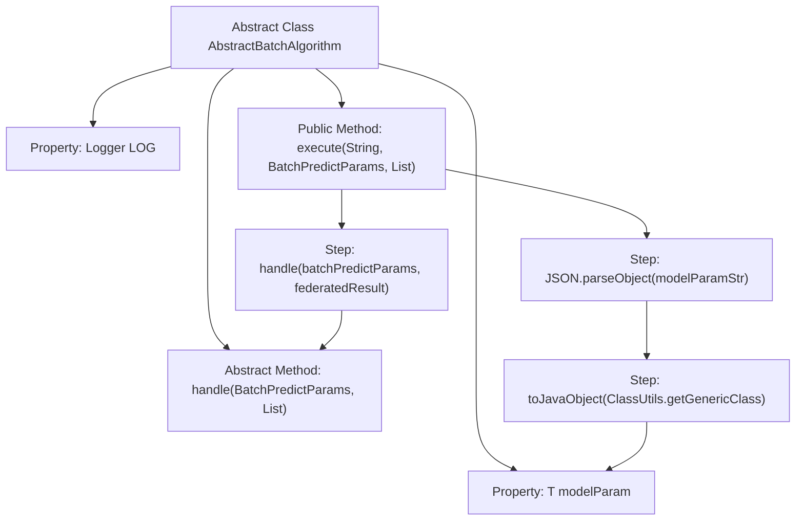

# Basic Information

|      |      |
|------|------|
| Name | AbstractBatchAlgorithm |
| Language | .java |
| Code Path | WeFe/serving/serving-sdk-java/src/main/java/com/welab/wefe/serving/sdk/algorithm/AbstractBatchAlgorithm.java |
| Package Name | com.welab.wefe.serving.sdk.algorithm |
| Dependencies | ['com.alibaba.fastjson.JSON', 'com.welab.wefe.common.exception.StatusCodeWithException', 'com.welab.wefe.common.util.ClassUtils', 'com.welab.wefe.common.util.JObject', 'com.welab.wefe.serving.sdk.dto.BatchPredictParams', 'org.slf4j.Logger', 'org.slf4j.LoggerFactory', 'java.util.List'] |
| Brief Description | The abstract class AbstractBatchAlgorithm defines the framework for batch prediction algorithms, including model parameters and logs. It parses parameters via the execute method and invokes the abstract method handle to perform predictions, returning the result R. |

# Description

This is an abstract class named AbstractBatchAlgorithm, designed to implement batch prediction algorithms. The class uses generic types T and R to represent model parameter type and prediction result type, respectively. It includes a protected logger and a model parameter variable. The core functionality is to perform batch prediction through the execute method, which takes a model parameter string, batch prediction parameters, and a joint result list. It converts the string parameters into entity objects and then calls the abstract handle method to complete the actual prediction. The handle method must be implemented by subclasses and may throw a StatusCodeWithException. The entire class provides a framework structure for batch prediction, with specific algorithms to be implemented by subclasses.

# Class Summary

| Name   | Type  | Description |
|-------|------|-------------|
| AbstractBatchAlgorithm | class | Abstract batch processing algorithm base class, defining template method execute and abstract method handle, supporting generic parameters T and R, with logging and model parameter processing capabilities. |

## Class AbstractBatchAlgorithm

|      |      |
|------|------|
| Access Modifier | public abstract |
| Type | class |
| Name | AbstractBatchAlgorithm |
| Description | Abstract batch processing algorithm base class, defining template method execute and abstract method handle, supporting generic parameters T and R, with logging and model parameter processing capabilities. |

### UML Class Diagram

This code demonstrates an abstract class `AbstractBatchAlgorithm` utilizing generic types `T` and `R`, primarily serving as an execution framework for batch processing algorithms. The class contains a protected logger, model parameter field, and two key methods: `execute` for executing batch processing flow (including parameter conversion and core processing), and `handle` as an abstract method requiring subclass implementation of specific logic. The class diagram clearly illustrates its dependency relationships with three auxiliary classes - `BatchPredictParams`, `JObject`, and `StatusCodeWithException`, reflecting parameter passing and exception handling mechanisms. This design provides an extensible template method pattern for batch processing algorithms.

### Internal Method Call Graph

This code defines an abstract class AbstractBatchAlgorithm with generic types T and R, primarily used for batch prediction tasks. The class includes a protected Logger property, a model parameter property modelParam, and an abstract handle method for processing batch prediction logic. The public execute method is responsible for converting parameter strings from the database into entity objects and invoking the handle method to perform the actual prediction. The flowchart illustrates the complete process starting from the execute method, through parameter conversion, and culminating in the invocation of the handle method.

### Field List

| Name  | Type  | Description |
|-------|-------|------|
| modelParam | T | Declare a protected generic variable modelParam of type T. |
| LOG = LoggerFactory.getLogger(getClass()) | Logger | Declare a protected final log object LOG, initialized with the current class name. |

### Method List

| Name  | Type  | Description |
|-------|-------|------|
| handle | R | Abstract method, processes batch prediction parameters and combines results, may throw status code exceptions. |
| execute | R | The method `execute` takes a model parameter string, batch prediction parameters, and a joint result list as input. It converts the parameter string into an entity object and then invokes `handle` for processing. It may throw a `StatusCodeWithException` exception. |

