# Basic Information

|      |      |
|------|------|
| Name | algorithm |
| Language | .java |
| Code Path | WeFe/serving/serving-sdk-java/src/main/java/com/welab/wefe/serving/sdk/algorithm |
| Package Name | docs.serving.serving-sdk-java.src.main.java.com.welab.wefe.serving.sdk.algorithm |
| Brief Description | The logistic regression module implements the prediction process, supporting both single and batch processing, including local computation, score adjustment, result merging, and desensitization. The XGBoost module integrates decision trees from multiple parties to perform joint predictions, supporting both vertical and horizontal federated learning. Abstract classes provide the prediction framework, while subclasses implement the specific logic. |

# Description

## Overview  
The core responsibility of this module is to implement prediction functionality in a federated learning environment, supporting logistic regression and XGBoost algorithms, encompassing single/batch prediction, score adjustment, and multi-party result merging. Standardized processes are defined through abstract base classes (AbstractAlgorithm/AbstractBatchAlgorithm), similar to the template method pattern. Key data structures include prediction result models (LrPredictResultModel/XgboostPredictResultModel), parameter objects (PredictParams), and feature mappings (fidValueMapping). External dependencies involve JObject, the XGBoost framework, multi-threading tools (e.g., CountDownLatch), and federated learning frameworks (e.g., WeFe). For instance, logistic regression supports scorecard binning transformation, while XGBoost handles tree structure merging in vertical federated learning.

## Key Business Scenarios  
The module supports horizontal/vertical federated prediction, with a typical workflow: parameter initialization → local computation → multi-party result merging → desensitized output. The interaction model adopts a Promoter-Provider architecture, resembling a hybrid of MapReduce and a distributed decision engine. Logistic regression scenarios involve Sigmoid transformation and user ID matching, while XGBoost scenarios require feature mapping and multi-thread synchronization. Functional completeness is reflected in support for classification/regression tasks, missing value handling, and skip mode. Examples include adjusting baseScore in financial risk control or merging remote tree structures via XgboostVertPromoterAlgorithm. APIs cover single prediction, batch interfaces, and federated result parsing.

### Package Internal Structure View

```mermaid
graph TD
    algorithm --> lr
    algorithm --> xgboost
    algorithm --> AbstractAlgorithm.java
    algorithm --> AbstractBatchAlgorithm.java
    lr --> single
    lr --> batch
    lr --> LrAlgorithmHelper.java
    single --> AbstractLrAlgorithm.java
    single --> LrHorzPromoterAlgorithm.java
    single --> LrVertProviderAlgorithm.java
    single --> LrVertPromoterAlgorithm.java
    batch --> AbstractLrBatchAlgorithm.java
    batch --> LrVertPromoterBatchAlgorithm.java
    batch --> LrVertProviderBatchAlgorithm.java
    batch --> LrHorzPromoterBatchAlgorithm.java
    xgboost --> single
    xgboost --> batch
    xgboost --> XgboostAlgorithmHelper.java
    single --> AbstractXgboostAlgorithm.java
    single --> XgboostVertPromoterAlgorithm.java
    single --> XgboostVertProviderAlgorithm.java
    single --> XgboostHorzPromoterAlgorithm.java
    batch --> AbstractXgBoostBatchAlgorithm.java
    batch --> XgboostVertProviderBatchAlgorithm.java
    batch --> XgboostVertPromoterBatchAlgorithm.java
    batch --> XgboostHorzPromoterBatchAlgorithm.java
```

This flowchart illustrates the hierarchical structure of the algorithm module in the WeFe service SDK, which includes two main algorithm categories: lr and xgboost. Each category is further divided into single and batch processing modes. The top-level abstract classes define the basic algorithm structure, while specific algorithm implementations are distributed in their respective subdirectories, forming a clear tree-like inheritance system that facilitates the maintenance and extension of machine learning algorithm functionalities.

# File List

| Name   | Type  | Description |
|-------|------|-------------|
| [AbstractAlgorithm.java](AbstractAlgorithm.md) | file | The abstract class AbstractAlgorithm defines the algorithm framework, including logging and model parameters. It provides an execution entry point `execute` and an abstract method `handle` to be implemented by subclasses, which processes prediction parameters and returns results. |
| [AbstractBatchAlgorithm.java](AbstractBatchAlgorithm.md) | file | The abstract class AbstractBatchAlgorithm defines the framework for batch prediction algorithms, including model parameters and logs. It parses parameters via the execute method and invokes the abstract method handle to perform predictions, returning the result R. |
| [xgboost](xgboost/_module.md) | package | This module implements XGBoost federated prediction, supporting vertical/horizontal federated modes, integrating multi-party decision tree structures and performing joint predictions. Core functionalities include feature mapping, multi-threaded parallel computing, and result aggregation, relying on the XGBoost framework and federated learning tools. |
| [lr](lr/_module.md) | package | This module implements the logistic regression prediction process, including local computation, score adjustment, and result merging. It supports both horizontal and vertical federated scenarios, involving data desensitization and distributed result aggregation. Utility classes provide methods such as Sigmoid transformation and scorecard calculation. It is suitable for batch prediction needs like financial risk control. |

