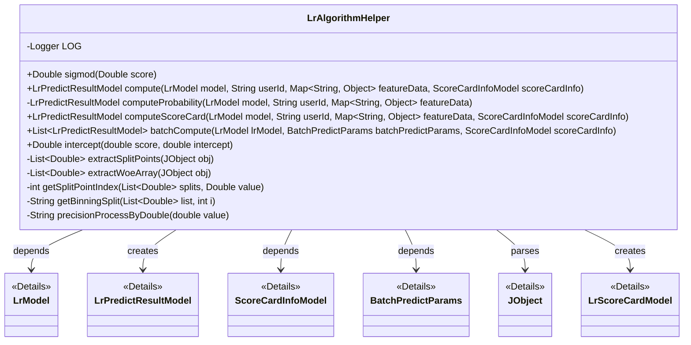
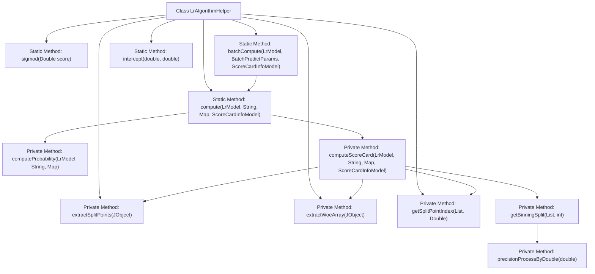

# Basic Information

|      |      |
|------|------|
| Name | LrAlgorithmHelper |
| Language | .java |
| Code Path | WeFe/serving/serving-sdk-java/src/main/java/com/welab/wefe/serving/sdk/algorithm/lr/LrAlgorithmHelper.java |
| Package Name | com.welab.wefe.serving.sdk.algorithm.lr |
| Dependencies | ['com.alibaba.fastjson.JSON', 'com.alibaba.fastjson.util.TypeUtils', 'com.welab.wefe.common.util.JObject', 'com.welab.wefe.serving.sdk.dto.BatchPredictParams', 'com.welab.wefe.serving.sdk.enums.StateCode', 'com.welab.wefe.serving.sdk.model.ScoreCardInfoModel', 'com.welab.wefe.serving.sdk.model.lr.LrModel', 'com.welab.wefe.serving.sdk.model.lr.LrPredictResultModel', 'com.welab.wefe.serving.sdk.model.lr.LrScoreCardModel', 'com.welab.wefe.serving.sdk.utils.AlgorithmThreadPool', 'org.apache.commons.compress.utils.Lists', 'org.slf4j.Logger', 'org.slf4j.LoggerFactory', 'java.math.BigDecimal', 'java.util.List', 'java.util.Map', 'java.util.concurrent.CopyOnWriteArrayList', 'java.util.concurrent.CountDownLatch', 'java.lang.Math.exp'] |
| Brief Description | The LrAlgorithmHelper class provides support for logistic regression algorithms, including the Sigmoid function, feature probability calculation, scorecard computation, and batch prediction capabilities, handling feature matching errors and returning prediction results. |

# Description

LrAlgorithmHelper is a logistic regression algorithm utility class that provides various computation methods. It includes sigmoid function calculation, probability computation based on features (computeProbability), and scorecard calculation (computeScoreCard). Probability computation derives scores by summing the product of feature values and weights; scorecard calculation additionally handles binning, WOE transformation, and score conversion. It offers batch computation method batchCompute, supporting multithreading for processing user prediction requests. Auxiliary methods include bin index retrieval, bin interval formatting, numerical precision handling, etc. When features mismatch, it logs error messages and returns failure results.

# Class Summary

| Name   | Type  | Description |
|-------|------|-------------|
| LrAlgorithmHelper | class | The LrAlgorithmHelper class provides logistic regression algorithm support, including the sigmoid function, feature probability calculation, scorecard computation, and batch prediction capabilities, handling feature matching errors and returning prediction results. |

## Class LrAlgorithmHelper

|      |      |
|------|------|
| Access Modifier | public |
| Type | class |
| Name | LrAlgorithmHelper |
| Description | The LrAlgorithmHelper class provides logistic regression algorithm support, including the sigmoid function, feature probability calculation, scorecard computation, and batch prediction capabilities, handling feature matching errors and returning prediction results. |

### UML Class Diagram

This code implements a logistic regression algorithm utility class, primarily providing features such as feature score calculation and batch prediction. Core methods include probability calculation based on features (computeProbability) and scorecard calculation (computeScoreCard), supporting both single and batch predictions. The class processes feature data using generic collections, parses scorecard configurations with JObject, and implements parallel batch prediction via thread pools. Exception handling includes feature matching checks and logging, while numerical processing employs BigDecimal to ensure precision.

### Internal Method Call Graph

This flowchart illustrates the core structure of the LrAlgorithmHelper class, comprising 12 primary method nodes and 15 invocation relationships. Key logic is reflected in the branching processing of the compute method (selecting either computeProbability or computeScoreCard based on scoreCardInfo), as well as the scorecard implementation flow within the computeScoreCard method through feature value matching, binning calculation, and WOE transformation. Private utility methods such as extractSplitPoints and getSplitPointIndex support the core score calculation functionality, while the batchCompute method enables batch prediction via a thread pool.

### Field List

| Name  | Type  | Description |
|-------|-------|------|
| LOG = LoggerFactory.getLogger(LrAlgorithmHelper.class) | Logger | Define a private static log constant LOG for the class LrAlgorithmHelper. |

### Method List

| Name  | Type  | Description |
|-------|-------|------|
| extractSplitPoints | List<Double> | Extract the `splitPoints` field from the JObject and return a list of Double type. |
| intercept | Double | This is a static method that takes two double parameters, score and intercept, and returns their sum. |
| batchCompute | List<LrPredictResultModel> | The method utilizes multi-threading for batch computation of prediction results, processing each user's feature data in parallel through a thread pool, and ultimately returns a result list. Error logs are recorded in case of exceptions. |
| computeScoreCard | LrPredictResultModel | This method calculates the user's scorecard points by iterating through the feature data, matching model weights, computing the score for each feature and accumulating them. If a feature does not match, it returns an error. Finally, it returns the user ID, total score, and scorecard details. |
| extractWoeArray | List<Double> | Extract the `woeArray` field from the JSON object and convert it into a list of Doubles. |
| computeProbability | LrPredictResultModel | The method `computeProbability` calculates the probability score based on model weights and feature data. It iterates through the feature data, matches the model weights, and accumulates the score. If no matching feature is found, an error is returned; otherwise, the user ID and score are returned. |
| sigmod | Double | This is a static method that implements the Sigmoid function, taking a Double type score as input and outputting the result of 1/(1+e^(-score)). |
| compute | LrPredictResultModel | The static method `compute` calculates the prediction result based on the model, user ID, feature data, and scorecard information. If the feature data is empty, it returns a score of 0; otherwise, it selects different calculation methods according to the scorecard information. |
| getSplitPointIndex | int | This method traverses the list splits and returns the index of the first element that is greater than or equal to the value. If no such element exists, it returns the last index. |
| getBinningSplit | String | The method `getBinningSplit` takes a list and an index, then generates an interval string. The lower bound is -∞ (for the first item) or the preceding item in the list, and the upper bound is the current item. The result is formatted as "lower bound,upper bound". |
| precisionProcessByDouble | String | This method converts a double-precision floating-point number into a string with two decimal places, applying rounding rules for processing. |

