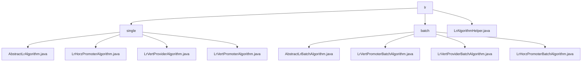

# Basic Information

|      |      |
|------|------|
| Name | lr |
| Language | .java |
| Code Path | WeFe/serving/serving-sdk-java/src/main/java/com/welab/wefe/serving/sdk/algorithm/lr |
| Package Name | docs.serving.serving-sdk-java.src.main.java.com.welab.wefe.serving.sdk.algorithm.lr |
| Brief Description | This module implements the logistic regression prediction process, including local computation, score adjustment, and result merging. It supports both horizontal and vertical federated scenarios, involving data desensitization and distributed result aggregation. Utility classes provide methods such as Sigmoid transformation and scorecard calculation. It is suitable for batch prediction needs like financial risk control. |

# Description

## Overview  
The core responsibility of this module is to implement the prediction process of the logistic regression algorithm, supporting both single and batch processing, covering local computation, score adjustment, result merging, and data desensitization. It defines standardized workflows through unified interface specifications (e.g., handle/batchLocalCompute) and abstract base classes (AbstractLrBatchAlgorithm), similar to distributed computing frameworks. Key data structures include LrPredictResultModel (storing prediction results), PredictParams (prediction parameters), and the isScoreCard flag (distinguishing scorecard models). External dependencies involve JObject, AbstractAlgorithm, and the batch computation framework provided by parent classes. For example, score adjustment includes Sigmoid transformation, intercept handling, and binning/WOE conversion (in scorecard scenarios).  

## Key Business Scenarios  
The module supports horizontal (LrHorzPromoter) and vertical (LrVertPromoter) prediction scenarios in federated learning. The typical workflow is: 1) Local computation generates prediction values; 2) The normalization method is determined based on isScoreCard; 3) In vertical scenarios, remote results are merged by user ID (similar to MapReduce). Interaction modes include synchronous merging (mergeRemote) and asynchronous computation, e.g., LrVertProvider invokes maskSensitiveData for desensitization. Typical applications include financial risk scoring (e.g., baseScore adjustment) and non-scorecard models (e.g., probability prediction). API types cover single prediction, batch computation, and cross-node aggregation, while the utility class LrAlgorithmHelper provides binning processing and multi-threading support.

### Package Internal Structure View

This flowchart illustrates the hierarchical structure of the logistic regression algorithm module. The top-level is the lr directory, which branches into two subdirectories: single (standalone version) and batch (batch version). The single directory contains 4 specific algorithm implementation classes, while the batch directory includes 3 batch algorithm implementation classes and 1 abstract base class. There is also 1 utility class under the root directory, presenting a clear tree-like dependency relationship overall.

# File List

| Name   | Type  | Description |
|-------|------|-------------|
| [LrAlgorithmHelper.java](LrAlgorithmHelper.md) | file | The LrAlgorithmHelper class provides support for logistic regression algorithms, including the Sigmoid function, feature probability calculation, scorecard computation, and batch prediction functionality, handling feature matching errors and returning prediction results. |
| [batch](batch/_module.md) | package | The LrVertPromoterBatchAlgorithm class handles batch prediction, including the handle and mergeRemote methods. The LrVertProviderBatchAlgorithm class implements batch prediction and data desensitization. The LrHorzPromoterBatchAlgorithm class overrides the handle method to process prediction results. The AbstractLrBatchAlgorithm abstract class provides core functionality for logistic regression batch prediction. |
| [single](single/_module.md) | package | The abstract class AbstractLrAlgorithm extends AbstractAlgorithm, implementing the core logic of logistic regression, including methods such as prediction calculation and score adjustment. LrHorzPromoterAlgorithm handles local computation and standardization. LrVertProviderAlgorithm performs local computation and clears sensitive data. LrVertPromoterAlgorithm merges remote results and normalizes them. |

