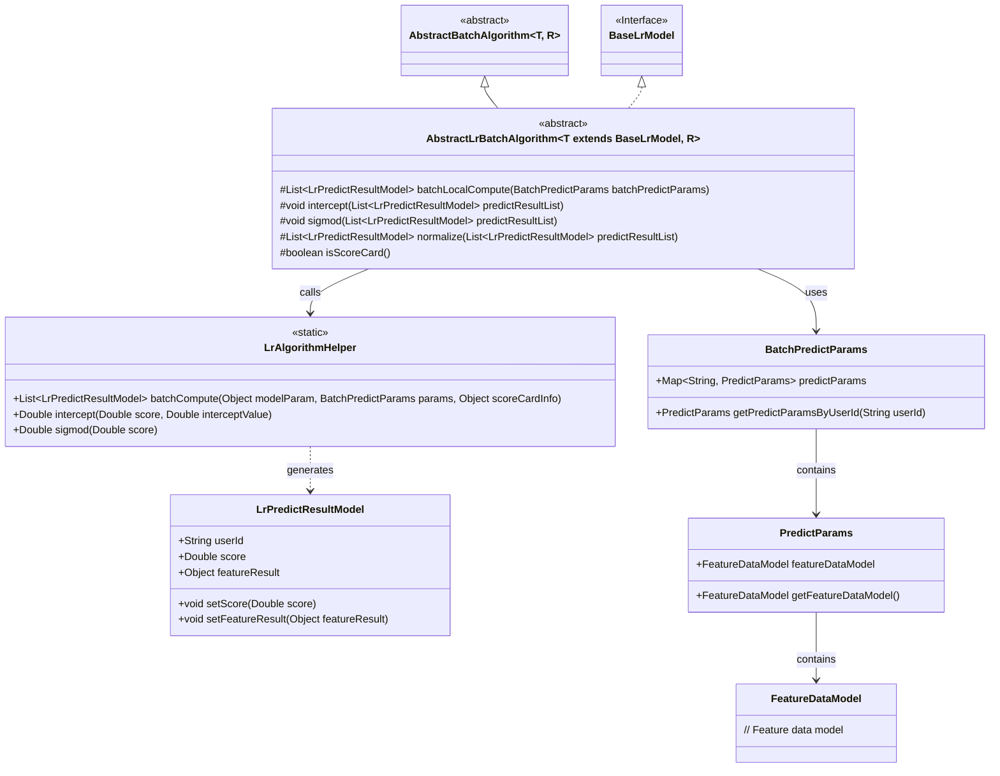
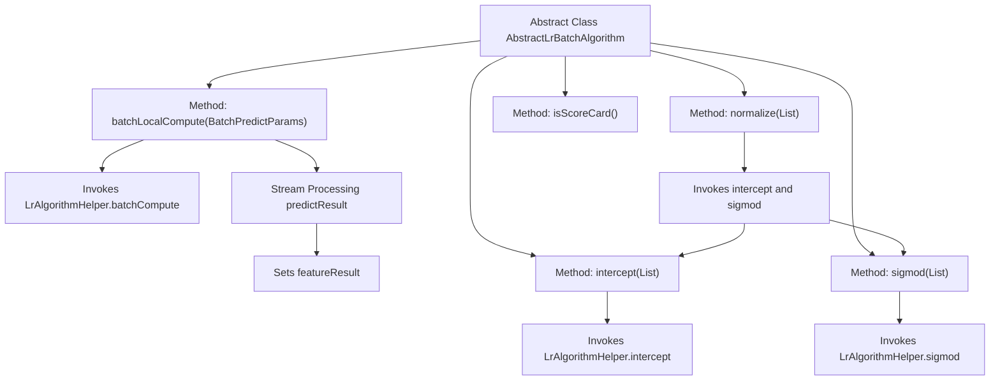

# Basic Information

|      |      |
|------|------|
| Name | AbstractLrBatchAlgorithm |
| Language | .java |
| Code Path | WeFe/serving/serving-sdk-java/src/main/java/com/welab/wefe/serving/sdk/algorithm/lr/batch/AbstractLrBatchAlgorithm.java |
| Package Name | com.welab.wefe.serving.sdk.algorithm.lr.batch |
| Dependencies | ['com.welab.wefe.serving.sdk.algorithm.AbstractBatchAlgorithm', 'com.welab.wefe.serving.sdk.algorithm.lr.LrAlgorithmHelper', 'com.welab.wefe.serving.sdk.dto.BatchPredictParams', 'com.welab.wefe.serving.sdk.model.PredictModel', 'com.welab.wefe.serving.sdk.model.lr.BaseLrModel', 'com.welab.wefe.serving.sdk.model.lr.LrPredictResultModel', 'java.util.List'] |
| Brief Description | The abstract class AbstractLrBatchAlgorithm provides batch prediction functionality, including local computation, intercept handling, Sigmoid transformation, and normalization methods, supporting scorecard judgment. |

# Description

This is an abstract class named AbstractLrBatchAlgorithm, which inherits from AbstractBatchAlgorithm and is primarily used to implement batch logistic regression algorithms. The class includes several key methods: the batchLocalCompute method performs batch prediction calculations and extracts feature results; the intercept method applies intercept processing to the prediction results; the sigmod method transforms scores using the sigmoid function; and the normalize method combines intercept processing with sigmoid transformation. Additionally, the isScoreCard method checks for the presence of scorecard information. The class supports different types of models and results through generics, with its core functionality centered around batch processing and standardization of logistic regression prediction results.

# Class Summary

| Name   | Type  | Description |
|-------|------|-------------|
| AbstractLrBatchAlgorithm | class | The abstract class AbstractLrBatchAlgorithm implements batch prediction logic, encompassing local computation, intercept handling, Sigmoid transformation, and result normalization methods, supporting scorecard evaluation. |

## Class AbstractLrBatchAlgorithm

|      |      |
|------|------|
| Access Modifier | public abstract |
| Type | class |
| Name | AbstractLrBatchAlgorithm |
| Description | The abstract class AbstractLrBatchAlgorithm implements batch prediction logic, encompassing local computation, intercept handling, Sigmoid transformation, and result normalization methods, supporting scorecard evaluation. |

### UML Class Diagram

This class diagram illustrates the abstract class structure of a logistic regression batch processing algorithm. AbstractLrBatchAlgorithm inherits from AbstractBatchAlgorithm and implements the BaseLrModel interface, containing methods such as batch computation, intercept handling, Sigmoid function transformation, and normalization. The core calculations are performed via the LrAlgorithmHelper utility class, which processes BatchPredictParams parameters and LrPredictResultModel result models, involving hierarchical relationships between feature data models and prediction parameters.

### Internal Method Call Graph

This code demonstrates the core method flow of the abstract class `AbstractLrBatchAlgorithm`. Key functionalities include batch prediction computation, intercept processing, Sigmoid function transformation, result normalization, and scorecard checking. The flowchart clearly illustrates the invocation relationships between methods, particularly how the `normalize` method sequentially calls `intercept` and `sigmod`, while the `batchLocalCompute` method sets feature values for each prediction result through stream processing. The overall structure reflects encapsulation and extensibility capabilities for machine learning batch processing algorithms.

### Field List

| Name  | Type  | Description |
|-------|-------|------|

### Method List

| Name  | Type  | Description |
|-------|-------|------|
| isScoreCard | boolean | Check if scoreCardInfo in modelParam is non-empty and return a boolean value. |
| intercept | void | This method adjusts the intercept for each model score in the prediction result list, using the LrAlgorithmHelper.intercept method combined with the intercept value in the model parameters for correction. |
| batchLocalCompute | List<LrPredictResultModel> | The method calculates prediction results in batches, using model parameters and input data to generate a list of prediction results, and returns them after supplementing each result with feature data. |
| sigmod | void | This method applies a sigmoid function transformation to each model score in the prediction result list. |
| normalize | List<LrPredictResultModel> | This method normalizes the prediction result list by first performing intercept adjustment, then applying the Sigmoid function transformation, and finally returning the processed list. |

