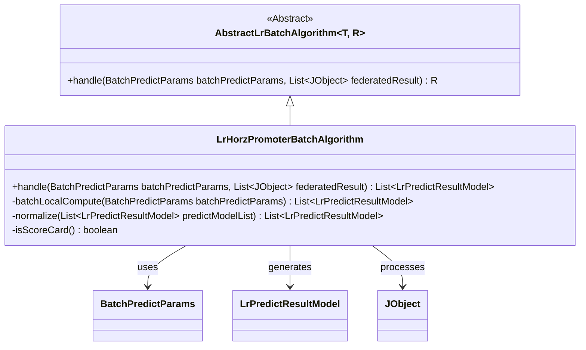
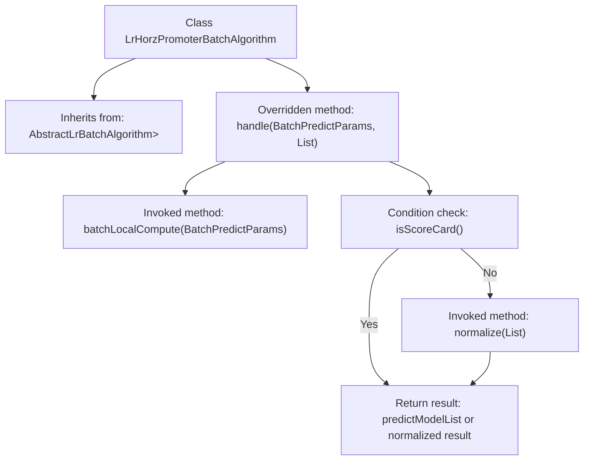

# Basic Information

|      |      |
|------|------|
| Name | LrHorzPromoterBatchAlgorithm |
| Language | .java |
| Code Path | WeFe/serving/serving-sdk-java/src/main/java/com/welab/wefe/serving/sdk/algorithm/lr/batch/LrHorzPromoterBatchAlgorithm.java |
| Package Name | com.welab.wefe.serving.sdk.algorithm.lr.batch |
| Dependencies | ['com.welab.wefe.common.util.JObject', 'com.welab.wefe.serving.sdk.dto.BatchPredictParams', 'com.welab.wefe.serving.sdk.model.lr.BaseLrModel', 'com.welab.wefe.serving.sdk.model.lr.LrPredictResultModel', 'java.util.List'] |
| Brief Description | The LrHorzPromoterBatchAlgorithm class inherits from AbstractLrBatchAlgorithm, processes batch prediction parameters and joint results, and returns a list of prediction models or normalized results. |

# Description

The content describes a class named LrHorzPromoterBatchAlgorithm, which inherits from AbstractLrBatchAlgorithm. This class overrides the handle method to process batch prediction parameters and joint computation results. The method first calls batchLocalCompute to perform local computations, generating a list of prediction results. Then, based on the return value of the isScoreCard method, it either directly returns the list of prediction results or returns the results after normalization. The entire process involves batch prediction and result handling logic.

# Class Summary

| Name   | Type  | Description |
|-------|------|-------------|
| LrHorzPromoterBatchAlgorithm | class | This is a Java class that extends an abstract batch processing algorithm class, designed for handling batch predictions of logistic regression models. The core method takes prediction parameters and joint results as input, performs local computations first, and then determines whether to normalize the results based on whether it is a scorecard. |

## Class LrHorzPromoterBatchAlgorithm

|      |      |
|------|------|
| Access Modifier | public |
| Type | class |
| Name | LrHorzPromoterBatchAlgorithm |
| Description | This is a Java class that extends an abstract batch processing algorithm class, designed for handling batch predictions of logistic regression models. The core method takes prediction parameters and joint results as input, performs local computations first, and then determines whether to normalize the results based on whether it is a scorecard. |

### UML Class Diagram

This code demonstrates the implementation of a horizontal logistic regression (LR) batch prediction algorithm. LrHorzPromoterBatchAlgorithm inherits from the generic abstract class AbstractLrBatchAlgorithm and implements the concrete handle method. The algorithm first performs local computation through batchLocalCompute, then determines whether the results require normalize standardization based on isScoreCard(). The class diagram clearly illustrates the inheritance relationships, dependencies, and access levels of key methods, reflecting the core logical structure of this batch processing algorithm.

### Internal Method Call Graph

This flowchart illustrates the core logical structure of the LrHorzPromoterBatchAlgorithm class. The class inherits from the base class AbstractLrBatchAlgorithm and overrides the handle method. The handle method first invokes batchLocalCompute for local computation, then determines whether to directly return the computation result or perform normalize standardization based on the return value of isScoreCard(). The entire process demonstrates the method invocation chain and conditional branches, clearly presenting the data processing path and decision points.

### Field List

| Name  | Type  | Description |
|-------|-------|------|

### Method List

| Name  | Type  | Description |
|-------|-------|------|
| handle | List<LrPredictResultModel> | This method processes batch prediction parameters and joint results by first performing local computations to generate a prediction list, and finally determining whether to return normalized results or the original list based on the presence of a scorecard. |

