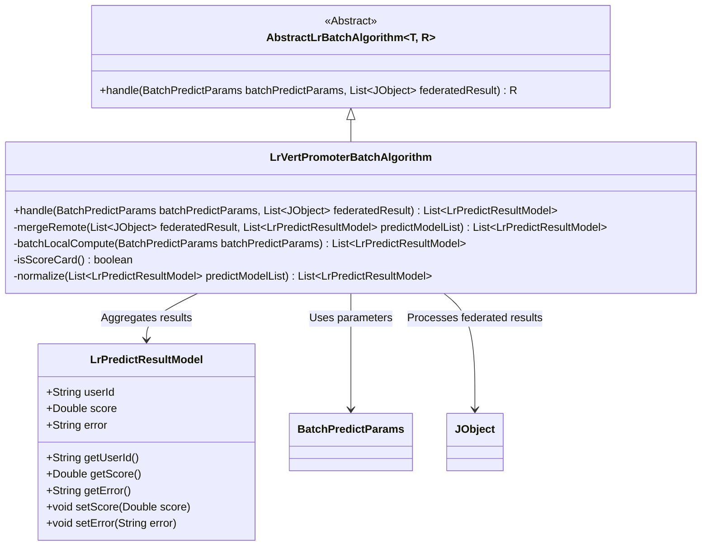
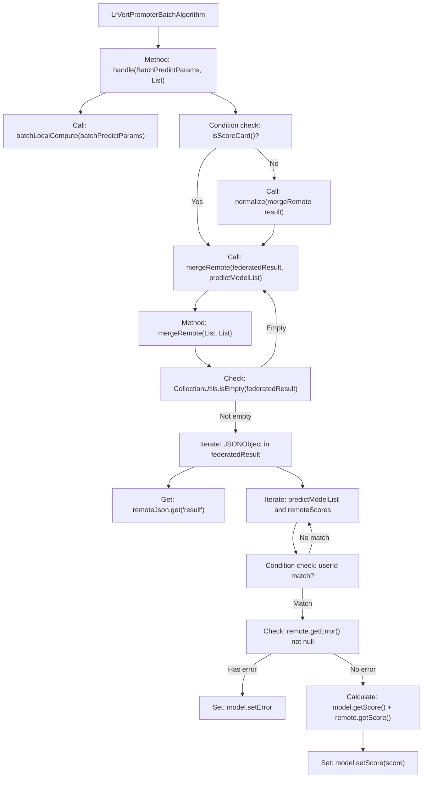
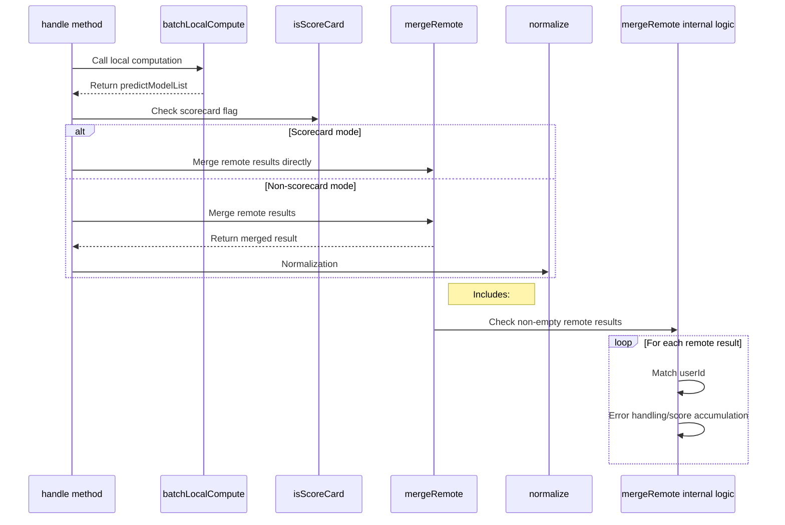

# Basic Information

|      |      |
|------|------|
| Name | LrVertPromoterBatchAlgorithm |
| Language | .java |
| Code Path | WeFe/serving/serving-sdk-java/src/main/java/com/welab/wefe/serving/sdk/algorithm/lr/batch/LrVertPromoterBatchAlgorithm.java |
| Package Name | com.welab.wefe.serving.sdk.algorithm.lr.batch |
| Dependencies | ['com.alibaba.fastjson.JSONObject', 'com.welab.wefe.common.exception.StatusCodeWithException', 'com.welab.wefe.common.util.JObject', 'com.welab.wefe.serving.sdk.dto.BatchPredictParams', 'com.welab.wefe.serving.sdk.model.lr.BaseLrModel', 'com.welab.wefe.serving.sdk.model.lr.LrPredictResultModel', 'org.apache.commons.collections4.CollectionUtils', 'java.util.List'] |
| Brief Description | The LrVertPromoterBatchAlgorithm class handles batch prediction by merging local and remote results. For scorecards, it directly combines them; otherwise, normalization is applied. During merging, it matches user IDs and accumulates scores while processing error messages. |

# Description

The code describes a class named `LrVertPromoterBatchAlgorithm`, which inherits from `AbstractLrBatchAlgorithm`. Its primary function is to handle batch prediction tasks and includes two core methods: `handle` and `mergeRemote`. The `handle` method performs local computations and then decides whether to normalize the merged results based on the `isScoreCard` flag. The `mergeRemote` method is responsible for merging local and remote prediction results by matching user IDs for score accumulation and handling errors in remote calls. The entire process achieves the aggregation of prediction results in a distributed environment.

# Class Summary

| Name   | Type  | Description |
|-------|------|-------------|
| LrVertPromoterBatchAlgorithm | class | The LrVertPromoterBatchAlgorithm class handles batch prediction, merging local and remote results, and determines whether to standardize based on whether it is a scorecard. During merging, it matches user IDs and accumulates scores or records errors. |

## Class LrVertPromoterBatchAlgorithm

|      |      |
|------|------|
| Access Modifier | public |
| Type | class |
| Name | LrVertPromoterBatchAlgorithm |
| Description | The LrVertPromoterBatchAlgorithm class handles batch prediction, merging local and remote results, and determines whether to standardize based on whether it is a scorecard. During merging, it matches user IDs and accumulates scores or records errors. |

### UML Class Diagram

This code demonstrates an implementation of a logistic regression vertical federated learning prediction algorithm. LrVertPromoterBatchAlgorithm inherits from the abstract class AbstractLrBatchAlgorithm and primarily implements the handle method for batch prediction processing, which includes two core steps: local computation (batchLocalCompute) and remote result merging (mergeRemote). The mergeRemote method adds local and remote prediction scores by matching user IDs while handling potential error cases. The class diagram clearly illustrates the dependency relationships between the algorithm class, parameter classes, and result classes, as well as the hierarchical structure inherited from the abstract base class.

### Internal Method Call Graph

This flowchart demonstrates the core processing logic of the vertical logistic regression batch prediction algorithm. It first generates prediction results through local computation, then determines whether to perform normalization based on the scorecard mode flag. When merging remote results, it iterates through all collaborators' calculation results for user ID matching and score aggregation, while handling potential error cases. The sequence diagram clearly presents the method invocation order and conditional branching logic.

### Field List

| Name  | Type  | Description |
|-------|-------|------|

### Method List

| Name  | Type  | Description |
|-------|-------|------|
| mergeRemote | List<LrPredictResultModel> | Merge remote prediction results into the local list. Return the local list if remote results are empty. Iterate through remote results, match user IDs, then merge scores or log errors. Finally, return the updated local list. |
| handle | List<LrPredictResultModel> | This method processes batch prediction parameters and joint results, first generating a list of prediction models through local computation, then determining the approach for merging remote results based on whether it involves a scorecard. |

