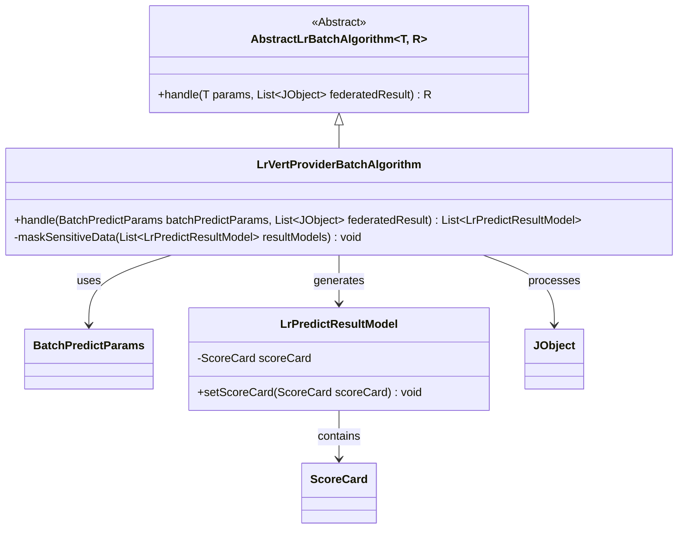
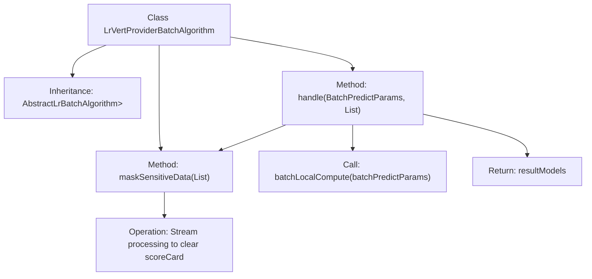

# Basic Information

|      |      |
|------|------|
| Name | LrVertProviderBatchAlgorithm |
| Language | .java |
| Code Path | WeFe/serving/serving-sdk-java/src/main/java/com/welab/wefe/serving/sdk/algorithm/lr/batch/LrVertProviderBatchAlgorithm.java |
| Package Name | com.welab.wefe.serving.sdk.algorithm.lr.batch |
| Dependencies | ['com.welab.wefe.common.util.JObject', 'com.welab.wefe.serving.sdk.dto.BatchPredictParams', 'com.welab.wefe.serving.sdk.model.lr.BaseLrModel', 'com.welab.wefe.serving.sdk.model.lr.LrPredictResultModel', 'java.util.List'] |
| Brief Description | The LrVertProviderBatchAlgorithm class inherits from AbstractLrBatchAlgorithm, overrides the handle method to process batch predictions, invokes local computations, and masks sensitive data (clearing the scoreCard). |

# Description

This is a Java class named LrVertProviderBatchAlgorithm, which inherits from the AbstractLrBatchAlgorithm abstract class. The class implements batch prediction logic, with main functionalities including: processing batch prediction parameters and joint computation results, executing local batch computations, and desensitizing sensitive data in the results. Specifically, data desensitization is achieved by setting the scoreCard field in the result model to null through the maskSensitiveData method. The final output is a list of processed prediction results.

# Class Summary

| Name   | Type  | Description |
|-------|------|-------------|
| LrVertProviderBatchAlgorithm | class | The LrVertProviderBatchAlgorithm class inherits from AbstractLrBatchAlgorithm, processes batch prediction parameters and joint results, performs local computations, and masks sensitive data. |

## Class LrVertProviderBatchAlgorithm

|      |      |
|------|------|
| Access Modifier | public |
| Type | class |
| Name | LrVertProviderBatchAlgorithm |
| Description | The LrVertProviderBatchAlgorithm class inherits from AbstractLrBatchAlgorithm, processes batch prediction parameters and joint results, performs local computations, and masks sensitive data. |

### UML Class Diagram

Class Diagram Description: This diagram illustrates the class structure of the Logistic Regression Vertical Provider Batch Algorithm (LrVertProviderBatchAlgorithm), which inherits from the generic abstract class AbstractLrBatchAlgorithm. Its primary function is to process batch prediction parameters and federated results via the handle method, generating a list of prediction results while including a private method for masking sensitive data. Key classes involved are batch prediction parameters, prediction result models (containing ScoreCard objects), and JSON objects, reflecting the critical component relationships in the data processing workflow.

### Internal Method Call Graph

This flowchart illustrates the core structure and workflow of the LrVertProviderBatchAlgorithm class. The class inherits from AbstractLrBatchAlgorithm and primarily includes two methods: handle and maskSensitiveData. The handle method first calls batchLocalCompute for local computation, then invokes the maskSensitiveData method to clear sensitive data in the scoreCard of all result models through stream processing, and finally returns the processed result list. The entire process demonstrates a complete chain of data processing and privacy protection.

### Field List

| Name  | Type  | Description |
|-------|-------|------|

### Method List

| Name  | Type  | Description |
|-------|-------|------|
| handle | List<LrPredictResultModel> | Rewrite the method to handle batch prediction parameters and joint results, perform local computations, and return the list of result models after masking sensitive data. |
| maskSensitiveData | void | The method iterates through the list of result models and clears the sensitive data scoreCard field for each model. |

