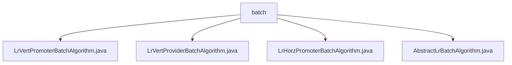

# Basic Information

|      |      |
|------|------|
| Name | batch |
| Language | .java |
| Code Path | WeFe/serving/serving-sdk-java/src/main/java/com/welab/wefe/serving/sdk/algorithm/lr/batch |
| Package Name | docs.serving.serving-sdk-java.src.main.java.com.welab.wefe.serving.sdk.algorithm.lr.batch |
| Brief Description | The LrVertPromoterBatchAlgorithm class handles batch prediction, including the handle and mergeRemote methods. The LrVertProviderBatchAlgorithm class implements batch prediction and data desensitization. The LrHorzPromoterBatchAlgorithm class overrides the handle method to process prediction results. The AbstractLrBatchAlgorithm abstract class provides core functionality for logistic regression batch prediction. |

# Description

## Overview  
This module implements distributed logistic regression batch prediction, with core responsibilities including local computation, result aggregation, and data desensitization. The abstract base class AbstractLrBatchAlgorithm defines standardized processes (e.g., sigmoid transformation, intercept handling), while subclasses like LrVertPromoter/LrHorzPromoter handle vertical/horizontal federated scenarios respectively. For instance, LrVertPromoter merges cross-node prediction scores via mergeRemote, resembling MapReduce's aggregation pattern. Key data structures include a prediction result list and the isScoreCard flag, leveraging the batch computation framework provided by the parent class AbstractBatchAlgorithm.

## Key Business Scenarios  
The module supports batch prediction tasks in federated learning, with a typical workflow: 1) Local execution of batchLocalCompute to generate predicted values; 2) Normalization decision based on isScoreCard; 3) Merging remote results via user ID matching in vertical scenarios. For example, LrVertProvider desensitizes sensitive data by calling maskSensitiveData. Interaction modes include synchronous merging (mergeRemote) and asynchronous computation, suitable for scenarios requiring distributed scoring like financial risk control. API types encompass local computation, result standardization, and cross-node aggregation operations.

### Package Internal Structure View

This flowchart illustrates the file structure of the LR batch algorithm module, where the batch directory contains four Java implementation classes: vertical collaborator/provider batch algorithms, horizontal collaborator batch algorithm, and an abstract base class for batch algorithms. All files reside at the same level and are directly subordinate to the batch directory.

# File List

| Name   | Type  | Description |
|-------|------|-------------|
| [LrVertPromoterBatchAlgorithm.java](LrVertPromoterBatchAlgorithm.md) | file | The LrVertPromoterBatchAlgorithm class handles batch prediction by merging local and remote results. For scorecards, it directly combines them; otherwise, normalization is applied. During merging, it matches user IDs and accumulates scores while processing error messages. |
| [LrVertProviderBatchAlgorithm.java](LrVertProviderBatchAlgorithm.md) | file | The LrVertProviderBatchAlgorithm class inherits from AbstractLrBatchAlgorithm, overrides the handle method to process batch predictions, invokes local computations, and masks sensitive data (clearing the scoreCard). |
| [LrHorzPromoterBatchAlgorithm.java](LrHorzPromoterBatchAlgorithm.md) | file | The LrHorzPromoterBatchAlgorithm class inherits from AbstractLrBatchAlgorithm, processes batch prediction parameters and joint results, and returns either a list of prediction models or normalized results. |
| [AbstractLrBatchAlgorithm.java](AbstractLrBatchAlgorithm.md) | file | The abstract class AbstractLrBatchAlgorithm provides batch prediction functionality, including local computation, intercept handling, Sigmoid transformation, and normalization methods, supporting scorecard judgment. |

