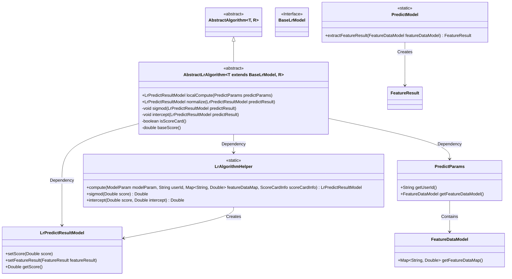
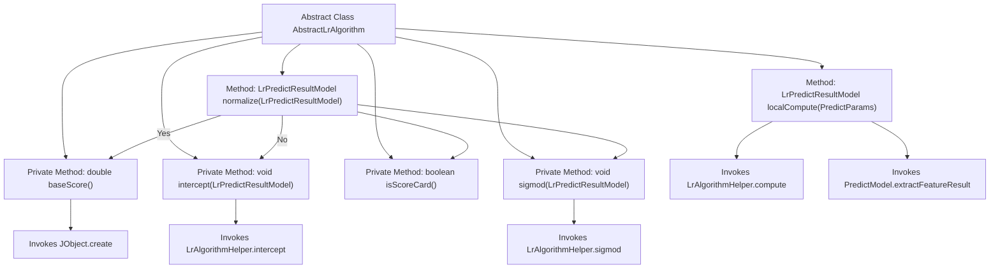

# Basic Information

|      |      |
|------|------|
| Name | AbstractLrAlgorithm |
| Language | .java |
| Code Path | WeFe/serving/serving-sdk-java/src/main/java/com/welab/wefe/serving/sdk/algorithm/lr/single/AbstractLrAlgorithm.java |
| Package Name | com.welab.wefe.serving.sdk.algorithm.lr.single |
| Dependencies | ['com.welab.wefe.common.util.JObject', 'com.welab.wefe.serving.sdk.algorithm.AbstractAlgorithm', 'com.welab.wefe.serving.sdk.algorithm.lr.LrAlgorithmHelper', 'com.welab.wefe.serving.sdk.dto.PredictParams', 'com.welab.wefe.serving.sdk.model.PredictModel', 'com.welab.wefe.serving.sdk.model.lr.BaseLrModel', 'com.welab.wefe.serving.sdk.model.lr.LrPredictResultModel'] |
| Brief Description | The abstract class AbstractLrAlgorithm implements logistic regression prediction, encompassing local computation, normalization processing (scorecard judgment, intercept adjustment, Sigmoid transformation), and basic score calculation functionalities. |

# Description

The abstract class extends AbstractAlgorithm and is specifically designed for logistic regression algorithms. Its main functionalities include: the localCompute method calculates prediction results through LrAlgorithmHelper and extracts feature results; the normalize method adjusts scores based on whether it is a scorecard model, performing intercept handling and Sigmoid transformation for non-scorecard cases. Auxiliary methods include sigmod for score conversion, intercept for handling intercepts, isScoreCard for determining model type, and baseScore for obtaining the scorecard's base score. Overall, it implements the core logic of the logistic regression prediction process.

# Class Summary

| Name   | Type  | Description |
|-------|------|-------------|
| AbstractLrAlgorithm | class | The abstract class AbstractLrAlgorithm implements prediction calculations for the LR model, encompassing methods such as local computation, normalization, sigmoid function, and intercept handling, while supporting scorecard functionality. |

## Class AbstractLrAlgorithm

|      |      |
|------|------|
| Access Modifier | public abstract |
| Type | class |
| Name | AbstractLrAlgorithm |
| Description | The abstract class AbstractLrAlgorithm implements prediction calculations for the LR model, encompassing methods such as local computation, normalization, sigmoid function, and intercept handling, while supporting scorecard functionality. |

### UML Class Diagram

This class diagram illustrates the inheritance relationships and collaborating objects of an abstract logistic regression algorithm class `AbstractLrAlgorithm`. The class inherits from `AbstractAlgorithm`, implements local computation and result normalization functionalities, depends on `LrAlgorithmHelper` for core calculations, uses `PredictParams` as input parameters, and generates `LrPredictResultModel` as output. The diagram clearly demonstrates generic parameter constraints (T must extend `BaseLrModel`), the usage of static utility classes, and the data flow path of model parameters.

### Internal Method Call Graph

This flowchart illustrates the core structure and method invocation relationships of the abstract class AbstractLrAlgorithm. It primarily includes two public methods: localCompute and normalize. The localCompute method performs prediction calculations via LrAlgorithmHelper and extracts feature results, while the normalize method processes differently based on whether it's in scorecard mode: in scorecard mode, it invokes baseScore to calculate the baseline score; otherwise, it first performs intercept processing before executing the sigmod function. Private methods include sigmod calculation, intercept processing, isScoreCard judgment, and baseScore calculation, forming a complete logical processing chain.

### Field List

| Name  | Type  | Description |
|-------|-------|------|

### Method List

| Name  | Type  | Description |
|-------|-------|------|
| sigmod | void | The method utilizes the Sigmoid function of logistic regression to transform the prediction result scores. |
| isScoreCard | boolean | Check if the scoreCardInfo of modelParam is not empty and return a boolean value. |
| localCompute | LrPredictResultModel | The method `localCompute` takes the `PredictParams` parameter, invokes `LrAlgorithmHelper.compute` to calculate the prediction result, sets the feature result, and returns an `LrPredictResultModel` object. |
| normalize | LrPredictResultModel | This method standardizes the prediction results: if it is a scorecard model, it accumulates the base score; otherwise, it performs intercept and Sigmoid transformation. The processed result is ultimately returned. |
| intercept | void | This method adjusts the predicted scores by invoking LrAlgorithmHelper.intercept and sets the new scores back to predictResult. |
| baseScore | double | This method calculates the base score, retrieves a_score and b_score from the scoring card, and performs a weighted summation with the intercept value from the model parameters. |

