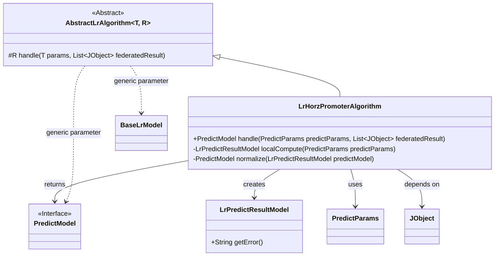
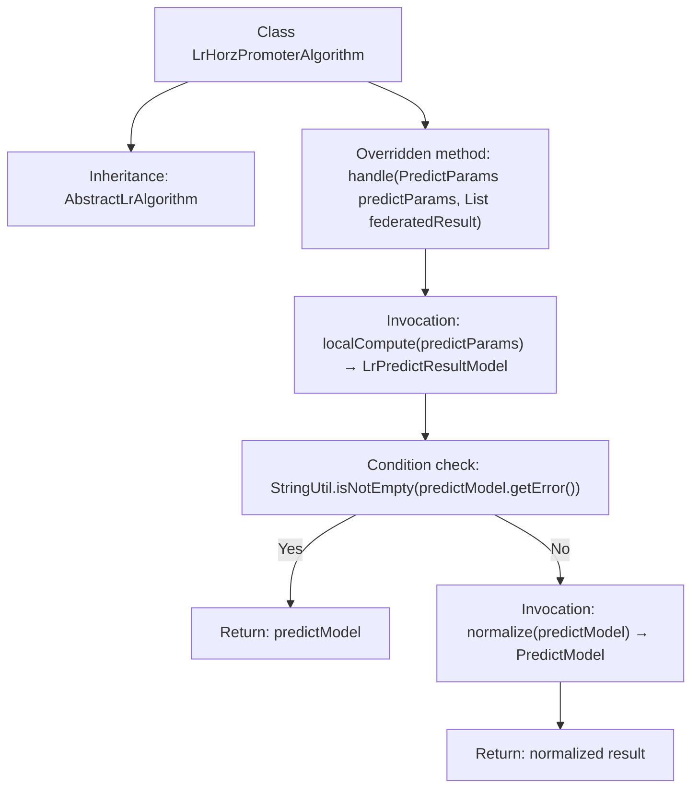

# Basic Information

|      |      |
|------|------|
| Name | LrHorzPromoterAlgorithm |
| Language | .java |
| Code Path | WeFe/serving/serving-sdk-java/src/main/java/com/welab/wefe/serving/sdk/algorithm/lr/single/LrHorzPromoterAlgorithm.java |
| Package Name | com.welab.wefe.serving.sdk.algorithm.lr.single |
| Dependencies | ['com.welab.wefe.common.util.JObject', 'com.welab.wefe.common.util.StringUtil', 'com.welab.wefe.serving.sdk.dto.PredictParams', 'com.welab.wefe.serving.sdk.model.PredictModel', 'com.welab.wefe.serving.sdk.model.lr.BaseLrModel', 'com.welab.wefe.serving.sdk.model.lr.LrPredictResultModel', 'java.util.List'] |
| Brief Description | LrHorzPromoterAlgorithm inherits from AbstractLrAlgorithm, overrides the handle method, first computes prediction results locally, returns if errors occur, otherwise returns after normalization. |

# Description

The content describes a class named LrHorzPromoterAlgorithm, which inherits from AbstractLrAlgorithm. This class overrides the handle method to process prediction parameters and joint computation results. It first calls localCompute for local computation and directly returns if the result contains errors; otherwise, it standardizes the result before returning. The entire process involves prediction parameters, joint computation results, and error checking.

# Class Summary

| Name   | Type  | Description |
|-------|------|-------------|
| LrHorzPromoterAlgorithm | class | LrHorzPromoterAlgorithm inherits from AbstractLrAlgorithm, overrides the handle method, performs local computation first, returns if an error occurs, otherwise normalizes the result. |

## Class LrHorzPromoterAlgorithm

|      |      |
|------|------|
| Access Modifier | public |
| Type | class |
| Name | LrHorzPromoterAlgorithm |
| Description | LrHorzPromoterAlgorithm inherits from AbstractLrAlgorithm, overrides the handle method, performs local computation first, returns if an error occurs, otherwise normalizes the result. |

### UML Class Diagram

This diagram illustrates how LrHorzPromoterAlgorithm inherits from the generic abstract class AbstractLrAlgorithm, implementing the prediction processing flow for horizontal federated learning. The class diagram includes six main classes/interfaces, clearly presenting the algorithm's core structure: LrHorzPromoterAlgorithm performs local computation through localCompute, then standardizes results via normalize, ultimately returning a PredictModel. The arrow relationships accurately express inheritance, dependency, and generic associations between classes.

### Internal Method Call Graph

This flowchart illustrates the core processing logic of the LrHorzPromoterAlgorithm class. It first performs local computation via the localCompute method, then checks whether the computation result contains errors: if errors exist, it directly returns the error message; otherwise, it returns the result after normalization. The entire process demonstrates a typical error-first handling and result post-processing pattern, with arrows clearly marking conditional branches and return paths.

### Field List

| Name  | Type  | Description |
|-------|-------|------|

### Method List

| Name  | Type  | Description |
|-------|-------|------|
| handle | PredictModel | The method processes prediction parameters and joint results by first performing local computations to generate a prediction model. If the model contains errors, it is returned directly; otherwise, the normalized model is returned. |

