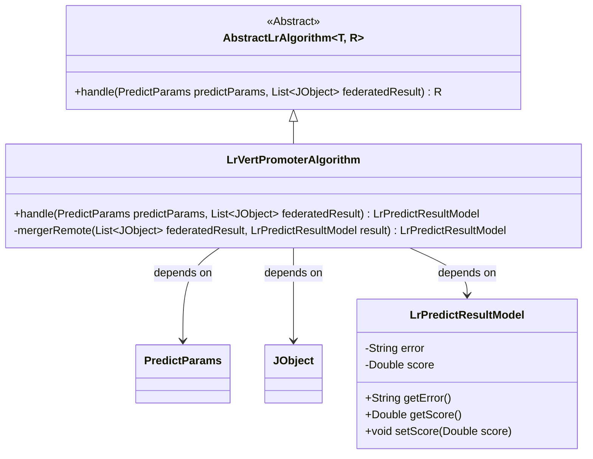
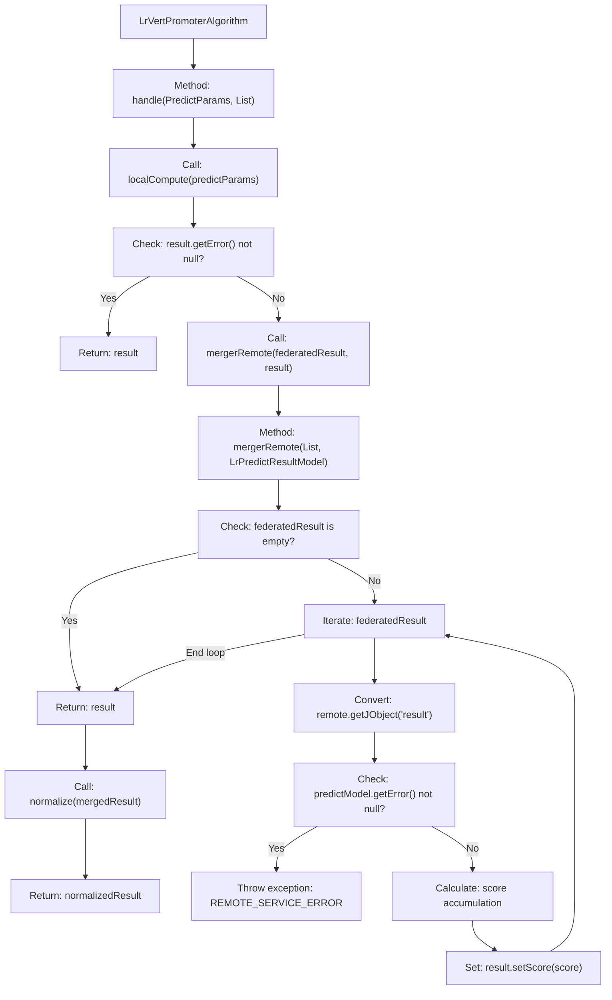

# Basic Information

|      |      |
|------|------|
| Name | LrVertPromoterAlgorithm |
| Language | .java |
| Code Path | WeFe/serving/serving-sdk-java/src/main/java/com/welab/wefe/serving/sdk/algorithm/lr/single/LrVertPromoterAlgorithm.java |
| Package Name | com.welab.wefe.serving.sdk.algorithm.lr.single |
| Dependencies | ['com.alibaba.fastjson.util.TypeUtils', 'com.welab.wefe.common.StatusCode', 'com.welab.wefe.common.exception.StatusCodeWithException', 'com.welab.wefe.common.util.JObject', 'com.welab.wefe.common.util.StringUtil', 'com.welab.wefe.serving.sdk.dto.PredictParams', 'com.welab.wefe.serving.sdk.model.lr.BaseLrModel', 'com.welab.wefe.serving.sdk.model.lr.LrPredictResultModel', 'org.apache.commons.collections4.CollectionUtils', 'java.util.List'] |
| Brief Description | LrVertPromoterAlgorithm inherits from AbstractLrAlgorithm, processes prediction parameters and federated results, merges remote scores, and normalizes the return. It throws exceptions or returns results upon errors. |

# Description

LrVertPromoterAlgorithm is a class that inherits from AbstractLrAlgorithm, designed to handle logistic regression predictions. It executes local computations and merges remote results through the handle method. First, it calls localCompute to perform local predictions and returns immediately if any error occurs. Otherwise, it merges remote results via mergerRemote, checking each remote result for errors. If no errors are found, the scores are accumulated. Finally, it returns the normalized merged result.

# Class Summary

| Name   | Type  | Description |
|-------|------|-------------|
| LrVertPromoterAlgorithm | class | The LrVertPromoterAlgorithm inherits from AbstractLrAlgorithm, handling prediction parameters and federated results. It first performs local computations, then merges remote results with normalization if no errors occur. During merging, it accumulates scores and throws exceptions upon encountering errors. |

## Class LrVertPromoterAlgorithm

|      |      |
|------|------|
| Access Modifier | public |
| Type | class |
| Name | LrVertPromoterAlgorithm |
| Description | The LrVertPromoterAlgorithm inherits from AbstractLrAlgorithm, handling prediction parameters and federated results. It first performs local computations, then merges remote results with normalization if no errors occur. During merging, it accumulates scores and throws exceptions upon encountering errors. |

### UML Class Diagram

This diagram illustrates that the vertical logistic regression algorithm (LrVertPromoterAlgorithm) inherits from the generic abstract class AbstractLrAlgorithm and implements concrete processing methods. It primarily involves prediction parameter handling, federated learning result merging, and prediction result model operations. The class diagram clearly depicts inheritance relationships and key dependencies, including the usage of three core classes: PredictParams, JObject, and LrPredictResultModel. LrVertPromoterAlgorithm processes local computations and remote result merging through the handle method, while the private mergerRemote method handles the specific logic for federated result aggregation.

### Internal Method Call Graph

This flowchart describes the prediction processing flow of the vertical logistic regression algorithm. It first performs local computation via localCompute. If the result contains an error, it returns directly; otherwise, it merges the computation results from remote participants, validating the remote results' validity and accumulating scores during the process. Finally, it normalizes the merged result before returning. The mergerRemote method implements the federated result aggregation logic, including null checks and error handling mechanisms.

### Field List

| Name  | Type  | Description |
|-------|-------|------|

### Method List

| Name  | Type  | Description |
|-------|-------|------|
| mergerRemote | LrPredictResultModel | Method to merge remote prediction results. Return directly if the input is empty. Iterate through remote results, check for errors and throw exceptions. Accumulate scores into the result model before returning. |
| handle | LrPredictResultModel | Process prediction parameters and joint results, perform local computation first, return if errors occur; otherwise, merge remote results and return after normalization. |

