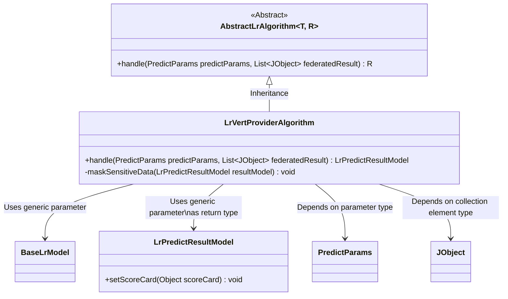
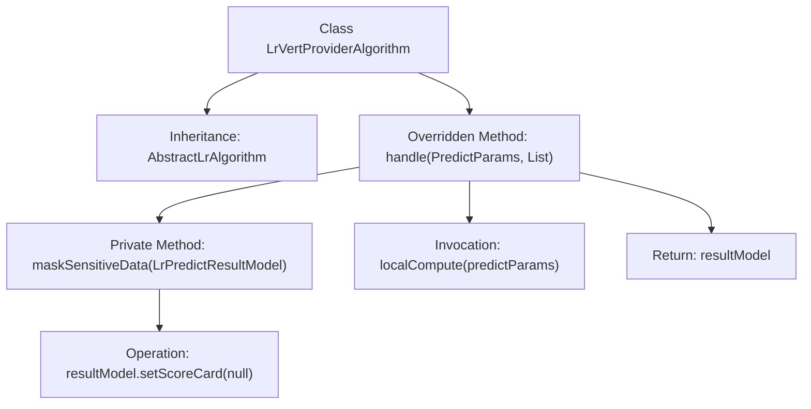

# Basic Information

|      |      |
|------|------|
| Name | LrVertProviderAlgorithm |
| Language | .java |
| Code Path | WeFe/serving/serving-sdk-java/src/main/java/com/welab/wefe/serving/sdk/algorithm/lr/single/LrVertProviderAlgorithm.java |
| Package Name | com.welab.wefe.serving.sdk.algorithm.lr.single |
| Dependencies | ['com.welab.wefe.common.util.JObject', 'com.welab.wefe.serving.sdk.dto.PredictParams', 'com.welab.wefe.serving.sdk.model.lr.BaseLrModel', 'com.welab.wefe.serving.sdk.model.lr.LrPredictResultModel', 'java.util.List'] |
| Brief Description | LrVertProviderAlgorithm inherits from AbstractLrAlgorithm, overriding the handle method to perform local computation and mask sensitive data (clearing the scoreCard). |

# Description

The code describes a class named LrVertProviderAlgorithm, which inherits from AbstractLrAlgorithm. It overrides the handle method, accepting PredictParams and a list of JObject as parameters. It first invokes localCompute to perform local computation and generate an LrPredictResultModel result, then clears sensitive data via the maskSensitiveData method (setting scoreCard to null), and finally returns the processed result model. The entire process combines prediction logic with sensitive data protection.

# Class Summary

| Name   | Type  | Description |
|-------|------|-------------|
| LrVertProviderAlgorithm | class | LrVertProviderAlgorithm inherits from AbstractLrAlgorithm, overriding the handle method to perform local computations and mask sensitive data (clearing the scoreCard). |

## Class LrVertProviderAlgorithm

|      |      |
|------|------|
| Access Modifier | public |
| Type | class |
| Name | LrVertProviderAlgorithm |
| Description | LrVertProviderAlgorithm inherits from AbstractLrAlgorithm, overriding the handle method to perform local computations and mask sensitive data (clearing the scoreCard). |

### UML Class Diagram

This code demonstrates the implementation of a vertical logistic regression (LR) provider algorithm, which inherits from the generic abstract class AbstractLrAlgorithm. LrVertProviderAlgorithm implements the handle method, performing local computations first and then clearing sensitive data (setting scoreCard to null) via the maskSensitiveData method. The class diagram clearly illustrates the inheritance relationship, generic parameter binding, method visibility, and dependencies between classes, reflecting the key data privacy protection workflow in vertical federated learning.

### Internal Method Call Graph

This flowchart illustrates the structure and method invocation relationships of the LrVertProviderAlgorithm class. The class inherits from the generic AbstractLrAlgorithm class and overrides the handle method to process prediction parameters and federated computation results. The handle method first invokes localCompute for local computation, then desensitizes sensitive data in the result (clearing the scoreCard field) via the maskSensitiveData method, and finally returns the processed result model. The entire process embodies security and integrity assurance mechanisms for data processing.

### Field List

| Name  | Type  | Description |
|-------|-------|------|

### Method List

| Name  | Type  | Description |
|-------|-------|------|
| handle | LrPredictResultModel | The method processes prediction parameters and joint results by first locally computing to generate a predictive result model, then anonymizing sensitive data, and finally returning the result model. |
| maskSensitiveData | void | The method `maskSensitiveData` clears the `scoreCard` field of `resultModel` to conceal sensitive data. |

