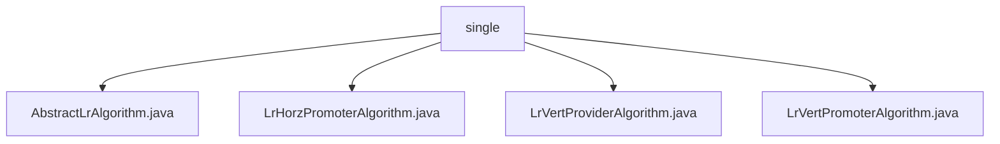

# Basic Information

|      |      |
|------|------|
| Name | single |
| Language | .java |
| Code Path | WeFe/serving/serving-sdk-java/src/main/java/com/welab/wefe/serving/sdk/algorithm/lr/single |
| Package Name | docs.serving.serving-sdk-java.src.main.java.com.welab.wefe.serving.sdk.algorithm.lr.single |
| Brief Description | The abstract class AbstractLrAlgorithm extends AbstractAlgorithm, implementing the core logic of logistic regression, including methods such as prediction calculation and score adjustment. LrHorzPromoterAlgorithm handles local computation and standardization. LrVertProviderAlgorithm performs local computation and clears sensitive data. LrVertPromoterAlgorithm merges remote results and normalizes them. |

# Description

## Overview  
The core responsibility of this module is to implement the prediction process of the logistic regression algorithm, including local computation, score adjustment, and result merging. The interface specifications uniformly handle prediction parameters through the `handle` method, supporting local computation (`localCompute`) and result standardization (`normalize`). Key data structures include `LrPredictResultModel` (for storing prediction results) and `PredictParams` (for prediction parameters). External dependencies include `JObject` (a JSON processing library) and `AbstractAlgorithm` (the algorithm base class). For example, score adjustment involves Sigmoid transformation and intercept handling.  

## Main Business Scenarios  
The business process is divided into three categories: the Promoter side (`LrHorzPromoterAlgorithm`) performs local computation and error checking; the Provider side (`LrVertProviderAlgorithm`) clears sensitive data after computation; and the VertPromoter side (`LrVertPromoterAlgorithm`) merges remote results and normalizes them. The interaction mode resembles distributed computing, where local processing precedes collaborative integration. Typical applications include scorecard model predictions (e.g., `baseScore` adjustment) and non-scorecard models (e.g., Sigmoid transformation). The API types are all prediction interfaces, and integration cases cover both horizontal and vertical federated scenarios.

### Package Internal Structure View

This flowchart illustrates the file structure relationships within the LR algorithm directory. The root node is the "single" directory, which contains four Java implementation files: an abstract base class AbstractLrAlgorithm and three concrete implementation classes (LrHorzPromoterAlgorithm, LrVertProviderAlgorithm, and LrVertPromoterAlgorithm), clearly reflecting the inheritance and extension relationships of the algorithm implementations.

# File List

| Name   | Type  | Description |
|-------|------|-------------|
| [AbstractLrAlgorithm.java](AbstractLrAlgorithm.md) | file | The abstract class AbstractLrAlgorithm implements logistic regression prediction, encompassing local computation, normalization processing (scorecard judgment, intercept adjustment, Sigmoid transformation), and basic score calculation functionalities. |
| [LrHorzPromoterAlgorithm.java](LrHorzPromoterAlgorithm.md) | file | LrHorzPromoterAlgorithm inherits from AbstractLrAlgorithm, overrides the handle method, first computes prediction results locally, returns if errors occur, otherwise returns after normalization. |
| [LrVertProviderAlgorithm.java](LrVertProviderAlgorithm.md) | file | LrVertProviderAlgorithm inherits from AbstractLrAlgorithm, overriding the handle method to perform local computations and mask sensitive data (clearing the scoreCard). |
| [LrVertPromoterAlgorithm.java](LrVertPromoterAlgorithm.md) | file | LrVertPromoterAlgorithm inherits from AbstractLrAlgorithm, processes prediction parameters and federated results, merges remote scores and normalizes the return. Throws exceptions or returns results when errors occur. |

