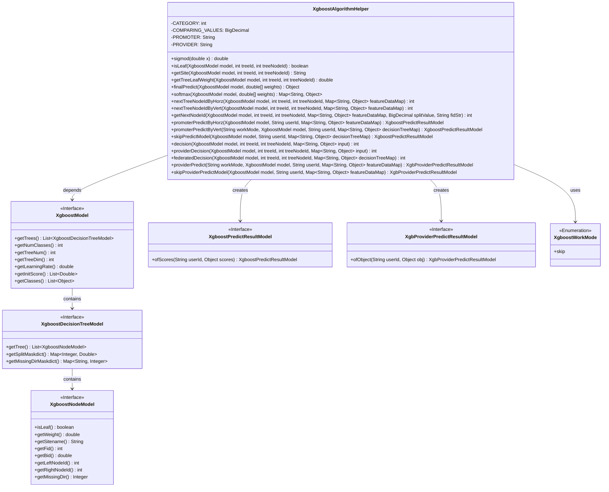
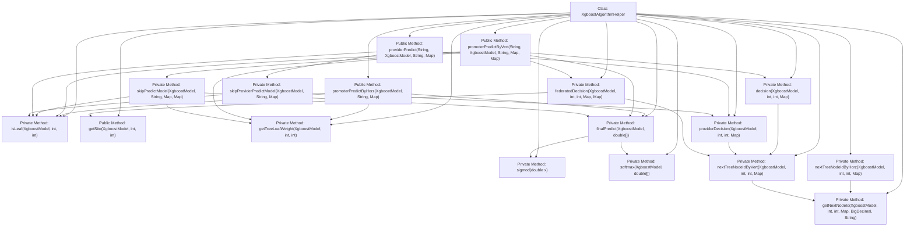

# Basic Information

|      |      |
|------|------|
| Name | XgboostAlgorithmHelper |
| Language | .java |
| Code Path | WeFe/serving/serving-sdk-java/src/main/java/com/welab/wefe/serving/sdk/algorithm/xgboost/XgboostAlgorithmHelper.java |
| Package Name | com.welab.wefe.serving.sdk.algorithm.xgboost |
| Dependencies | ['java.lang.Math.exp', 'java.math.BigDecimal', 'java.util.ArrayList', 'java.util.HashMap', 'java.util.Map', 'org.apache.commons.collections4.MapUtils', 'org.apache.commons.lang3.ObjectUtils', 'com.alibaba.fastjson.util.TypeUtils', 'com.welab.wefe.serving.sdk.enums.XgboostWorkMode', 'com.welab.wefe.serving.sdk.model.xgboost.XgbProviderPredictResultModel', 'com.welab.wefe.serving.sdk.model.xgboost.XgboostDecisionTreeModel', 'com.welab.wefe.serving.sdk.model.xgboost.XgboostModel', 'com.welab.wefe.serving.sdk.model.xgboost.XgboostNodeModel', 'com.welab.wefe.serving.sdk.model.xgboost.XgboostPredictResultModel'] |
| Brief Description | The XgboostAlgorithmHelper class provides XGBoost model prediction capabilities, including sigmoid activation, node judgment, weight acquisition, horizontal/vertical federated prediction, and softmax multi-class processing. It supports local and joint decision-making for initiators and collaborators, adapting to different working modes. |

# Description

The `XgboostAlgorithmHelper` class provides prediction-related functionalities for XGBoost models, encompassing decision logic for both horizontal and vertical federated learning scenarios. Key features include determining whether a node is a leaf node, obtaining node weights, computing sigmoid and softmax results, handling feature data mapping, and performing local or joint decision-making based on the working mode. It supports binary classification, multi-class classification, and regression tasks by traversing the tree structure to obtain leaf node weights and aggregating the final prediction results. The class defines node traversal logic for horizontal and vertical federated settings, processes missing-value paths, and distinguishes between the prediction workflows of the initiator and collaborators. It also includes special handling logic for the `skip` working mode to accommodate diverse scenario requirements.

# Class Summary

| Name   | Type  | Description |
|-------|------|-------------|
| XgboostAlgorithmHelper | class | The XgboostAlgorithmHelper class provides XGBoost model prediction capabilities, including sigmoid and softmax calculations, node judgment, weight retrieval, horizontal and vertical federated prediction, and collaborator prediction methods. It supports binary classification, multiclass classification, and regression tasks. |

## Class XgboostAlgorithmHelper

|      |      |
|------|------|
| Access Modifier | public |
| Type | class |
| Name | XgboostAlgorithmHelper |
| Description | The XgboostAlgorithmHelper class provides XGBoost model prediction capabilities, including sigmoid and softmax calculations, node judgment, weight retrieval, horizontal and vertical federated prediction, and collaborator prediction methods. It supports binary classification, multiclass classification, and regression tasks. |

### UML Class Diagram

This code represents an XGBoost algorithm helper class primarily designed for handling XGBoost model predictions in federated learning scenarios. It provides multiple prediction methods (horizontal/vertical federation, skip mode) and includes core prediction logic such as node traversal, weight calculation, sigmoid/softmax conversion, etc. The class diagram illustrates dependencies with XGBoost-related interfaces, including model structure, decision trees, nodes, along with associations to prediction results and enumeration types. The class encapsulates the complete prediction workflow, supporting collaborative prediction requirements across different federated learning modes.

### Internal Method Call Graph

This flowchart illustrates the main method invocation relationships within the XgboostAlgorithmHelper class. The core logic revolves around the prediction workflow of XGBoost models, including prediction paths for horizontal/vertical federated learning, leaf node determination, weight calculation, and final prediction result aggregation. Key paths involve two primary prediction entry points: promoterPredictByHorz and promoterPredictByVert, which implement distributed prediction through decision tree traversal and federated decision mechanisms. The flowchart clearly depicts hierarchical method call relationships, particularly highlighting finalPredict as the core method for merging prediction results, which invokes sigmod and softmax for probability calculations.

### Field List

| Name  | Type  | Description |
|-------|-------|------|
| COMPARING_VALUES = BigDecimal.valueOf(1e-17) | BigDecimal | Defined a static immutable BigDecimal constant COMPARING_VALUES with a value of 1 multiplied by 10 to the power of -17, used for comparison operations. |
| PROMOTER = "promoter" | String | Define a private static constant PROMOTER with the value "promoter". |
| PROVIDER = "provider" | String | Defined a private static constant string variable PROVIDER with the value "provider". |
| CATEGORY = 2 | int | Define a private static constant CATEGORY with a value of 2. |

### Method List

| Name  | Type  | Description |
|-------|-------|------|
| nextTreeNodeIdByHorz | int | This method calculates the next horizontal node ID of a specified tree node in the XGBoost model based on feature data mapping. By obtaining the feature ID and split value of the current node, it calls an internal method to determine the next node. |
| nextTreeNodeIdByVert | int | This method calculates the next node ID for the current node based on the XGBoost model, tree ID, node ID, and feature data. It first retrieves the feature ID and split value. If a split mask dictionary exists, the values are taken from it; otherwise, the default node values are used. Finally, it calls getNextNodeId to return the result. |
| softmax | Map<String, Object> | This method implements the softmax function, calculates the probability distribution of the weight array, and returns the label with the highest probability along with all scores. |
| isLeaf | boolean | Check if a specified tree node in an XGBoost model is a leaf node. |
| promoterPredictByHorz | XgboostPredictResultModel | The static method `promoterPredictByHorz` uses an XGBoost model to predict results. It traverses the model's tree nodes to obtain leaf nodes, calculates weights, and returns the prediction score. The input consists of the model, user ID, and feature data, while the output is a prediction result object. |
| decision | int | This method traverses tree nodes based on the decision path of the XGBoost model until encountering a leaf node or non-PROMOTER node, then returns the final node ID. |
| skipPredictModel | XgboostPredictResultModel | This method bypasses the prediction model, traverses the decision tree to obtain node IDs and weights, and ultimately returns the user ID and prediction score. |
| getTreeLeafWeight | double | This method is used to retrieve the weight value of a specified tree node in an XGBoost model. The input parameters are the model object, tree ID, and node ID, and it returns the weight of the corresponding node. |
| finalPredict | Object | The method `finalPredict` processes predictions based on the number of classes in `XgboostModel`: for binary classification, it returns the sigmoid result; for multiclass classification, it returns the softmax result; and for regression, it returns the weighted sum. |
| promoterPredictByVert | XgboostPredictResultModel | This method is based on the XGBoost model for prediction and supports skip mode to bypass processing. In non-skip mode, it traverses the decision trees through local and federated decision-making, obtains leaf node weights, and calculates the final prediction result. |
| federatedDecision | int | This method implements federated decision logic, determining path selection based on model and node types until a leaf node returns an ID. |
| getNextNodeId | int | The method determines the next node ID of the XGBoost model based on feature value comparison: if the feature exists and is less than the split value, return the left node; otherwise, return the right node. If the feature is missing, return the corresponding node according to the missing direction, with the right node returned by default. |
| providerDecision | int | This method traverses the decision tree of the XGBoost model, starting from a specified node, determines the path based on input data until reaching a leaf node, and returns its ID. |
| providerPredict | XgbProviderPredictResultModel | The static method `providerPredict` processes predictions based on the working mode: in skip mode, it calls `skipProviderPredictModel`; otherwise, it traverses the model decision tree to generate prediction results. Key steps include feature comparison and missing value handling, ultimately returning the user ID and prediction results. |
| getSite | String | Retrieve the site name of the first part for a specified tree node in the Xgboost model. |
| sigmod | double | The code defines a static method sigmod, which is used to calculate the sigmoid function value of the input x, with the formula being 1/(1+e^(-x)). |
| skipProviderPredictModel | XgbProviderPredictResultModel | The method `skipProviderPredictModel` skips predictions for specific providers based on the XGBoost model. It traverses the model tree, checks whether a node is a leaf node or a non-target provider, executes local decisions, and records the results. Finally, it returns a model object containing the user ID and decision result. |

