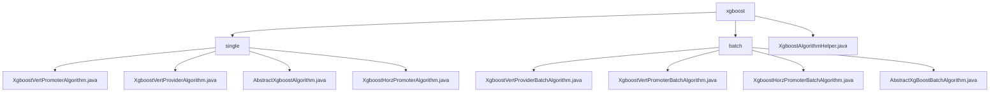

# Basic Information

|      |      |
|------|------|
| Name | xgboost |
| Language | .java |
| Code Path | WeFe/serving/serving-sdk-java/src/main/java/com/welab/wefe/serving/sdk/algorithm/xgboost |
| Package Name | docs.serving.serving-sdk-java.src.main.java.com.welab.wefe.serving.sdk.algorithm.xgboost |
| Brief Description | This module implements XGBoost federated prediction, supporting vertical/horizontal federated modes, integrating multi-party decision tree structures and performing joint predictions. Core functionalities include feature mapping, multi-threaded parallel computing, and result aggregation, relying on the XGBoost framework and federated learning tools. |

# Description

## Overview  
This module implements federated prediction functionality based on XGBoost, supporting both single-instance and batch prediction scenarios. Its core responsibilities include integrating multi-party decision tree structures (e.g., vertical/horizontal federated modes) and executing joint predictions. The interface specification requires the implementation of the `handlePredict` method, which utilizes the `XgboostAlgorithmHelper` utility class to perform predictions, including feature mapping transformation (`setFidValueMapping`) and federated result parsing (`getFederatedPredict`). Key data structures encompass `fidValueMapping` feature ID mapping, the `XgboostPredictResultModel` result model, and thread-safe collections. External dependencies include the XGBoost framework, multi-thread synchronization tools (e.g., `CountDownLatch`), and federated learning frameworks (e.g., WeFe). For example, `XgboostVertPromoterAlgorithm` merges multi-party tree structures, while `XgboostHorzPromoterBatchAlgorithm` handles multi-threaded horizontal federated prediction.

## Primary Business Scenarios  
The module supports prediction workflows for both vertical and horizontal federated learning, resembling a hybrid model of distributed decision engines and MapReduce. A typical workflow involves: initializing feature mapping → parallel multi-threaded computation → aggregating collaborator data → returning results. The interaction model follows the "Promoter-Provider" architecture, where the Promoter synchronizes threads via `CountDownLatch`, and the Provider supplies feature data or model parameters. For instance, vertical federated learning parses remote tree structures, while horizontal federated learning synchronizes model parameters. Functional completeness is demonstrated through support for binary/multi-class classification, regression tasks, missing value handling, and special logic for skip modes. API types cover single-instance prediction, batch interfaces, and federated result parsing interfaces.

### Package Internal Structure View

This flowchart illustrates the hierarchical structure of the XGBoost algorithm module, which includes two subdirectories (single and batch) along with their corresponding implementation class files. The single directory contains 4 standalone algorithm implementation classes, while the batch directory contains 4 batch processing algorithm implementation classes and 1 abstract base class. Additionally, there is 1 algorithm utility helper class in the root directory.

# File List

| Name   | Type  | Description |
|-------|------|-------------|
| [XgboostAlgorithmHelper.java](XgboostAlgorithmHelper.md) | file | The XgboostAlgorithmHelper class provides XGBoost model prediction capabilities, including sigmoid activation, node judgment, weight acquisition, horizontal/vertical federated prediction, and softmax multi-class processing. It supports local and joint decision-making for both initiators and collaborators, adapting to different working modes. |
| [batch](batch/_module.md) | package | The XgboostVertProviderBatchAlgorithm class handles batch prediction, computes node results in multi-threading, and stores results using CopyOnWriteArrayList. The XgboostVertPromoterBatchAlgorithm class parses federated decision tree results, performs multi-threaded prediction, and synchronizes threads. The XgboostHorzPromoterBatchAlgorithm class conducts parallel prediction with multi-threading, logs events, and handles exceptions. The AbstractXgBoostBatchAlgorithm is an abstract base class that manages feature mapping and defines the batch prediction framework. |
| [single](single/_module.md) | package | The XgboostVertPromoterAlgorithm class handles XGBoost vertical federated prediction, extracting decision tree structures and merging them. The XgboostVertProviderAlgorithm class overrides the prediction method, checking feature mappings before invoking the prediction logic. AbstractXgboostAlgorithm serves as the abstract base class, setting feature mappings and defining the prediction workflow. The XgboostHorzPromoterAlgorithm class manages horizontal federated prediction, verifying feature mappings before calling the prediction method. |

