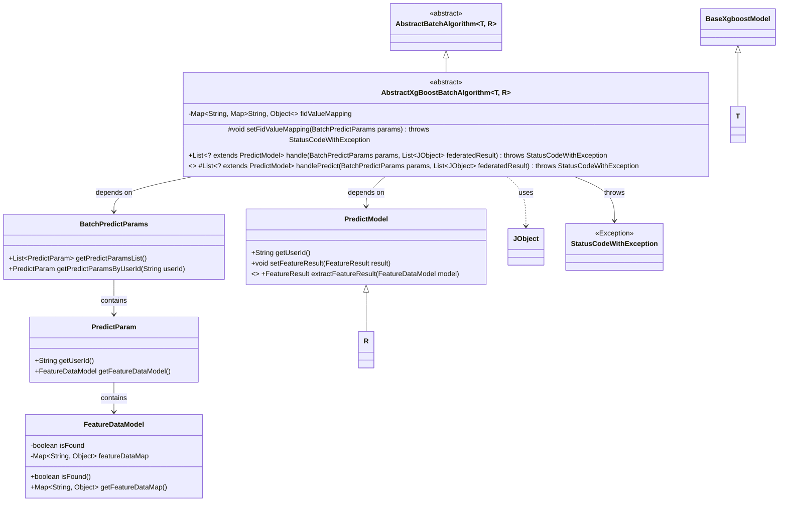

# Basic Information

|      |      |
|------|------|
| Name | AbstractXgBoostBatchAlgorithm |
| Language | .java |
| Code Path | WeFe/serving/serving-sdk-java/src/main/java/com/welab/wefe/serving/sdk/algorithm/xgboost/batch/AbstractXgBoostBatchAlgorithm.java |
| Package Name | com.welab.wefe.serving.sdk.algorithm.xgboost.batch |
| Dependencies | ['com.welab.wefe.common.exception.StatusCodeWithException', 'com.welab.wefe.common.util.JObject', 'com.welab.wefe.serving.sdk.algorithm.AbstractBatchAlgorithm', 'com.welab.wefe.serving.sdk.dto.BatchPredictParams', 'com.welab.wefe.serving.sdk.model.PredictModel', 'com.welab.wefe.serving.sdk.model.xgboost.BaseXgboostModel', 'java.util.HashMap', 'java.util.List', 'java.util.Map', 'java.util.stream.Collectors'] |
| Brief Description | The abstract class `AbstractXgBoostBatchAlgorithm` implements batch prediction algorithms, encompassing feature mapping transformation and prediction processing methods, while supporting customizable model execution logic. |

# Description

This is an abstract class named AbstractXgBoostBatchAlgorithm, which inherits from AbstractBatchAlgorithm and is used to implement the XGBoost batch prediction algorithm. The class contains a fidValueMapping that stores the correspondence between user IDs and feature data. The setFidValueMapping method is responsible for converting feature names into feature ID format and populating fidValueMapping. The handle method processes batch prediction parameters, calls the abstract method handlePredict to execute model prediction, and sets the feature results into the prediction model. handlePredict is an abstract method that requires subclasses to implement specific prediction logic.

# Class Summary

| Name   | Type  | Description |
|-------|------|-------------|
| AbstractXgBoostBatchAlgorithm | class | AbstractXgBoostBatchAlgorithm is an abstract batch processing algorithm class designed for XGBoost model prediction. It includes feature value mapping transformation and prediction processing methods, supporting batch prediction and returning results. |

## Class AbstractXgBoostBatchAlgorithm

|      |      |
|------|------|
| Access Modifier | public abstract |
| Type | class |
| Name | AbstractXgBoostBatchAlgorithm |
| Description | AbstractXgBoostBatchAlgorithm is an abstract batch processing algorithm class designed for XGBoost model prediction. It includes feature value mapping transformation and prediction processing methods, supporting batch prediction and returning results. |

### UML Class Diagram

This class diagram illustrates an abstract class `AbstractXgBoostBatchAlgorithm` that inherits from `AbstractBatchAlgorithm` with generic parameters T and R. Its primary function is to handle batch prediction tasks, including feature value mapping setup and prediction result processing. The diagram clearly shows inheritance, dependency, and association relationships between classes, including relationships with parameter classes, model classes, and exception classes. The core method `handle` coordinates the entire prediction workflow, while `handlePredict` serves as an abstract method requiring subclasses to implement specific prediction logic.

### Internal Method Call Graph

This flowchart illustrates the core process of XGBoost batch prediction algorithm. The abstract class contains feature value mapping storage and three key methods: a private method for initializing feature mappings, a main processing method for predictions, and an abstract prediction method to be implemented by subclasses. The main flow first transforms feature key name formats, then invokes concrete model implementations for prediction, and finally attaches feature processing results to the prediction model object. The entire process demonstrates a decoupled design between feature preprocessing and model prediction, supporting concrete implementations through abstract methods in different subclasses.

### Field List

| Name  | Type  | Description |
|-------|-------|------|
| fidValueMapping = new HashMap<>() | Map<String, Map<String, Object>> | Defined a nested hash map variable `fidValueMapping`, where the outer key is a string and the inner mapping is from strings to objects. |

### Method List

| Name  | Type  | Description |
|-------|-------|------|
| setFidValueMapping | void | The method reverses the mapping relationship between feature names and FIDs in the model parameters and stores it in a temporary Map. It then iterates through the prediction parameter list. If feature data exists, it filters out the key-value pairs that match the temporary Map and stores them in the result mapping; otherwise, it stores an empty Map. Finally, it stores the result with the user ID as the key. |
| handle | List<? extends PredictModel> | The method overrides batch prediction processing, sets FID mapping, invokes prediction handling, iterates through results and sets feature outcomes, and finally returns the list of prediction models. |
| handlePredict | List<? extends PredictModel> | The abstract method `handlePredict` handles batch prediction, accepts parameters of `BatchPredictParams` and a list of combined results, returns a list of `PredictModel` subclasses, and may throw a `StatusCodeWithException` exception. |

