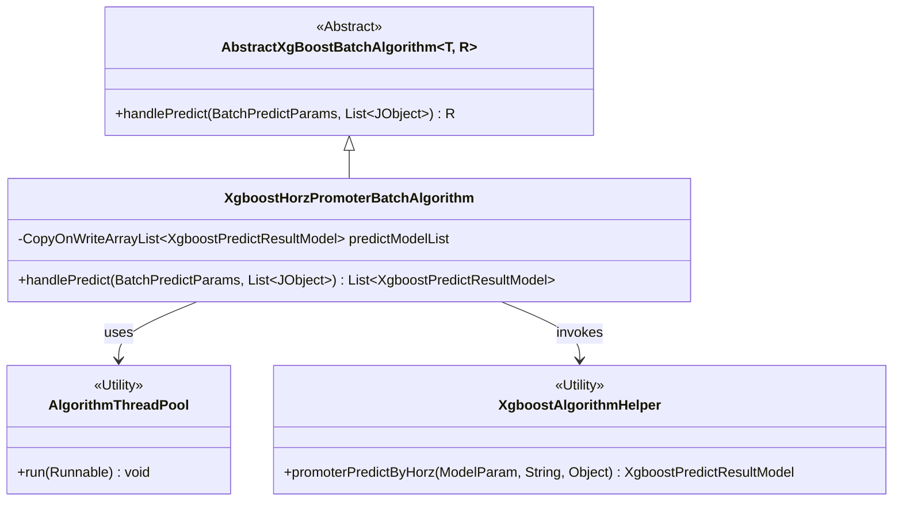
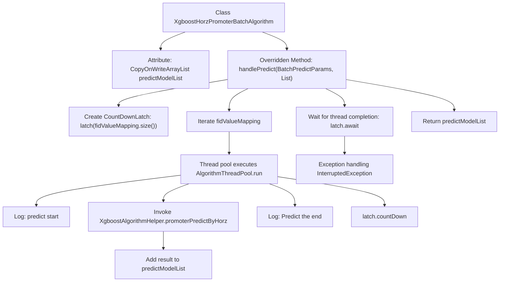

# Basic Information

|      |      |
|------|------|
| Name | XgboostHorzPromoterBatchAlgorithm |
| Language | .java |
| Code Path | WeFe/serving/serving-sdk-java/src/main/java/com/welab/wefe/serving/sdk/algorithm/xgboost/batch/XgboostHorzPromoterBatchAlgorithm.java |
| Package Name | com.welab.wefe.serving.sdk.algorithm.xgboost.batch |
| Dependencies | ['com.welab.wefe.common.util.JObject', 'com.welab.wefe.serving.sdk.algorithm.xgboost.XgboostAlgorithmHelper', 'com.welab.wefe.serving.sdk.dto.BatchPredictParams', 'com.welab.wefe.serving.sdk.model.xgboost.BaseXgboostModel', 'com.welab.wefe.serving.sdk.model.xgboost.XgboostPredictResultModel', 'com.welab.wefe.serving.sdk.utils.AlgorithmThreadPool', 'java.util.List', 'java.util.concurrent.CopyOnWriteArrayList', 'java.util.concurrent.CountDownLatch'] |
| Brief Description | The XgboostHorzPromoterBatchAlgorithm class implements multi-threaded horizontal federated prediction, using CountDownLatch to synchronize threads and returns a list of prediction results. |

# Description

The `XgboostHorzPromoterBatchAlgorithm` class inherits from `AbstractXgBoostBatchAlgorithm` and is designed for handling batch prediction tasks. This class maintains a thread-safe list `predictModelList` of `XgboostPredictResultModel`. In the `handlePredict` method, it calculates the prediction results for each node in parallel using a multi-threaded approach, with `CountDownLatch` synchronizing the threads. Each thread invokes the `promoterPredictByHorz` method of `XgboostAlgorithmHelper` to perform predictions and adds the results to `predictModelList`. The method ultimately returns a list containing all prediction results. During execution, logs are recorded for the start and end of predictions, and any potential exceptions are caught.

# Class Summary

| Name   | Type  | Description |
|-------|------|-------------|
| XgboostHorzPromoterBatchAlgorithm | class | The XgboostHorzPromoterBatchAlgorithm class inherits from AbstractXgBoostBatchAlgorithm, processes prediction tasks through multithreading, uses CountDownLatch to synchronize threads, and returns a list of prediction results. |

## Class XgboostHorzPromoterBatchAlgorithm

|      |      |
|------|------|
| Access Modifier | public |
| Type | class |
| Name | XgboostHorzPromoterBatchAlgorithm |
| Description | The XgboostHorzPromoterBatchAlgorithm class inherits from AbstractXgBoostBatchAlgorithm, processes prediction tasks through multithreading, uses CountDownLatch to synchronize threads, and returns a list of prediction results. |

### UML Class Diagram

This class diagram illustrates that XgboostHorzPromoterBatchAlgorithm inherits from the generic abstract class AbstractXgBoostBatchAlgorithm and implements multi-threaded prediction functionality. Key components include: 1) Utilizing AlgorithmThreadPool for parallel prediction task processing; 2) Executing specific prediction logic through the utility class XgboostAlgorithmHelper; 3) Maintaining a thread-safe prediction result list predictModelList. The design implements the batch prediction workflow for the Promoter party in horizontal federated learning, using CountDownLatch to ensure aggregated results are returned after all threads complete.

### Internal Method Call Graph

This flowchart illustrates the core prediction process of the XgboostHorzPromoterBatchAlgorithm class. It employs multithreading to parallelly process each key-value pair in fidValueMapping, invokes XgboostAlgorithmHelper for prediction, and collects results into the thread-safe predictModelList. The main thread waits for all child threads to complete via CountDownLatch before returning the aggregated prediction results. The entire process incorporates logging and exception handling mechanisms to ensure reliable execution of distributed prediction tasks.

### Field List

| Name  | Type  | Description |
|-------|-------|------|
| predictModelList = new CopyOnWriteArrayList<>() | CopyOnWriteArrayList<XgboostPredictResultModel> | Declare a thread-safe CopyOnWriteArrayList to store prediction models of type XgboostPredictResultModel. |

### Method List

| Name  | Type  | Description |
|-------|-------|------|
| handlePredict | List<XgboostPredictResultModel> | The method handles batch prediction by utilizing multi-threaded computing nodes to execute XGBoost predictions in parallel, synchronizing threads via CountDownLatch, and returning the prediction result list upon completion. |

