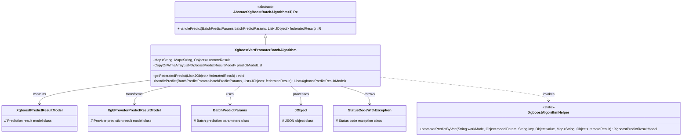
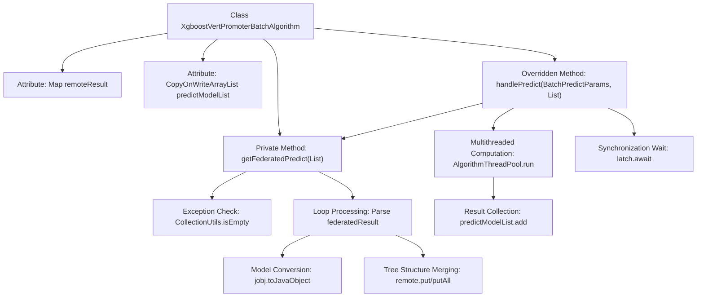

# Basic Information

|      |      |
|------|------|
| Name | XgboostVertPromoterBatchAlgorithm |
| Language | .java |
| Code Path | WeFe/serving/serving-sdk-java/src/main/java/com/welab/wefe/serving/sdk/algorithm/xgboost/batch/XgboostVertPromoterBatchAlgorithm.java |
| Package Name | com.welab.wefe.serving.sdk.algorithm.xgboost.batch |
| Dependencies | ['com.welab.wefe.common.StatusCode', 'com.welab.wefe.common.exception.StatusCodeWithException', 'com.welab.wefe.common.util.JObject', 'com.welab.wefe.serving.sdk.algorithm.xgboost.XgboostAlgorithmHelper', 'com.welab.wefe.serving.sdk.dto.BatchPredictParams', 'com.welab.wefe.serving.sdk.enums.XgboostWorkMode', 'com.welab.wefe.serving.sdk.model.xgboost.BaseXgboostModel', 'com.welab.wefe.serving.sdk.model.xgboost.XgbProviderPredictResultModel', 'com.welab.wefe.serving.sdk.model.xgboost.XgboostPredictResultModel', 'com.welab.wefe.serving.sdk.utils.AlgorithmThreadPool', 'org.apache.commons.collections4.CollectionUtils', 'org.apache.commons.collections4.MapUtils', 'java.util.HashMap', 'java.util.List', 'java.util.Map', 'java.util.concurrent.CopyOnWriteArrayList', 'java.util.concurrent.CountDownLatch'] |
| Brief Description | The `XgboostVertPromoterBatchAlgorithm` class implements federated XGBoost prediction. It processes the decision tree results returned by collaborators through the `getFederatedPredict` method, computes node prediction results in a multi-threaded manner, and aggregates them. |

# Description

The code defines a class named `XgboostVertPromoterBatchAlgorithm`, which inherits from `AbstractXgBoostBatchAlgorithm` and is used for batch prediction tasks of XGBoost models. The class contains two main member variables: `remoteResult` stores the data returned from federated prediction, while `predictModelList` stores prediction result models in a thread-safe manner. The core method `getFederatedPredict` is responsible for parsing the federated decision tree results returned by collaborators, converting them into a specific structure, and storing them in `remoteResult`. The `handlePredict` method invokes `XgboostAlgorithmHelper` for prediction calculations in a multi-threaded manner, using `CountDownLatch` to synchronize threads, and ultimately returns a list of prediction results. The entire process includes an exception handling mechanism to ensure that exceptions such as remote service errors and null results can be captured and handled.

# Class Summary

| Name   | Type  | Description |
|-------|------|-------------|
| XgboostVertPromoterBatchAlgorithm | class | The XgboostVertPromoterBatchAlgorithm class implements federated XGBoost prediction. It processes the decision tree data returned by collaborators through the getFederatedPredict method, calculates node prediction results in a multi-threaded manner, and aggregates the results for return. |

## Class XgboostVertPromoterBatchAlgorithm

|      |      |
|------|------|
| Access Modifier | public |
| Type | class |
| Name | XgboostVertPromoterBatchAlgorithm |
| Description | The XgboostVertPromoterBatchAlgorithm class implements federated XGBoost prediction. It processes the decision tree data returned by collaborators through the getFederatedPredict method, calculates node prediction results in a multi-threaded manner, and aggregates the results for return. |

### UML Class Diagram

This code demonstrates an implementation of XGBoost vertical federated learning batch prediction algorithm. XgboostVertPromoterBatchAlgorithm inherits from the abstract class AbstractXgBoostBatchAlgorithm and is primarily responsible for handling federated prediction tasks. It parses collaborators' prediction results through the getFederatedPredict method and utilizes multi-threading to invoke XgboostAlgorithmHelper for local prediction computation. The class diagram clearly illustrates relationships between core classes, including dependencies among data model classes, parameter classes, and utility classes, reflecting the processing flow of prediction tasks in federated learning scenarios.

### Internal Method Call Graph

This flowchart illustrates the core process of the Xgboost vertical federated prediction algorithm. First, the getFederatedPredict method parses the decision tree data returned by collaborators, performing data validation and structure merging. Then, the handlePredict method initiates multithreaded computation for node prediction tasks, using CountDownLatch for thread synchronization, and finally collects the prediction results into the thread-safe predictModelList. The entire process includes key steps such as data validation, tree structure processing, parallel computation, and thread synchronization.

### Field List

| Name  | Type  | Description |
|-------|-------|------|
| remoteResult = new HashMap<>() | Map<String, Map<String, Object>> | Define remote result mapping: keys as strings, values as nested mappings (string keys, object values). |
| predictModelList = new CopyOnWriteArrayList<>() | CopyOnWriteArrayList<XgboostPredictResultModel> | Private thread-safe list for storing XGBoost prediction result models, utilizing copy-on-write mechanism. |

### Method List

| Name  | Type  | Description |
|-------|-------|------|
| getFederatedPredict | void | Method checks the federated learning results, throwing an exception if empty. Iterates through the result set and processes prediction model data, merging tree structures into the remote result mapping. Reports an error if the final result is empty. |
| handlePredict | List<XgboostPredictResultModel> | This method handles batch prediction by executing XGBoost prediction tasks in parallel across multiple computing nodes via multithreading, using CountDownLatch to synchronize threads, and ultimately returning a list of prediction results. |

