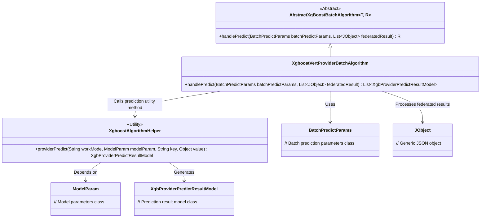
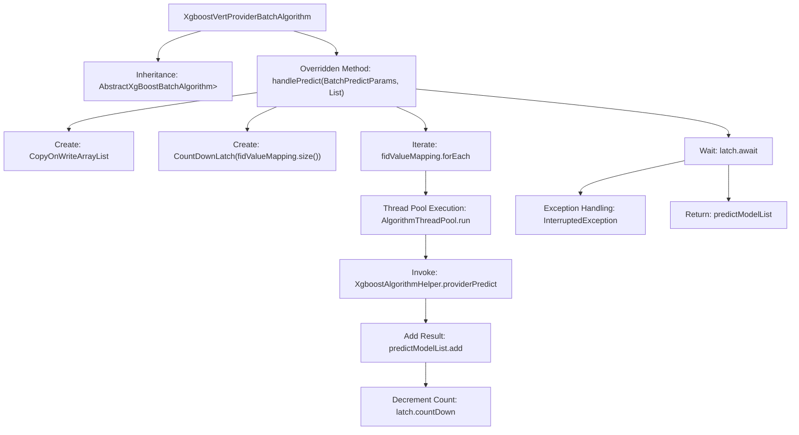

# Basic Information

|      |      |
|------|------|
| Name | XgboostVertProviderBatchAlgorithm |
| Language | .java |
| Code Path | WeFe/serving/serving-sdk-java/src/main/java/com/welab/wefe/serving/sdk/algorithm/xgboost/batch/XgboostVertProviderBatchAlgorithm.java |
| Package Name | com.welab.wefe.serving.sdk.algorithm.xgboost.batch |
| Dependencies | ['com.welab.wefe.common.util.JObject', 'com.welab.wefe.serving.sdk.algorithm.xgboost.XgboostAlgorithmHelper', 'com.welab.wefe.serving.sdk.dto.BatchPredictParams', 'com.welab.wefe.serving.sdk.model.xgboost.BaseXgboostModel', 'com.welab.wefe.serving.sdk.model.xgboost.XgbProviderPredictResultModel', 'com.welab.wefe.serving.sdk.utils.AlgorithmThreadPool', 'java.util.List', 'java.util.concurrent.CopyOnWriteArrayList', 'java.util.concurrent.CountDownLatch'] |
| Brief Description | The XgboostVertProviderBatchAlgorithm class inherits from AbstractXgBoostBatchAlgorithm, processes batch prediction tasks through multithreading, uses CountDownLatch to synchronize threads, and ultimately returns a list of prediction results. |

# Description

The content describes a class named XgboostVertProviderBatchAlgorithm, which inherits from AbstractXgBoostBatchAlgorithm. This class overrides the handlePredict method to handle batch prediction tasks. The method takes BatchPredictParams parameters and a federatedResult list, computing node prediction results in a multi-threaded manner. It uses CopyOnWriteArrayList to store prediction result models and ensures all threads complete via CountDownLatch. Each thread calls the XgboostAlgorithmHelper.providerPredict method to generate prediction results, ultimately returning a list of prediction models. If a thread is interrupted, an error log is recorded.

# Class Summary

| Name   | Type  | Description |
|-------|------|-------------|
| XgboostVertProviderBatchAlgorithm | class | The XgboostVertProviderBatchAlgorithm class processes batch prediction tasks using multiple threads, synchronizes the threads with CountDownLatch, and ultimately returns a list of prediction results. |

## Class XgboostVertProviderBatchAlgorithm

|      |      |
|------|------|
| Access Modifier | public |
| Type | class |
| Name | XgboostVertProviderBatchAlgorithm |
| Description | The XgboostVertProviderBatchAlgorithm class processes batch prediction tasks using multiple threads, synchronizes the threads with CountDownLatch, and ultimately returns a list of prediction results. |

### UML Class Diagram

This code demonstrates an XGBoost-based batch prediction algorithm implementation, inheriting from the abstract base class `AbstractXgBoostBatchAlgorithm`. The core method `handlePredict` employs multi-threaded parallel processing for prediction tasks, synchronizes threads via `CountDownLatch`, and ultimately returns a list of prediction results. The class diagram clearly illustrates the dependencies between the algorithm, parameter classes, and utility classes, as well as the inheritance hierarchy, reflecting the distributed prediction task processing flow and key component interactions.

### Internal Method Call Graph

This flowchart describes the execution process of the `handlePredict` method in the `XgboostVertProviderBatchAlgorithm` class. The method processes prediction tasks in parallel using multithreading, synchronizes threads with `CountDownLatch`, and ultimately returns a collection of prediction results. Key steps include: initializing a thread-safe collection and counter, iterating through a mapping table to submit thread tasks, each thread invoking a prediction helper class and collecting results, the main thread waiting for all tasks to complete, and finally returning the result list or handling interruption exceptions. This design is suitable for high-concurrency prediction scenarios, ensuring thread safety and task synchronization.

### Field List

| Name  | Type  | Description |
|-------|-------|------|

### Method List

| Name  | Type  | Description |
|-------|-------|------|
| handlePredict | List<XgbProviderPredictResultModel> | This method employs multi-threading to handle batch prediction tasks, utilizing a thread pool to compute each node's prediction results in parallel. It synchronizes threads using CountDownLatch and ultimately returns the collection of prediction results. Error logs are recorded in case of exceptions. |

