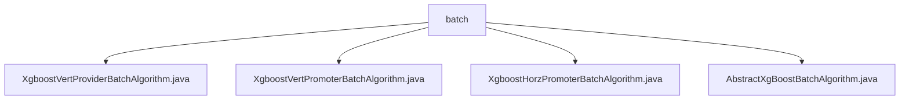

# Basic Information

|      |      |
|------|------|
| Name | batch |
| Language | .java |
| Code Path | WeFe/serving/serving-sdk-java/src/main/java/com/welab/wefe/serving/sdk/algorithm/xgboost/batch |
| Package Name | docs.serving.serving-sdk-java.src.main.java.com.welab.wefe.serving.sdk.algorithm.xgboost.batch |
| Brief Description | The XgboostVertProviderBatchAlgorithm class handles batch prediction, computes node results in multi-threading, and stores results using CopyOnWriteArrayList. The XgboostVertPromoterBatchAlgorithm class parses federated decision tree results, performs multi-threaded prediction, and synchronizes threads. The XgboostHorzPromoterBatchAlgorithm class conducts parallel prediction with multi-threading, logs events, and handles exceptions. The AbstractXgBoostBatchAlgorithm is an abstract base class that manages feature mapping and defines the batch prediction framework. |

# Description

## Overview  
The core responsibility of this module is to implement federated batch prediction for XGBoost models, supporting both horizontal and vertical federated learning scenarios. It handles prediction tasks through multi-threaded parallel computing and thread-safe data structures (e.g., CopyOnWriteArrayList), resembling a distributed task scheduling pattern.  

The interface specifications include: the `handlePredict` method processes batch prediction parameters and federated results, `getFederatedPredict` parses collaborator data, and `setFidValueMapping` converts feature ID formats. Key data structures consist of `XgboostPredictResultModel`, `fidValueMapping` mappings, and the `remoteResult` federated result set.  

External dependencies include the XGBoost algorithm library, multi-thread synchronization tools (e.g., `CountDownLatch`), and federated learning frameworks (e.g., WeFe). For instance, prediction methods are invoked via `XgboostAlgorithmHelper`, and `CountDownLatch` ensures thread synchronization.  

## Key Business Scenarios  
The module supports batch prediction workflows for both horizontal and vertical federated learning. A typical scenario involves: the initiator computes node prediction results through multi-threaded parallel processing and aggregates federated decision tree data returned by collaborators, akin to a MapReduce pattern. Examples include `XgboostVertPromoterBatchAlgorithm` parsing remote results and `XgboostHorzPromoterBatchAlgorithm` handling horizontal predictions.  

Interaction patterns include: threads synchronize via `CountDownLatch`, with results stored in thread-safe collections; an exception handling mechanism captures remote service errors. Functional completeness is demonstrated through support for ID feature mapping, multi-threaded prediction, and result aggregation. API types encompass batch prediction interfaces and federated result parsing interfaces.

### Package Internal Structure View

This flowchart illustrates the class file structure of the XGBoost batch algorithm module. The batch folder contains four Java class files: XgboostVertProviderBatchAlgorithm, XgboostVertPromoterBatchAlgorithm, XgboostHorzPromoterBatchAlgorithm, and the abstract base class AbstractXgBoostBatchAlgorithm. These classes collectively form the foundation for implementing batch processing of the XGBoost algorithm in both horizontal and vertical federated learning scenarios.

# File List

| Name   | Type  | Description |
|-------|------|-------------|
| [XgboostVertProviderBatchAlgorithm.java](XgboostVertProviderBatchAlgorithm.md) | file | The XgboostVertProviderBatchAlgorithm class inherits from AbstractXgBoostBatchAlgorithm, processes batch prediction tasks through multithreading, uses CountDownLatch to synchronize threads, and ultimately returns a list of prediction results. |
| [XgboostVertPromoterBatchAlgorithm.java](XgboostVertPromoterBatchAlgorithm.md) | file | The XgboostVertPromoterBatchAlgorithm class implements federated XGBoost prediction. It processes the decision tree results returned by collaborating parties through the getFederatedPredict method, calculates node prediction results in a multi-threaded manner, and aggregates them. |
| [XgboostHorzPromoterBatchAlgorithm.java](XgboostHorzPromoterBatchAlgorithm.md) | file | The XgboostHorzPromoterBatchAlgorithm class implements multi-threaded horizontal federated prediction, using CountDownLatch to synchronize threads and returns a list of prediction results. |
| [AbstractXgBoostBatchAlgorithm.java](AbstractXgBoostBatchAlgorithm.md) | file | The abstract class AbstractXgBoostBatchAlgorithm implements batch prediction algorithms, encompassing feature mapping transformation and prediction processing methods, with support for custom model execution logic. |

