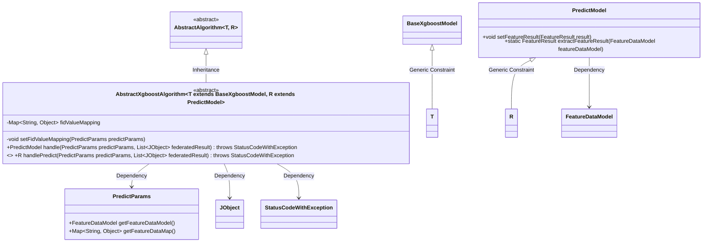
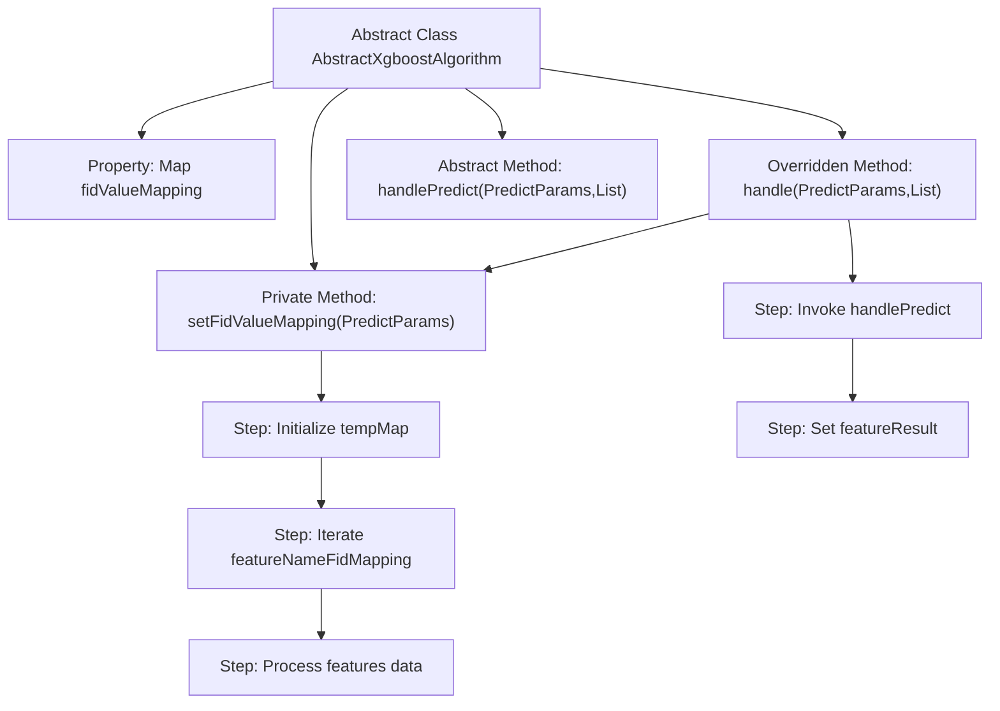

# Basic Information

|      |      |
|------|------|
| Name | AbstractXgboostAlgorithm |
| Language | .java |
| Code Path | WeFe/serving/serving-sdk-java/src/main/java/com/welab/wefe/serving/sdk/algorithm/xgboost/single/AbstractXgboostAlgorithm.java |
| Package Name | com.welab.wefe.serving.sdk.algorithm.xgboost.single |
| Dependencies | ['com.welab.wefe.common.exception.StatusCodeWithException', 'com.welab.wefe.common.util.JObject', 'com.welab.wefe.serving.sdk.algorithm.AbstractAlgorithm', 'com.welab.wefe.serving.sdk.dto.PredictParams', 'com.welab.wefe.serving.sdk.model.PredictModel', 'com.welab.wefe.serving.sdk.model.xgboost.BaseXgboostModel', 'java.util.HashMap', 'java.util.List', 'java.util.Map'] |
| Brief Description | Abstract the XGBoost algorithm class, including feature mapping conversion methods, to process prediction parameters and return results. Core methods consist of feature value mapping setup and abstract prediction processing. |

# Description

This is an abstract class `AbstractXgboostAlgorithm`, which inherits from `AbstractAlgorithm` and is used to implement the XGBoost algorithm. The class includes a feature mapping relationship `fidValueMapping`, where feature names are converted to ID format via the `setFidValueMapping` method. The main processing logic resides in the `handle` method, which first sets the feature mapping, then calls the abstract method `handlePredict` for prediction, and finally sets the prediction result. The `handlePredict` method requires subclasses to implement the specific prediction logic.

# Class Summary

| Name   | Type  | Description |
|-------|------|-------------|
| AbstractXgboostAlgorithm | class | The abstract class AbstractXgboostAlgorithm implements feature mapping transformation and prediction processing, including the feature value mapping method setFidValueMapping and the abstract prediction method handlePredict. |

## Class AbstractXgboostAlgorithm

|      |      |
|------|------|
| Access Modifier | public abstract |
| Type | class |
| Name | AbstractXgboostAlgorithm |
| Description | The abstract class AbstractXgboostAlgorithm implements feature mapping transformation and prediction processing, including the feature value mapping method setFidValueMapping and the abstract prediction method handlePredict. |

### UML Class Diagram

This code demonstrates an abstract class structure for XGBoost algorithms, where AbstractXgboostAlgorithm inherits from AbstractAlgorithm and implements core logic for feature mapping transformation and prediction processing. The class constrains model type and prediction result type through generic parameters T and R respectively, including feature value mapping handling (setFidValueMapping), main prediction flow (handle), and abstract prediction method (handlePredict). The class diagram clearly presents generic constraint relationships, inheritance hierarchy, and key dependencies, particularly interaction relationships with core components such as PredictParams and PredictModel. This design achieves separation between algorithm framework and concrete implementations, supporting standard prediction workflows for XGBoost models.

### Internal Method Call Graph

This flowchart illustrates the core structure and processing flow of the abstract class AbstractXgboostAlgorithm. The class contains a feature mapping property and key methods: the private method setFidValueMapping is used to transform feature key names, the handle method acts as the main flow controller by first executing feature mapping transformation, then invoking the abstract prediction method handlePredict, and finally setting the predicted feature data. The abstract method handlePredict requires subclass implementation of specific prediction logic, embodying the template method design pattern. The entire flow achieves a complete processing chain from raw features to standardized feature mapping, followed by model prediction.

### Field List

| Name  | Type  | Description |
|-------|-------|------|
| fidValueMapping = new HashMap<>() | Map<String, Object> | Define a protected Map variable named fidValueMapping, used to store mappings with String keys and Object values, initialized as a HashMap instance. |

### Method List

| Name  | Type  | Description |
|-------|-------|------|
| setFidValueMapping | void | This method reverses the mapping between feature names in the model parameters and FIDs, and updates the fidValueMapping based on the feature data of the predicted parameters. |
| handle | PredictModel | This method overrides the parent class logic to handle prediction parameters and joint results. It first sets up the feature ID mapping, then performs prediction processing, and finally extracts feature results and returns the prediction model. |
| handlePredict | R | Abstract method, processes prediction results, receives prediction parameters and a list of combined results, may throw status code exceptions. |

