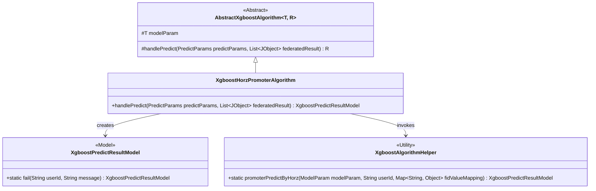
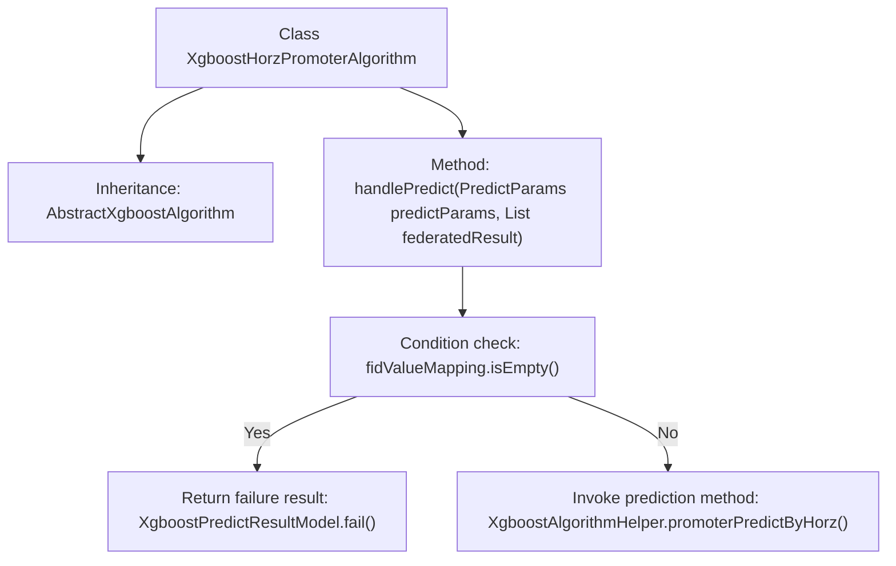

# Basic Information

|      |      |
|------|------|
| Name | XgboostHorzPromoterAlgorithm |
| Language | .java |
| Code Path | WeFe/serving/serving-sdk-java/src/main/java/com/welab/wefe/serving/sdk/algorithm/xgboost/single/XgboostHorzPromoterAlgorithm.java |
| Package Name | com.welab.wefe.serving.sdk.algorithm.xgboost.single |
| Dependencies | ['com.welab.wefe.common.util.JObject', 'com.welab.wefe.serving.sdk.algorithm.xgboost.XgboostAlgorithmHelper', 'com.welab.wefe.serving.sdk.dto.PredictParams', 'com.welab.wefe.serving.sdk.enums.StateCode', 'com.welab.wefe.serving.sdk.model.xgboost.BaseXgboostModel', 'com.welab.wefe.serving.sdk.model.xgboost.XgboostPredictResultModel', 'java.util.List'] |
| Brief Description | The XgboostHorzPromoterAlgorithm class inherits from AbstractXgboostAlgorithm and overrides the handlePredict method: if fidValueMapping is empty, it returns an error; otherwise, it invokes XgboostAlgorithmHelper to perform prediction. |

# Description

The code defines a class named XgboostHorzPromoterAlgorithm, which inherits from AbstractXgboostAlgorithm. It overrides the handlePredict method to handle prediction logic. The method first checks if fidValueMapping is empty; if so, it returns a failure result containing an error message. Otherwise, it invokes the promoterPredictByHorz method of XgboostAlgorithmHelper to perform predictions for horizontal federated learning and returns the prediction result model. The entire process involves key data such as user IDs, model parameters, and feature value mappings.

# Class Summary

| Name   | Type  | Description |
|-------|------|-------------|
| XgboostHorzPromoterAlgorithm | class | The XgboostHorzPromoterAlgorithm class processes prediction requests, checks that the feature map is not empty, and then invokes the XgboostAlgorithmHelper for horizontal federated prediction, returning an error message if the operation fails. |

## Class XgboostHorzPromoterAlgorithm

|      |      |
|------|------|
| Access Modifier | public |
| Type | class |
| Name | XgboostHorzPromoterAlgorithm |
| Description | The XgboostHorzPromoterAlgorithm class processes prediction requests, checks that the feature map is not empty, and then invokes the XgboostAlgorithmHelper for horizontal federated prediction, returning an error message if the operation fails. |

### UML Class Diagram

This class diagram illustrates that XgboostHorzPromoterAlgorithm inherits from the generic abstract class AbstractXgboostAlgorithm and implements the handlePredict method. The method relies on XgboostPredictResultModel to return prediction results and utilizes the XgboostAlgorithmHelper utility class to complete the prediction logic for horizontal federated learning. The diagram clearly depicts the inheritance relationships between classes, dependency relationships, and static method invocations of utility classes, with an overall structure that aligns with the implementation pattern of XGBoost algorithms in horizontal federated learning scenarios.

### Internal Method Call Graph

This code demonstrates the prediction workflow of an XGBoost horizontal federated learning algorithm. The class XgboostHorzPromoterAlgorithm inherits from an abstract base class and overrides the handlePredict method. The method first checks if the feature value mapping is empty, returning a failure result with error message if true; otherwise it invokes the promoterPredictByHorz method of a helper class for horizontal federated prediction. The flowchart clearly presents conditional branches and different execution paths, reflecting defensive checks for feature integrity.

### Field List

| Name  | Type  | Description |
|-------|-------|------|

### Method List

| Name  | Type  | Description |
|-------|-------|------|
| handlePredict | XgboostPredictResultModel | Rewrite the Xgboost prediction processing method: After checking that the feature mapping is not empty, call horizontal federated prediction, and return an error message if it fails. |

