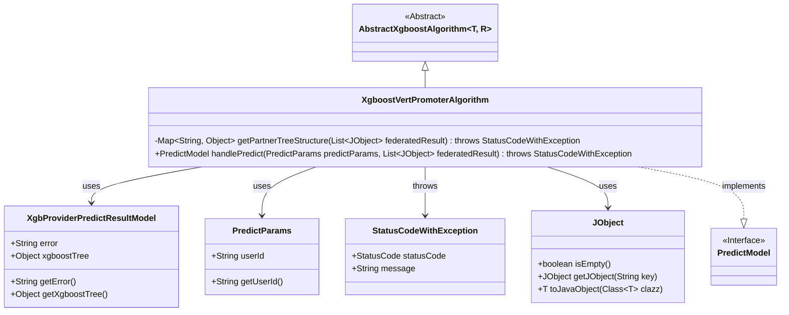
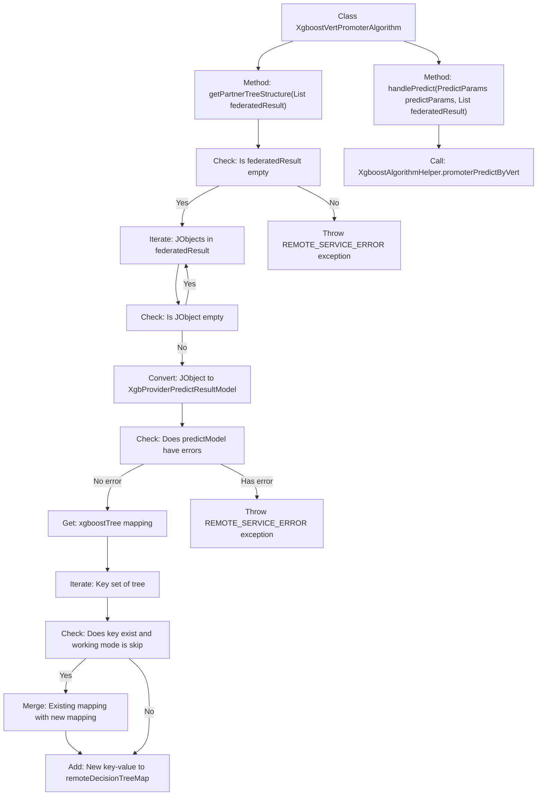

# Basic Information

|      |      |
|------|------|
| Name | XgboostVertPromoterAlgorithm |
| Language | .java |
| Code Path | WeFe/serving/serving-sdk-java/src/main/java/com/welab/wefe/serving/sdk/algorithm/xgboost/single/XgboostVertPromoterAlgorithm.java |
| Package Name | com.welab.wefe.serving.sdk.algorithm.xgboost.single |
| Dependencies | ['com.welab.wefe.common.StatusCode', 'com.welab.wefe.common.exception.StatusCodeWithException', 'com.welab.wefe.common.util.JObject', 'com.welab.wefe.common.util.StringUtil', 'com.welab.wefe.serving.sdk.algorithm.xgboost.XgboostAlgorithmHelper', 'com.welab.wefe.serving.sdk.dto.PredictParams', 'com.welab.wefe.serving.sdk.enums.XgboostWorkMode', 'com.welab.wefe.serving.sdk.model.PredictModel', 'com.welab.wefe.serving.sdk.model.xgboost.BaseXgboostModel', 'com.welab.wefe.serving.sdk.model.xgboost.XgbProviderPredictResultModel', 'org.apache.commons.collections4.CollectionUtils', 'java.util.HashMap', 'java.util.List', 'java.util.Map'] |
| Brief Description | The XgboostVertPromoterAlgorithm class inherits from AbstractXgboostAlgorithm, containing the getPartnerTreeStructure method to process federated decision tree structures, and invoking XgboostAlgorithmHelper for prediction through the handlePredict method. |

# Description

The `XgboostVertPromoterAlgorithm` class inherits from `AbstractXgboostAlgorithm` and is primarily used for handling federated prediction of XGBoost models. The core method `getPartnerTreeStructure` extracts decision tree structures from federated results, returning a mapping containing tree node relationships. If the results are empty or contain errors, an exception is thrown. This method merges tree structures from different providers, supporting skip mode to handle duplicate keys. The `handlePredict` method invokes `XgboostAlgorithmHelper` for prediction, integrating the working mode, model parameters, user ID, feature mapping, and the retrieved decision tree structures.

# Class Summary

| Name   | Type  | Description |
|-------|------|-------------|
| XgboostVertPromoterAlgorithm | class | The XgboostVertPromoterAlgorithm class retrieves the federated decision tree structure via the getPartnerTreeStructure method, processes remote prediction results and merges tree structures, and ultimately invokes promoterPredictByVert to perform predictions. |

## Class XgboostVertPromoterAlgorithm

|      |      |
|------|------|
| Access Modifier | public |
| Type | class |
| Name | XgboostVertPromoterAlgorithm |
| Description | The XgboostVertPromoterAlgorithm class retrieves the federated decision tree structure via the getPartnerTreeStructure method, processes remote prediction results and merges tree structures, and ultimately invokes promoterPredictByVert to perform predictions. |

### UML Class Diagram

This code illustrates an XGBoost vertical boosting algorithm implementation class XgboostVertPromoterAlgorithm, which inherits from the abstract class AbstractXgboostAlgorithm. Its primary functionalities include processing federated learning results via the getPartnerTreeStructure method to construct decision tree structure mappings, and invoking helper classes for prediction through the handlePredict method. The class interacts with multiple auxiliary classes, including JObject for JSON data processing, XgbProviderPredictResultModel for storing prediction results, PredictParams containing user IDs, etc., while potentially throwing StatusCodeWithException exceptions. The overall design reflects the collaborative prediction workflow of XGBoost algorithms in federated learning scenarios.

### Internal Method Call Graph

This code flowchart illustrates the core logic of the XgboostVertPromoterAlgorithm class, primarily consisting of two key methods: getPartnerTreeStructure for merging tree structures from federated learning results, and handlePredict for coordinating the prediction process. The flowchart clearly presents critical steps such as null checks, exception handling, tree structure traversal and merging, with particular emphasis on the special merge logic when the working mode is skip. The process ultimately completes the prediction task via XgboostAlgorithmHelper. The entire flow demonstrates rigorous handling of edge cases and data conversion integrity.

### Field List

| Name  | Type  | Description |
|-------|-------|------|

### Method List

| Name  | Type  | Description |
|-------|-------|------|
| handlePredict | PredictModel | This method overrides the parent class logic, invokes the Xgboost tool for vertical federated prediction, and passes in the working mode, model parameters, user ID, feature mapping, and collaborator tree structure, then returns the prediction result. |
| getPartnerTreeStructure | Map<String, Object> | This method extracts the XGBoost tree structure from the federated results, merges duplicate key values, handles null results and errors, and returns a decision tree mapping. |

