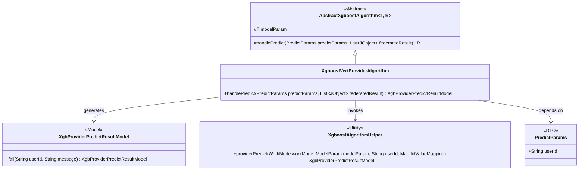

# Basic Information

|      |      |
|------|------|
| Name | XgboostVertProviderAlgorithm |
| Language | .java |
| Code Path | WeFe/serving/serving-sdk-java/src/main/java/com/welab/wefe/serving/sdk/algorithm/xgboost/single/XgboostVertProviderAlgorithm.java |
| Package Name | com.welab.wefe.serving.sdk.algorithm.xgboost.single |
| Dependencies | ['com.welab.wefe.common.util.JObject', 'com.welab.wefe.serving.sdk.algorithm.xgboost.XgboostAlgorithmHelper', 'com.welab.wefe.serving.sdk.dto.PredictParams', 'com.welab.wefe.serving.sdk.enums.StateCode', 'com.welab.wefe.serving.sdk.model.xgboost.BaseXgboostModel', 'com.welab.wefe.serving.sdk.model.xgboost.XgbProviderPredictResultModel', 'java.util.List'] |
| Brief Description | The XgboostVertProviderAlgorithm inherits from AbstractXgboostAlgorithm and overrides the handlePredict method. If fidValueMapping is empty, it returns an error result; otherwise, it invokes XgboostAlgorithmHelper for prediction. |

# Description

The code defines a class named `XgboostVertProviderAlgorithm`, which inherits from `AbstractXgboostAlgorithm`. It overrides the `handlePredict` method to process prediction requests. The method first checks if `fidValueMapping` is empty; if so, it returns a failure result containing an error message. Otherwise, it invokes the `providerPredict` method of `XgboostAlgorithmHelper` to perform the prediction, passing parameters such as the working mode, model parameters, user ID, and feature value mapping. The entire process implements prediction functionality based on the XGBoost model.

# Class Summary

| Name   | Type  | Description |
|-------|------|-------------|
| XgboostVertProviderAlgorithm | class | The XgboostVertProviderAlgorithm class inherits from AbstractXgboostAlgorithm and overrides the handlePredict method. If fidValueMapping is empty, it returns an error result; otherwise, it invokes XgboostAlgorithmHelper for prediction. |

## Class XgboostVertProviderAlgorithm

|      |      |
|------|------|
| Access Modifier | public |
| Type | class |
| Name | XgboostVertProviderAlgorithm |
| Description | The XgboostVertProviderAlgorithm class inherits from AbstractXgboostAlgorithm and overrides the handlePredict method. If fidValueMapping is empty, it returns an error result; otherwise, it invokes XgboostAlgorithmHelper for prediction. |

### UML Class Diagram

This class diagram illustrates the inheritance and collaboration relationships of the Xgboost vertical provider algorithm. XgboostVertProviderAlgorithm inherits from the generic abstract class AbstractXgboostAlgorithm and implements the concrete handlePredict method. The method relies on the PredictParams parameter object, performs prediction calculations through the XgboostAlgorithmHelper utility class, and ultimately generates the XgbProviderPredictResultModel result model. The diagram includes 5 core classes/components, clearly demonstrating the application of the Template Method pattern and the collaborative approach of utility class invocation.

### Internal Method Call Graph

This flowchart illustrates the core logical structure of the XgboostVertProviderAlgorithm class. The class inherits from AbstractXgboostAlgorithm and primarily implements the handlePredict method. The method first checks if fidValueMapping is empty; if true, it returns a failure result containing error information. Otherwise, it invokes the providerPredict method of XgboostAlgorithmHelper for prediction, passing key parameters such as work mode, model parameters, user ID, and feature value mapping. The entire process clearly demonstrates the handling path of prediction requests and the exception handling mechanism.

### Field List

| Name  | Type  | Description |
|-------|-------|------|

### Method List

| Name  | Type  | Description |
|-------|-------|------|
| handlePredict | XgbProviderPredictResultModel | Rewrite the XGBoost prediction processing method: Check if the feature map is non-empty before calling the prediction tool, and return an error message if it fails. |

