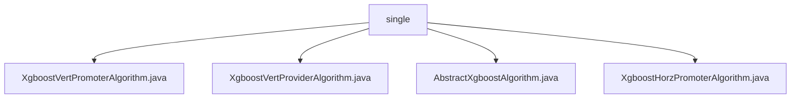

# Basic Information

|      |      |
|------|------|
| Name | single |
| Language | .java |
| Code Path | WeFe/serving/serving-sdk-java/src/main/java/com/welab/wefe/serving/sdk/algorithm/xgboost/single |
| Package Name | docs.serving.serving-sdk-java.src.main.java.com.welab.wefe.serving.sdk.algorithm.xgboost.single |
| Brief Description | The XgboostVertPromoterAlgorithm class handles XGBoost vertical federated prediction, extracting decision tree structures and merging them. The XgboostVertProviderAlgorithm class overrides the prediction method, checking feature mappings before invoking the prediction logic. AbstractXgboostAlgorithm serves as the abstract base class, setting feature mappings and defining the prediction workflow. The XgboostHorzPromoterAlgorithm class manages horizontal federated prediction, verifying feature mappings before calling the prediction method. |

# Description

## Overview  
This module implements federated prediction functionality based on XGBoost, with core responsibilities including integrating multi-party decision tree structures (e.g., vertical/horizontal federated modes) and executing joint predictions. The interface specification requires subclasses to implement the `handlePredict` method and perform actual predictions through the `XgboostAlgorithmHelper` utility class. Key data structures include `fidValueMapping` (feature ID mapping), tree node relationship mappings, and model parameters. The only external dependency is the XGBoost framework. For example, `XgboostVertPromoterAlgorithm` merges multi-party tree structures via `getPartnerTreeStructure`, while `XgboostHorzPromoterAlgorithm` invokes `promoterPredictByHorz` to handle horizontal federated prediction.  

## Key Business Scenarios  
The module supports both vertical and horizontal federated prediction modes, akin to a distributed decision engine. A typical workflow involves: initializing feature mappings → validating inputs → invoking the Helper class for prediction → returning results. The interaction model follows the "Promoter-Provider" architecture, where the Promoter integrates tree structures, and the Provider supplies feature data. For instance, in vertical federation, the Promoter merges multi-party tree structures, whereas horizontal federation synchronizes model parameters via `horzPredict`. All scenarios rely on standardized feature ID mappings and XGBoost model parameter transmission.

### Package Internal Structure View

This flowchart illustrates four implementation classes of the Xgboost algorithm in standalone mode, all located under the "single" directory. It includes the Promoter and Provider algorithm implementations for vertical federated learning, as well as the Promoter algorithm implementation for horizontal federated learning. The abstract base class AbstractXgboostAlgorithm serves as the foundational structure for other concrete algorithms. The entire structure clearly demonstrates the implementation relationships of Xgboost algorithms across different federated learning scenarios in standalone mode.

# File List

| Name   | Type  | Description |
|-------|------|-------------|
| [XgboostVertPromoterAlgorithm.java](XgboostVertPromoterAlgorithm.md) | file | The XgboostVertPromoterAlgorithm class inherits from AbstractXgboostAlgorithm, containing the getPartnerTreeStructure method to handle federated decision tree structures, and invoking XgboostAlgorithmHelper for prediction through the handlePredict method. |
| [XgboostVertProviderAlgorithm.java](XgboostVertProviderAlgorithm.md) | file | The XgboostVertProviderAlgorithm inherits from AbstractXgboostAlgorithm and overrides the handlePredict method. If fidValueMapping is empty, it returns an error result; otherwise, it invokes XgboostAlgorithmHelper for prediction. |
| [AbstractXgboostAlgorithm.java](AbstractXgboostAlgorithm.md) | file | Abstract XGBoost algorithm class, including feature mapping transformation methods, processing prediction parameters and returning results. Core methods consist of feature value mapping setup and abstract prediction processing. |
| [XgboostHorzPromoterAlgorithm.java](XgboostHorzPromoterAlgorithm.md) | file | The `XgboostHorzPromoterAlgorithm` class inherits from `AbstractXgboostAlgorithm` and overrides the `handlePredict` method: if `fidValueMapping` is empty, it returns an error; otherwise, it invokes `XgboostAlgorithmHelper` to perform the prediction. |

