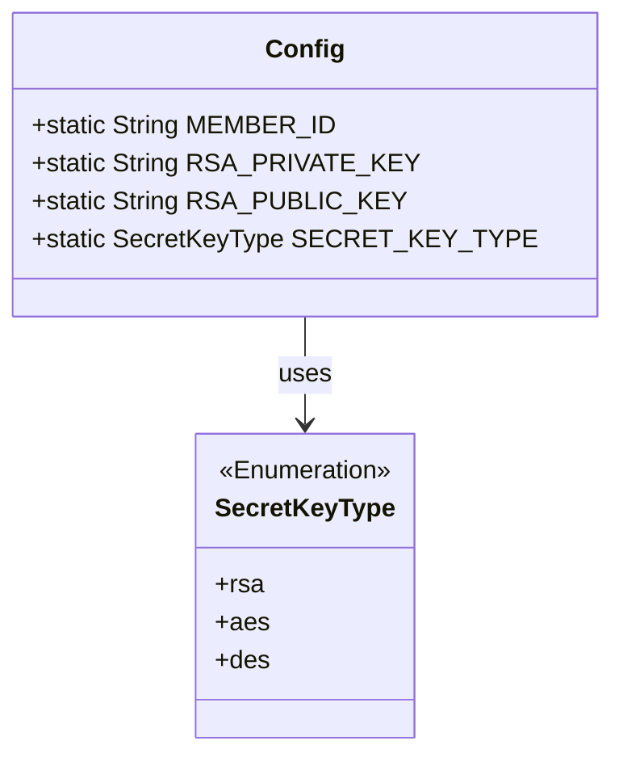
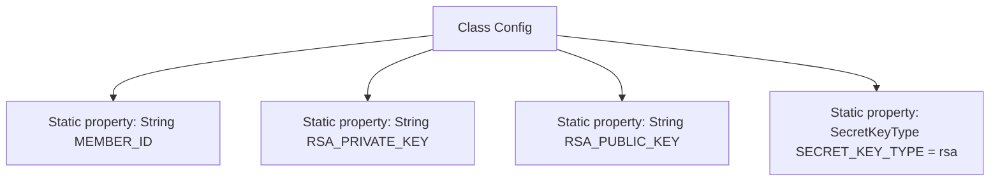

# Basic Information

|      |      |
|------|------|
| Name | Config |
| Language | .java |
| Code Path | WeFe/serving/serving-sdk-java/src/main/java/com/welab/wefe/serving/sdk/config/Config.java |
| Package Name | com.welab.wefe.serving.sdk.config |
| Dependencies | ['com.welab.wefe.common.constant.SecretKeyType'] |
| Brief Description | The Config class contains static member variables: MEMBER_ID, RSA private key, RSA public key, with the default key type being rsa. |

# Description

This is a public Java class named Config, used for storing configuration information. It contains four static member variables: MEMBER_ID for storing member identification, RSA_PRIVATE_KEY and RSA_PUBLIC_KEY for storing RSA private and public keys respectively, and SECRET_KEY_TYPE which defines the key type and is default set to rsa. All variables are publicly accessible.

# Class Summary

| Name   | Type  | Description |
|-------|------|-------------|
| Config | class | The Config class contains static member variables: MEMBER_ID, RSA_PRIVATE_KEY, RSA_PUBLIC_KEY, and SECRET_KEY_TYPE with a default value of rsa. |

## Class Config

|      |      |
|------|------|
| Access Modifier | public |
| Type | class |
| Name | Config |
| Description | The Config class contains static member variables: MEMBER_ID, RSA_PRIVATE_KEY, RSA_PUBLIC_KEY, and SECRET_KEY_TYPE with a default value of rsa. |

### UML Class Diagram

This code demonstrates a configuration class `Config` containing four static member variables: `MEMBER_ID`, `RSA_PRIVATE_KEY`, and `RSA_PUBLIC_KEY` for storing string-type configuration data, along with an enumeration-type variable `SECRET_KEY_TYPE` (default value `rsa`) to specify the key type. The class diagram clearly illustrates the dependency relationship between `Config` and the enumeration class `SecretKeyType`, which defines possible key type options. This represents a typical global configuration class design pattern for centralized management of cryptographic-related configuration parameters in applications.

### Internal Method Call Graph

This flowchart illustrates the structure of static properties in the Config class, containing 4 static fields: three string-type properties (MEMBER_ID, RSA_PRIVATE_KEY, RSA_PUBLIC_KEY) and an enum-type property SECRET_KEY_TYPE with a default value of "rsa". All properties are marked as static, indicating they belong to class-level rather than instance-level, and can be accessed directly without creating class instances.

### Field List

| Name  | Type  | Description |
|-------|-------|------|
| MEMBER_ID | String | The static string variable MEMBER_ID is used to store the member ID. |
| RSA_PRIVATE_KEY | String | The static string variable RSA_PRIVATE_KEY is used to store the RSA private key. |
| RSA_PUBLIC_KEY | String | Static string variable storing RSA public key. |
| SECRET_KEY_TYPE = SecretKeyType.rsa | SecretKeyType | Static key type set to RSA. |

### Method List

| Name  | Type  | Description |
|-------|-------|------|

