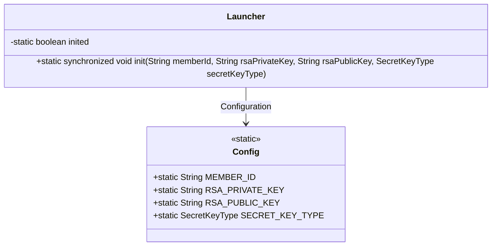
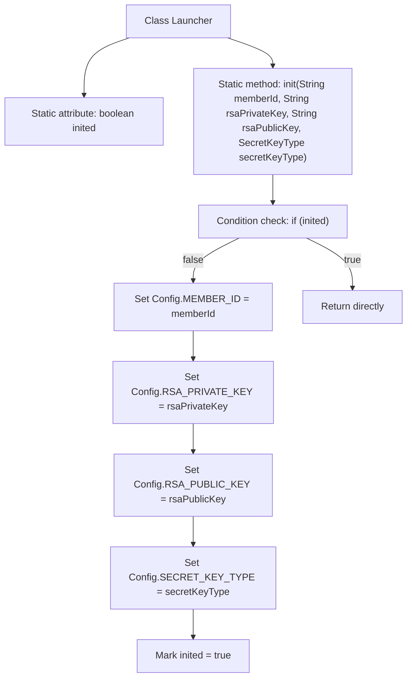

# Basic Information

|      |      |
|------|------|
| Name | Launcher |
| Language | .java |
| Code Path | WeFe/serving/serving-sdk-java/src/main/java/com/welab/wefe/serving/sdk/config/Launcher.java |
| Package Name | com.welab.wefe.serving.sdk.config |
| Dependencies | ['com.welab.wefe.common.constant.SecretKeyType', 'java.io.Serializable'] |
| Brief Description | The Java class Launcher implements Serializable and provides a static synchronized method init for initializing configuration items (member ID, RSA public/private keys, key type), ensuring it is executed only once. |

# Description

The Launcher class implements the Serializable interface and includes a static boolean variable `inited` to mark the initialization status. It provides a static synchronized method `init` for initializing configuration parameters. The method first checks the `inited` status and returns directly if already initialized. Otherwise, it assigns the passed `memberId`, `rsaPrivateKey`, `rsaPublicKey`, and `secretKeyType` to the corresponding static variables of the Config class and sets `inited` to true. This method ensures the configuration is initialized only once.

# Class Summary

| Name   | Type  | Description |
|-------|------|-------------|
| Launcher | class | The Launcher class implements serialization and provides a static synchronized method init for initializing configuration items (member ID, RSA public-private keys, key type), ensuring initialization occurs only once. |

## Class Launcher

|      |      |
|------|------|
| Access Modifier | public |
| Type | class |
| Name | Launcher |
| Description | The Launcher class implements serialization and provides a static synchronized method init for initializing configuration items (member ID, RSA public-private keys, key type), ensuring initialization occurs only once. |

### UML Class Diagram

This code demonstrates a serializable Launcher class that initializes static configuration items of the Config class through the static synchronized method init(). The Launcher uses an inited flag to ensure initialization is performed only once, preventing duplicate configurations. The Config class stores static configuration information such as member ID, RSA key pairs, and secret key type. The class diagram clearly reflects the dependency relationship between Launcher and Config, as well as the thread-safe design of initialization control.

### Internal Method Call Graph

Flowchart description: This flowchart illustrates the initialization process of the Launcher class. It first checks the static flag 'inited'. If uninitialized, it sequentially sets four static fields of the Config class (member ID, RSA public/private keys, and secret key type), then marks 'inited' as true. If already initialized, it returns directly. The entire process ensures thread safety through synchronization to avoid repeated initialization of configuration parameters.

### Field List

| Name  | Type  | Description |
|-------|-------|------|
| inited = false | boolean | The static boolean variable `inited` is initially set to false, serving as a marker for the initialization state. |

### Method List

| Name  | Type  | Description |
|-------|-------|------|
| init | void | The static synchronous method `init` is used to initialize configurations, with parameters including member ID, RSA public/private keys, and key type. It takes effect only on the first call. |

