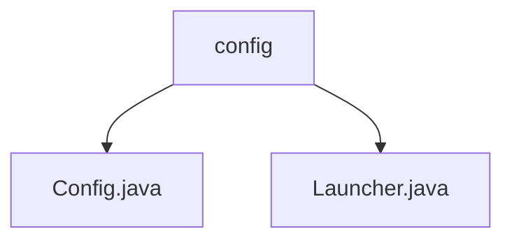

# Basic Information

|      |      |
|------|------|
| Name | config |
| Language | .java |
| Code Path | WeFe/serving/serving-sdk-java/src/main/java/com/welab/wefe/serving/sdk/config |
| Package Name | docs.serving.serving-sdk-java.src.main.java.com.welab.wefe.serving.sdk.config |
| Brief Description | The Config class stores configuration information, including member ID, RSA public-private key pairs, and key type variables. The Launcher class initializes Config variables via the init method, ensuring it is executed only once. |

# Description

## Overview  
The core responsibility of this module is to manage encrypted configuration information, employing the singleton pattern to ensure configurations are initialized only once. The interface specification includes uniformly setting static parameters of the Config class via the Launcher.init method, which includes MemberId, RSA key pairs, and key types. The key data structure consists of static fields in the Config class, such as MEMBER_ID and RSA_PRIVATE_KEY. The only external dependency is the Java native Serializable interface. For example, the default value of Config.SECRET_KEY_TYPE is "rsa".  

## Key Business Scenarios  
A typical scenario involves loading encryption configurations via Launcher.init during service startup, similar to a foundational module in a configuration center. The business process includes parameter validation and thread-safe initialization, such as checking the inited status to avoid duplicate operations. Complete functionality covers key storage and type management, supporting global access through static variables. The interaction mode is synchronous calls, where methods like Launcher.init use synchronized to ensure atomicity. The API type is static method invocation, with integration examples including setting parameters like RSA key pairs.

### Package Internal Structure View

This flowchart illustrates the hierarchical structure of the config directory under the serving-sdk-java module in the WeFe project. The root node is the config folder, which contains two Java files: Config.java and Launcher.java. These two files are directly subordinate to the config directory with no deeper subdirectory levels. The entire structure is concise and clear, reflecting the organization of configuration-related classes.

# File List

| Name   | Type  | Description |
|-------|------|-------------|
| [Config.java](Config.md) | file | The Config class contains static member variables: MEMBER_ID, RSA private key, RSA public key, with the default key type being rsa. |
| [Launcher.java](Launcher.md) | file | The Java class Launcher implements Serializable and provides a static synchronized method init, which is used to initialize configuration items (member ID, RSA public-private keys, key type), ensuring it is executed only once. |

