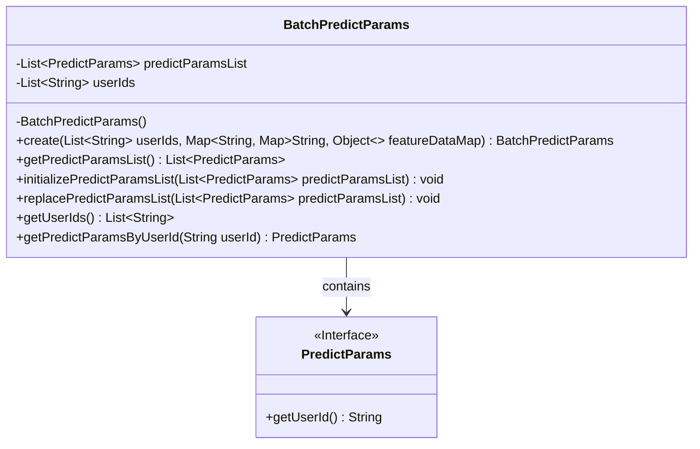
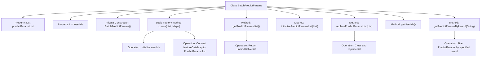

# Basic Information

|      |      |
|------|------|
| Name | BatchPredictParams |
| Language | .java |
| Code Path | WeFe/serving/serving-sdk-java/src/main/java/com/welab/wefe/serving/sdk/dto/BatchPredictParams.java |
| Package Name | com.welab.wefe.serving.sdk.dto |
| Dependencies | ['org.apache.commons.collections4.MapUtils', 'org.apache.commons.compress.utils.Lists', 'java.util.Collections', 'java.util.List', 'java.util.Map', 'java.util.stream.Collectors'] |
| Brief Description | The `BatchPredictParams` class is used for batch prediction, containing a list of user IDs and a list of prediction parameters, and provides methods for creating, retrieving, initializing, and replacing prediction parameters. |

# Description

The `BatchPredictParams` class is used for managing batch prediction parameters, including a list of user IDs and a list of prediction parameters. The private constructor ensures instances are created via the static factory method `create`, which accepts a list of user IDs and a feature data map, converting the latter into a list of `PredictParams` objects. It provides methods to retrieve unmodifiable lists of user IDs and prediction parameters. Supports initializing or replacing the prediction parameter list. Allows querying prediction parameters by user ID, returning `null` if the list is empty.

# Class Summary

| Name   | Type  | Description |
|-------|------|-------------|
| BatchPredictParams | class | The BatchPredictParams class is used for batch prediction, containing a list of user IDs and a list of prediction parameters, and provides methods for creation, initialization, replacement, and querying. |

## Class BatchPredictParams

|      |      |
|------|------|
| Access Modifier | public |
| Type | class |
| Name | BatchPredictParams |
| Description | The BatchPredictParams class is used for batch prediction, containing a list of user IDs and a list of prediction parameters, and provides methods for creation, initialization, replacement, and querying. |

### UML Class Diagram

This code illustrates a batch prediction parameters class BatchPredictParams, which creates instances via a private constructor and static factory method, managing user ID lists and prediction parameter lists. The class contains a dependency on the PredictParams interface, providing functionalities for initializing, replacing, and querying parameter lists. All returned lists are encapsulated as unmodifiable collections to ensure data security. Core methods can retrieve corresponding prediction parameters based on user IDs, reflecting design principles of data encapsulation and thread safety.

### Internal Method Call Graph

This flowchart illustrates the complete structure of the BatchPredictParams class, featuring two core property lists, a private constructor, and five primary methods. The static factory method create() handles object initialization and input data conversion, getter methods return unmodifiable lists to ensure encapsulation, replace methods implement clear-then-replace logic, and query methods employ stream processing for precise data filtering. The class design embodies defensive programming principles, safeguarding data integrity through immutable collections and null checks.

### Field List

| Name  | Type  | Description |
|-------|-------|------|
| predictParamsList = Lists.newArrayList() | List<PredictParams> | Define a private list variable predictParamsList, initialized using Lists.newArrayList(). |
| userIds = Lists.newArrayList() | List<String> | Declare a private string list variable named userIds, initialized as an empty ArrayList. |

### Method List

| Name  | Type  | Description |
|-------|-------|------|
| replacePredictParamsList | void | Method replacement prediction parameter list: First clear the original list, then add the new parameter list. |
| getUserIds | List<String> | The method returns an unmodifiable list of user IDs, ensuring the list data cannot be externally modified. |
| getPredictParamsByUserId | PredictParams | This method searches for matching prediction parameters from the list using the user ID, returns null if the list is empty, otherwise returns the first matching item. |
| create | BatchPredictParams | Static method creates a batch prediction parameter object, receives a user ID list and feature data mapping, initializes parameters, converts the mapped data into a prediction parameter list, and returns it. |
| getPredictParamsList | List<PredictParams> | This method returns an unmodifiable list of prediction parameters. |
| initializePredictParamsList | void | This method adds all the input prediction parameters to the current object's prediction parameter list. |

