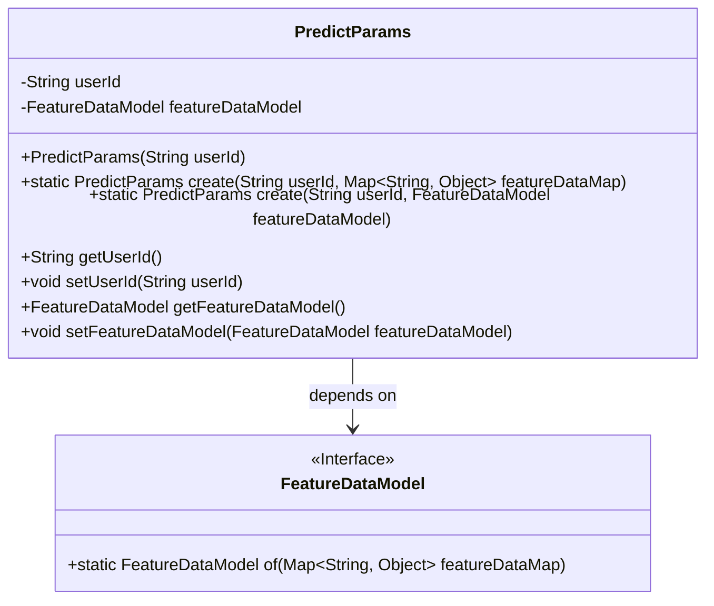
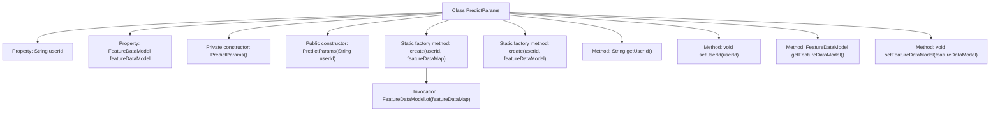

# Basic Information

|      |      |
|------|------|
| Name | PredictParams |
| Language | .java |
| Code Path | WeFe/serving/serving-sdk-java/src/main/java/com/welab/wefe/serving/sdk/dto/PredictParams.java |
| Package Name | com.welab.wefe.serving.sdk.dto |
| Dependencies | ['com.welab.wefe.serving.sdk.model.FeatureDataModel', 'java.util.Map'] |
| Brief Description | The `PredictParams` class is used for managing prediction parameters, containing the `userId` and `featureDataModel` attributes. It provides a constructor and static factory methods, supporting feature data configuration via either a `Map` or `FeatureDataModel`. |

# Description

The PredictParams class is a Java class designed to encapsulate prediction parameters, containing two private attributes: userId and featureDataModel. This class provides two static factory methods: one accepts userId and featureDataMap as parameters, while the other accepts userId and featureDataModel. Additionally, it includes a public constructor that only accepts the userId parameter, along with a private no-argument constructor. The class also features standard getter and setter methods for accessing and modifying attribute values. The overall design supports initializing prediction parameter objects through various approaches.

# Class Summary

| Name   | Type  | Description |
|-------|------|-------------|
| PredictParams | class | The `PredictParams` class is used to store user IDs and feature data models, providing constructor methods and static factory methods to create instances, and supporting getter and setter operations. |

## Class PredictParams

|      |      |
|------|------|
| Access Modifier | public |
| Type | class |
| Name | PredictParams |
| Description | The `PredictParams` class is used to store user IDs and feature data models, providing constructor methods and static factory methods to create instances, and supporting getter and setter operations. |

### UML Class Diagram

Class diagram description: The PredictParams class encapsulates a user ID and feature data model, providing two static factory methods for instance creation. FeatureDataModel serves as an interface offering data conversion functionality, with PredictParams holding an instance of this interface through composition. The class design demonstrates encapsulation and flexibility, supporting initialization via either a Map or direct feature model input.

### Internal Method Call Graph

This code defines a PredictParams class, primarily used to encapsulate user ID and feature data model. The class provides two construction approaches: direct construction and static factory method creation. The static factory methods support initializing feature data through either a Map or FeatureDataModel object, with object creation implemented via a private constructor. The class also includes standard getter/setter methods for property access, with the overall design reflecting encapsulation and flexibility.

### Field List

| Name  | Type  | Description |
|-------|-------|------|
| featureDataModel | FeatureDataModel | The private member variable `featureDataModel`, of type `FeatureDataModel`. |
| userId | String | Declare a private string variable userId. |

### Method List

| Name  | Type  | Description |
|-------|-------|------|
| create | PredictParams | The static method `create` takes a user ID and a feature data map, constructs and returns a `PredictParams` object containing these parameters. |
| getUserId | String | Methods to obtain the user ID, returns a string-type userId. |
| create | PredictParams | The static method `create` takes a user ID and a feature data model, creates and returns a `PredictParams` instance, sets its attributes, and then returns it. |
| setUserId | void | Methods for setting the user ID: Assign the parameter userId to the userId property of the current object. |
| getFeatureDataModel | FeatureDataModel | Methods to obtain the featureDataModel object. |
| setFeatureDataModel | void | Set the feature data model method by assigning the input parameters to the `featureDataModel` property of the current object. |

