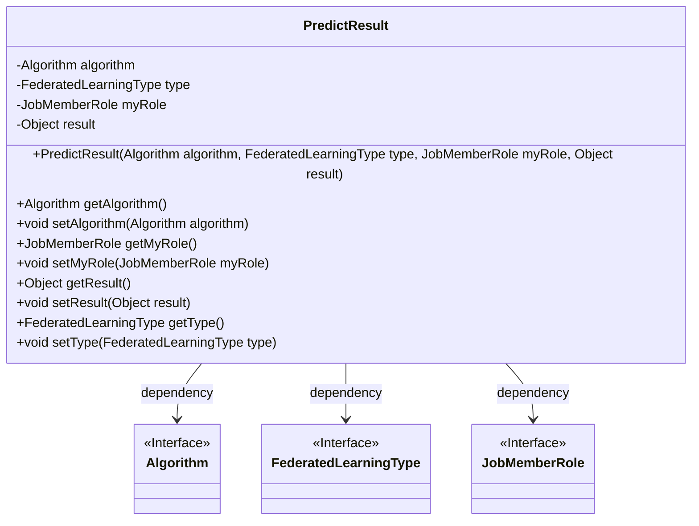

# Basic Information

|      |      |
|------|------|
| Name | PredictResult |
| Language | .java |
| Code Path | WeFe/serving/serving-sdk-java/src/main/java/com/welab/wefe/serving/sdk/dto/PredictResult.java |
| Package Name | com.welab.wefe.serving.sdk.dto |
| Dependencies | ['com.welab.wefe.common.wefe.enums.Algorithm', 'com.welab.wefe.common.wefe.enums.FederatedLearningType', 'com.welab.wefe.common.wefe.enums.JobMemberRole'] |
| Brief Description | The PredictResult class encapsulates prediction results, including algorithm, federated learning type, role, and result fields, providing constructor methods and getter/setter. |

# Description

The PredictResult class is used to encapsulate prediction results, containing four attributes: algorithm represents the algorithm type, type indicates the federated learning type, myRole denotes the task member role, and result stores the actual results. It provides a constructor method to initialize these attributes and offers getter and setter methods for each attribute to facilitate access and modification.

# Class Summary

| Name   | Type  | Description |
|-------|------|-------------|
| PredictResult | class | The PredictResult class includes algorithm, federated learning type, role, and result attributes, providing constructor methods and getter/setter. |

## Class PredictResult

|      |      |
|------|------|
| Access Modifier | public |
| Type | class |
| Name | PredictResult |
| Description | The PredictResult class includes algorithm, federated learning type, role, and result attributes, providing constructor methods and getter/setter. |

### UML Class Diagram

This code defines a `PredictResult` class that encapsulates prediction results in federated learning, containing four core attributes: algorithm type, federated learning type, member role, and result object. The class initializes these attributes through a constructor and provides getter and setter methods for each attribute. The class diagram shows the dependency relationships between `PredictResult` and three interfaces: `Algorithm`, `FederatedLearningType`, and `JobMemberRole`, indicating that these attributes are of interface type with specific implementations provided externally. The overall design demonstrates encapsulation and flexible configuration capabilities for federated learning prediction results.

### Internal Method Call Graph

```mermaid
graph TD
    A["Class PredictResult"]
    B["Property: Algorithm algorithm"]
    C["Property: FederatedLearningType type"]
    D["Property: JobMemberRole myRole"]
    E["Property: Object result"]
    F["Constructor: PredictResult(Algorithm, FederatedLearningType, JobMemberRole, Object)"]
    G["Method: Algorithm getAlgorithm()"]
    H["Method: void setAlgorithm(Algorithm)"]
    I["Method: JobMemberRole getMyRole()"]
    J["Method: void setMyRole(JobMemberRole)"]
    K["Method: Object getResult()"]
    L["Method: void setResult(Object)"]
    M["Method: FederatedLearningType getType()"]
    N["Method: void setType(FederatedLearningType)"]

    A --> B
    A --> C
    A --> D
    A --> E
    A --> F
    A --> G
    A --> H
    A --> I
    A --> J
    A --> K
    A --> L
    A --> M
    A --> N
```

This code defines a class named PredictResult for encapsulating prediction result information. The class contains four private properties: algorithm represents the used algorithm, type indicates the federated learning type, myRole denotes the job member role, and result stores the prediction result object. It provides a constructor and corresponding getter/setter methods for initializing and accessing these properties. This is a typical data encapsulation class designed for transmitting and managing prediction result data in federated learning scenarios.

### Field List

| Name  | Type  | Description |
|-------|-------|------|
| result | Object | Private result object |
| algorithm | Algorithm | Private algorithm instance variables. |
| type | FederatedLearningType | Private federated learning type variables. |
| myRole | JobMemberRole | The private variable myRole, of type JobMemberRole. |

### Method List

| Name  | Type  | Description |
|-------|-------|------|
| getMyRole | JobMemberRole | Get the current user's role information. |
| setResult | void | Setting method: Assign the parameter `result` to the class member variable `result`. |
| setMyRole | void | This is a Java method used to set the myRole property of the current object, with the parameter being of type JobMemberRole. |
| getAlgorithm | Algorithm | Methods to obtain the current algorithm instance. |
| getResult | Object | The method returns a result object. |
| setAlgorithm | void | Set the algorithm method by assigning the passed algorithm object to the `algorithm` property of the current object. |
| getType | FederatedLearningType | Methods for obtaining federated learning types, returning type variables. |
| setType | void | The method for setting the federated learning type assigns the input parameters to the class member variables. |

