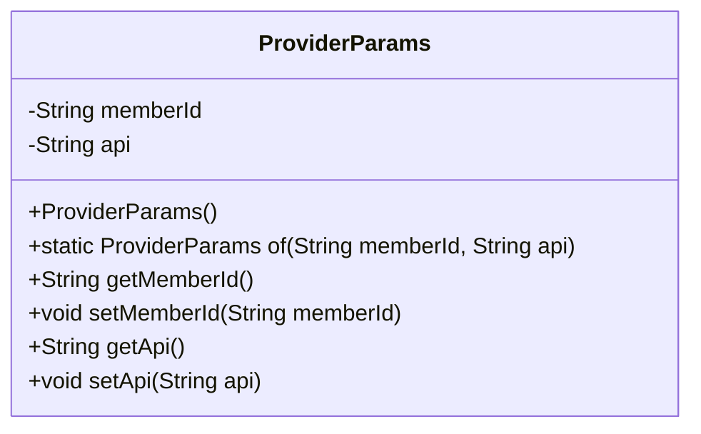
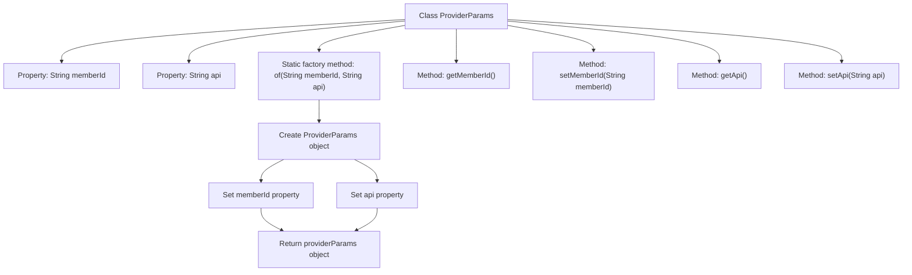

# Basic Information

|      |      |
|------|------|
| Name | ProviderParams |
| Language | .java |
| Code Path | WeFe/serving/serving-sdk-java/src/main/java/com/welab/wefe/serving/sdk/dto/ProviderParams.java |
| Package Name | com.welab.wefe.serving.sdk.dto |
| Dependencies | [] |
| Brief Description | The ProviderParams class includes the memberId and api fields, providing the constructor method 'of' along with getter/setter methods. |

# Description

ProviderParams is a Java class designed to encapsulate provider parameters. It contains two private String fields: memberId and api. The class provides a static factory method `of` to create a ProviderParams instance using memberId and api parameters. Additionally, the class includes standard getter and setter methods for each field, allowing external access and modification of these two field values. The primary function of this class is to serve as a data transfer object for storing and passing provider-related parameter information.

# Class Summary

| Name   | Type  | Description |
|-------|------|-------------|
| ProviderParams | class | The ProviderParams class includes the memberId and api attributes, providing the constructor method 'of' along with getter and setter methods. |

## Class ProviderParams

|      |      |
|------|------|
| Access Modifier | public |
| Type | class |
| Name | ProviderParams |
| Description | The ProviderParams class includes the memberId and api attributes, providing the constructor method 'of' along with getter and setter methods. |

### UML Class Diagram

This code defines a class named `ProviderParams` for encapsulating provider parameter information. The class contains two private fields `memberId` and `api`, representing the member ID and API address respectively. The static factory method `of()` allows creating and initializing object instances, while standard getter and setter methods are provided for field access and modification. This is a typical Data Transfer Object (DTO) design used for passing parameter data between different layers.

### Internal Method Call Graph

This flowchart illustrates the structure of the ProviderParams class, which contains two private properties and five methods. The core is the static factory method 'of' that creates an object, sets property values, and returns the instance. Other methods include standard getters/setters for accessing and modifying member variables. The flowchart clearly presents the sequence of object creation and property assignment.

### Field List

| Name  | Type  | Description |
|-------|-------|------|
| api | String | Private string variable api |
| memberId | String | Member ID string variable |

### Method List

| Name  | Type  | Description |
|-------|-------|------|
| getMemberId | String | Methods to obtain member ID, returns the member ID string. |
| setMemberId | void | The method to set the member ID assigns the input string to the member variable memberId. |
| of | ProviderParams | The static method `of` creates and returns a `ProviderParams` object containing `memberId` and `api`. |
| getApi | String | Methods to Obtain API Strings. |
| setApi | void | This is a Java method used to set the api property value of a class. The method takes a string parameter api and assigns it to the api member variable of the current object. |

