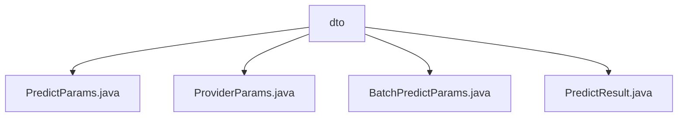

# Basic Information

|      |      |
|------|------|
| Name | dto |
| Language | .java |
| Code Path | WeFe/serving/serving-sdk-java/src/main/java/com/welab/wefe/serving/sdk/dto |
| Package Name | docs.serving.serving-sdk-java.src.main.java.com.welab.wefe.serving.sdk.dto |
| Brief Description | The PredictParams class encapsulates prediction parameters, including userId and featureDataModel attributes, and provides multiple creation methods. The ProviderParams class stores provider parameters, containing memberId and api fields, and supports factory method creation. The BatchPredictParams class manages batch prediction parameters, including a user ID list and a prediction parameter list, and supports querying. The PredictResult class encapsulates prediction results, containing algorithm type, federated learning type, role, and result attributes. |

# Description

## Overview  
The core responsibility of this module is to encapsulate parameters and results in the federated learning prediction process, providing standardized data transfer objects. The interface specification includes four types of DTOs: PredictParams encapsulates single prediction parameters, ProviderParams stores provider information, BatchPredictParams manages batch prediction parameters, and PredictResult standardizes the result format. Key data structures include user ID, feature data model, algorithm type, and prediction results. External dependencies are limited to Java basic libraries. For example, PredictParams supports initialization via user ID and feature data, while BatchPredictParams provides batch parameter conversion functionality.  

## Key Business Scenarios  
The module supports both single and batch prediction modes, resembling the parameter assembly process of a workflow engine. In single prediction scenarios, user features are transmitted via PredictParams, whereas batch scenarios use BatchPredictParams to manage user lists and parameter mappings. For instance, ProviderParams can identify data providers, and PredictResult uniformly returns algorithm types and federated role information. The overall workflow forms a closed loop of "parameter encapsulation-prediction execution-result return," suitable for federated learning prediction service integrations requiring standardized interfaces.

### Package Internal Structure View

This flowchart illustrates the file structure of the DTO layer in a Java project, with the root node being the dto directory. It contains four parameter class files: PredictParams, ProviderParams, BatchPredictParams, and PredictResult, which are used to define the data transfer object structures for service invocations.

# File List

| Name   | Type  | Description |
|-------|------|-------------|
| [PredictParams.java](PredictParams.md) | file | The `PredictParams` class is used for managing prediction parameters, containing the `userId` and `featureDataModel` attributes. It provides constructor methods and static factory methods, supporting feature data configuration via either a `Map` or `FeatureDataModel`. |
| [ProviderParams.java](ProviderParams.md) | file | The `ProviderParams` class includes the `memberId` and `api` fields, providing the constructor method `of` as well as getter/setter methods. |
| [BatchPredictParams.java](BatchPredictParams.md) | file | The BatchPredictParams class is used for batch prediction, containing a list of user IDs and a list of prediction parameters, and provides methods for creating, retrieving, initializing, and replacing prediction parameters. |
| [PredictResult.java](PredictResult.md) | file | The PredictResult class encapsulates prediction results, including fields for algorithm, federated learning type, role, and results, providing constructor methods and getter/setter. |

