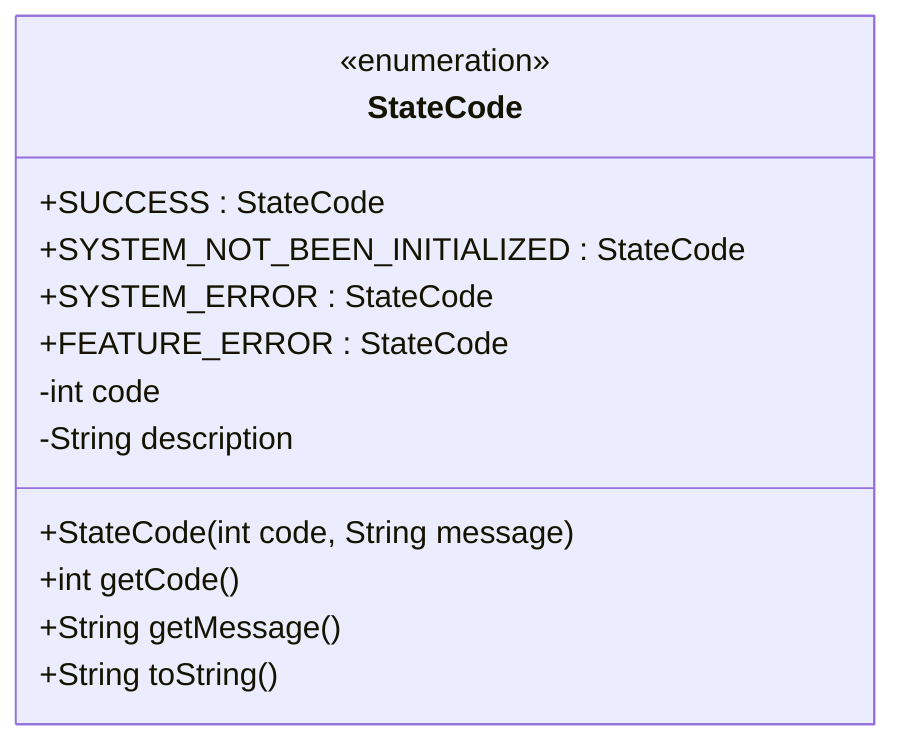
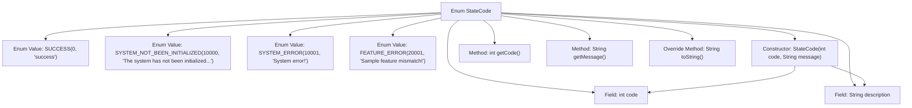

# Basic Information

|      |      |
|------|------|
| Name | StateCode |
| Language | .java |
| Code Path | WeFe/serving/serving-sdk-java/src/main/java/com/welab/wefe/serving/sdk/enums/StateCode.java |
| Package Name | com.welab.wefe.serving.sdk.enums |
| Dependencies | [] |
| Brief Description | The enumeration StateCode defines status codes: SUCCESS(0) indicates success; SYSTEM_NOT_BEEN_INITIALIZED(10000) and SYSTEM_ERROR(10001) represent system errors; FEATURE_ERROR(20001) denotes data errors. Each status code includes a code and descriptive information. |

# Description

This is an enumeration class StateCode, which defines system status codes and their corresponding descriptions. It includes three types of statuses: success status SUCCESS (0), system-level errors (10000-10001), and data errors (20001). Each enumeration item consists of an integer `code` and a string `description`, initialized via a constructor. It provides `getCode` and `getMessage` methods to retrieve attribute values, and the `toString` method returns the string representation of the `code`. The status codes are used to identify operation results or error types, such as system uninitialized, system errors, and sample feature mismatches, among other scenarios.

# Class Summary

| Name   | Type  | Description |
|-------|------|-------------|
| StateCode | enum | The enumeration StateCode defines status codes: 0 for success, 10000 for system not initialized, 10001 for system error, and 20001 for feature mismatch. It includes the attributes code and description along with their corresponding methods. |

## Class StateCode

|      |      |
|------|------|
| Access Modifier | public |
| Type | enum |
| Name | StateCode |
| Description | The enumeration StateCode defines status codes: 0 for success, 10000 for system not initialized, 10001 for system error, and 20001 for feature mismatch. It includes the attributes code and description along with their corresponding methods. |

### UML Class Diagram

This code defines an enumeration class `StateCode` for representing system status codes and their descriptive messages. The enumeration includes four states: `SUCCESS` (operation succeeded), `SYSTEM_NOT_BEEN_INITIALIZED` (system not initialized), `SYSTEM_ERROR` (system error), and `FEATURE_ERROR` (sample feature mismatch). Each enum value is associated with an integer `code` and a string `description`, initialized via the constructor, with `getCode()` and `getMessage()` methods provided to retrieve these values. The `toString()` method returns the string representation of the `code`. This design is suitable for systems requiring standardized error codes and messages, facilitating centralized management and maintenance of error information.

### Internal Method Call Graph

This flowchart illustrates the structure of the StateCode enum, which includes 4 predefined enum values (SUCCESS, SYSTEM_NOT_BEEN_INITIALIZED, etc.), two private fields (code and description), along with a constructor, three member methods (getCode, getMessage, and overridden toString). The constructor initializes the fields, while the methods provide functionality for retrieving status codes, obtaining description messages, and string conversion. The enum is designed to centrally manage system status codes and their corresponding description messages.

### Field List

| Name  | Type  | Description |
|-------|-------|------|

### Method List

| Name  | Type  | Description |
|-------|-------|------|

