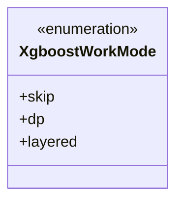
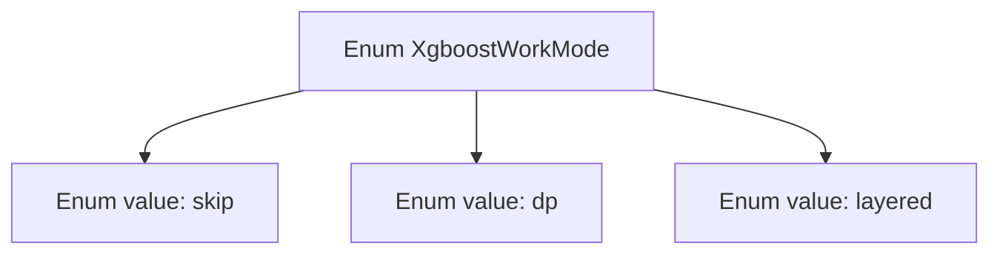

# Basic Information

|      |      |
|------|------|
| Name | XgboostWorkMode |
| Language | .java |
| Code Path | WeFe/serving/serving-sdk-java/src/main/java/com/welab/wefe/serving/sdk/enums/XgboostWorkMode.java |
| Package Name | com.welab.wefe.serving.sdk.enums |
| Dependencies | [] |
| Brief Description | The XgboostWorkMode enumeration defines three working modes: skip, data parallel (dp), and layered. |

# Description

The content defines a public enumeration type named XgboostWorkMode, which includes three enumeration values: skip, dp, and layered. These enumeration values may represent different working modes or configuration options of the XGBoost model, used to control the behavior during model training or prediction.

# Class Summary

| Name   | Type  | Description |
|-------|------|-------------|
| XgboostWorkMode | enum | The XgboostWorkMode enum defines three working modes: skip, data parallel (dp), and layered. |

## Class XgboostWorkMode

|      |      |
|------|------|
| Access Modifier | public |
| Type | enum |
| Name | XgboostWorkMode |
| Description | The XgboostWorkMode enum defines three working modes: skip, data parallel (dp), and layered. |

### UML Class Diagram

This code defines an enumeration type named XgboostWorkMode, which includes three enumeration constants: skip, dp, and layered. Enumeration types are used to represent a fixed set of constant values, likely specifying the working modes of the XGBoost algorithm here. "skip" may indicate skipping certain processing steps, "dp" could denote data-parallel mode, and "layered" might represent a layered processing mode. In the class diagram, the enumeration type is marked with <<enumeration>>, clearly illustrating its structure and potential usage scenarios.

### Internal Method Call Graph

This flowchart illustrates the structure of the XgboostWorkMode enum, which contains three enum values: skip, dp, and layered. As a special data type, an enum is used to define a fixed set of constant values, here representing possible working modes of the XGBoost algorithm. Each enum value is an instance of this enum type and can be directly referenced via notations like XgboostWorkMode.skip. This design pattern is commonly used to replace magic numbers, enhancing code readability and type safety.

### Field List

| Name  | Type  | Description |
|-------|-------|------|

### Method List

| Name  | Type  | Description |
|-------|-------|------|

