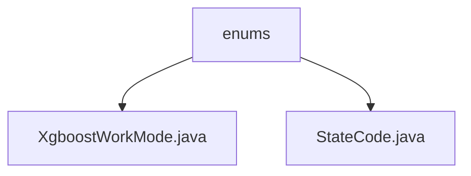

# Basic Information

|      |      |
|------|------|
| Name | enums |
| Language | .java |
| Code Path | WeFe/serving/serving-sdk-java/src/main/java/com/welab/wefe/serving/sdk/enums |
| Package Name | docs.serving.serving-sdk-java.src.main.java.com.welab.wefe.serving.sdk.enums |
| Brief Description | The XgboostWorkMode enumeration defines three working modes: skip, dp, and layered. The StateCode enumeration includes status codes such as SUCCESS (0), system errors (10000-10001), and data errors (20001), providing the code and description attributes along with their corresponding access methods. |

# Description

## Overview  
The core responsibility of this module is to provide enumeration type definitions, supporting XGBoost work mode selection and system status code management. The interface specifications include three modes of XgboostWorkMode (skip/dp/layered) and the status code retrieval methods of StateCode (getCode/getMessage). The key data structure is the enumeration class, which contains an integer code and a string description. External dependencies only involve the XGBoost framework. For example, StateCode defines specific error codes such as sample feature mismatch (20001).  

## Main Business Scenarios  
The module is used to control the XGBoost training process (e.g., layered mode) and unify exception handling (similar to the HTTP status code mechanism). Business processes cover scenarios such as model configuration and error interception, for example, system uninitialized (10000) triggering status code validation. The interaction mode passes parameters through enumeration values, such as SUCCESS(0) indicating a successful operation. Typical applications include distributed training mode (dp) selection and API call result status feedback.

### Package Internal Structure View

This flowchart illustrates the hierarchical structure of the enums directory within the serving-sdk-java module of the WeFe project. The parent node "enums" contains two enum class files: XgboostWorkMode.java and StateCode.java, which represent the enum definitions for XGBoost working modes and status codes, respectively. The entire structure clearly demonstrates the organization of enum types within the project.

# File List

| Name   | Type  | Description |
|-------|------|-------------|
| [XgboostWorkMode.java](XgboostWorkMode.md) | file | The XgboostWorkMode enumeration defines three working modes: skip, data parallel (dp), and layered. |
| [StateCode.java](StateCode.md) | file | The enumeration StateCode defines status codes: SUCCESS(0) indicates success; SYSTEM_NOT_BEEN_INITIALIZED(10000) and SYSTEM_ERROR(10001) represent system errors; FEATURE_ERROR(20001) denotes data errors. Each status code includes a code and description information. |

