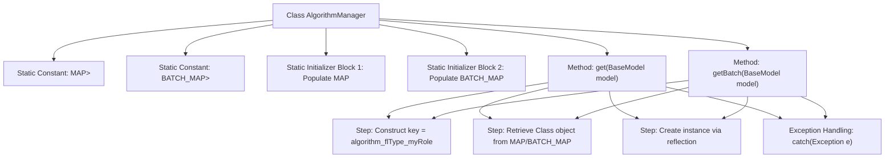

# Basic Information

|      |      |
|------|------|
| Name | AlgorithmManager |
| Language | .java |
| Code Path | WeFe/serving/serving-sdk-java/src/main/java/com/welab/wefe/serving/sdk/manager/AlgorithmManager.java |
| Package Name | com.welab.wefe.serving.sdk.manager |
| Dependencies | ['com.welab.wefe.serving.sdk.algorithm.AbstractAlgorithm', 'com.welab.wefe.serving.sdk.algorithm.AbstractBatchAlgorithm', 'com.welab.wefe.serving.sdk.algorithm.lr.batch.LrHorzPromoterBatchAlgorithm', 'com.welab.wefe.serving.sdk.algorithm.lr.batch.LrVertPromoterBatchAlgorithm', 'com.welab.wefe.serving.sdk.algorithm.lr.batch.LrVertProviderBatchAlgorithm', 'com.welab.wefe.serving.sdk.algorithm.lr.single.LrHorzPromoterAlgorithm', 'com.welab.wefe.serving.sdk.algorithm.lr.single.LrVertPromoterAlgorithm', 'com.welab.wefe.serving.sdk.algorithm.lr.single.LrVertProviderAlgorithm', 'com.welab.wefe.serving.sdk.algorithm.xgboost.batch.XgboostHorzPromoterBatchAlgorithm', 'com.welab.wefe.serving.sdk.algorithm.xgboost.batch.XgboostVertPromoterBatchAlgorithm', 'com.welab.wefe.serving.sdk.algorithm.xgboost.batch.XgboostVertProviderBatchAlgorithm', 'com.welab.wefe.serving.sdk.algorithm.xgboost.single.XgboostHorzPromoterAlgorithm', 'com.welab.wefe.serving.sdk.algorithm.xgboost.single.XgboostVertPromoterAlgorithm', 'com.welab.wefe.serving.sdk.algorithm.xgboost.single.XgboostVertProviderAlgorithm', 'com.welab.wefe.serving.sdk.model.BaseModel', 'java.util.HashMap', 'java.util.Map'] |
| Brief Description | The AlgorithmManager class manages algorithm mappings, including two mapping tables for regular and batch algorithms, dynamically retrieving corresponding algorithm instances based on model parameters. It supports different distributed types and roles for logistic regression and XGBoost. |

# Description

The AlgorithmManager class manages algorithm implementation classes through two static mapping tables, MAP and BATCH_MAP. MAP stores regular algorithm classes, while BATCH_MAP stores batch processing algorithm classes. The mapping tables use a combination of algorithm name, federated learning type, and role as keys to correspond to algorithm implementation classes for different scenarios. It provides get and getBatch methods to dynamically generate corresponding algorithm instances based on the incoming BaseModel parameters. The system supports two algorithms: logistic regression and XGBoost, covering three federated learning modes (horizontal, vertical, and hybrid), and distinguishes between two roles: initiator and provider.

# Class Summary

| Name   | Type  | Description |
|-------|------|-------------|
| AlgorithmManager | class | The AlgorithmManager class manages algorithm instances through a static mapping table, supporting different distributed types and roles for logistic regression and XGBoost, and provides both single and batch processing methods for retrieval. |

## Class AlgorithmManager

|      |      |
|------|------|
| Access Modifier | public |
| Type | class |
| Name | AlgorithmManager |
| Description | The AlgorithmManager class manages algorithm instances through a static mapping table, supporting different distributed types and roles for logistic regression and XGBoost, and provides both single and batch processing methods for retrieval. |

### UML Class Diagram

```mermaid
classDiagram
    class AlgorithmManager {
        -Map~String, Class~? extends AbstractAlgorithm~~ MAP
        -Map~String, Class~? extends AbstractBatchAlgorithm~~ BATCH_MAP
        +get(BaseModel model) AbstractAlgorithm
        +getBatch(BaseModel model) AbstractBatchAlgorithm
    }

    class AbstractAlgorithm {
        <<Abstract>>
    }

    class AbstractBatchAlgorithm {
        <<Abstract>>
    }

    class LrHorzPromoterAlgorithm {
        <<Concrete>>
    }

    class LrVertPromoterAlgorithm {
        <<Concrete>>
    }

    class LrVertProviderAlgorithm {
        <<Concrete>>
    }

    class XgboostVertPromoterAlgorithm {
        <<Concrete>>
    }

    class XgboostVertProviderAlgorithm {
        <<Concrete>>
    }

    class XgboostHorzPromoterAlgorithm {
        <<Concrete>>
    }

    class LrHorzPromoterBatchAlgorithm {
        <<Concrete>>
    }

    class LrVertPromoterBatchAlgorithm {
        <<Concrete>>
    }

    class LrVertProviderBatchAlgorithm {
        <<Concrete>>
    }

    class XgboostVertPromoterBatchAlgorithm {
        <<Concrete>>
    }

    class XgboostVertProviderBatchAlgorithm {
        <<Concrete>>
    }

    class XgboostHorzPromoterBatchAlgorithm {
        <<Concrete>>
    }

    class BaseModel {
        +algorithm: Enum
        +flType: Enum
        +myRole: Enum
    }

    AlgorithmManager --> AbstractAlgorithm : Dependency
    AlgorithmManager --> AbstractBatchAlgorithm : Dependency
    LrHorzPromoterAlgorithm --|> AbstractAlgorithm
    LrVertPromoterAlgorithm --|> AbstractAlgorithm
    LrVertProviderAlgorithm --|> AbstractAlgorithm
    XgboostVertPromoterAlgorithm --|> AbstractAlgorithm
    XgboostVertProviderAlgorithm --|> AbstractAlgorithm
    XgboostHorzPromoterAlgorithm --|> AbstractAlgorithm
    LrHorzPromoterBatchAlgorithm --|> AbstractBatchAlgorithm
    LrVertPromoterBatchAlgorithm --|> AbstractBatchAlgorithm
    LrVertProviderBatchAlgorithm --|> AbstractBatchAlgorithm
    XgboostVertPromoterBatchAlgorithm --|> AbstractBatchAlgorithm
    XgboostVertProviderBatchAlgorithm --|> AbstractBatchAlgorithm
    XgboostHorzPromoterBatchAlgorithm --|> AbstractBatchAlgorithm
    AlgorithmManager --> BaseModel : Dependency
```

This code describes an Algorithm Manager that manages different types of algorithm implementation classes through static mapping tables (MAP and BATCH_MAP). The class provides two core methods: get() and getBatch(), which dynamically create corresponding algorithm instances based on the input BaseModel parameter. The system includes two abstract algorithm types (AbstractAlgorithm and AbstractBatchAlgorithm) along with their various concrete implementations (such as different variants of logistic regression and XGBoost). BaseModel serves as the input parameter, containing algorithm type, federated learning type, and role information to determine the specific algorithm class to instantiate. The overall design adopts the factory pattern concept, using string key-value mappings to decouple algorithm creation logic.

### Internal Method Call Graph

This code demonstrates an algorithm manager class that dynamically loads algorithm classes through static mapping tables. The core functionality involves generating a key from model parameters, retrieving corresponding algorithm classes from predefined MAP or BATCH_MAP, and instantiating them via reflection. The flowchart clearly presents the class structure, static initialization process, and execution flow of two core methods, including key generation, mapping lookup, instance creation, and exception handling.

### Field List

| Name  | Type  | Description |
|-------|-------|------|
| BATCH_MAP = new HashMap<>() | Map<String, Class<? extends AbstractBatchAlgorithm>> | Defined a private static immutable map BATCH_MAP with string keys and values of AbstractBatchAlgorithm subclass types. |
| MAP = new HashMap<>() | Map<String, Class<? extends AbstractAlgorithm>> | Define a static constant MAP, of type HashMap, with String as the key and Class objects of AbstractAlgorithm subclasses as the value. |

### Method List

| Name  | Type  | Description |
|-------|-------|------|
| get | AbstractAlgorithm | Static methods generate algorithm instances based on model parameters by concatenating key names to retrieve classes from a mapping and instantiate them, returning null on exception. |
| getBatch | AbstractBatchAlgorithm | This method generates a unique key based on model parameters, retrieves the corresponding algorithm class from a mapping table and instantiates it, returning null in case of exceptions. |

