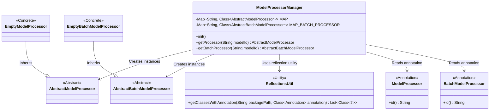
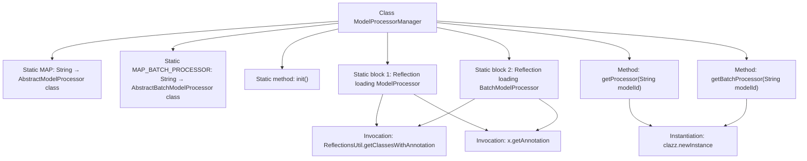

# Basic Information

|      |      |
|------|------|
| Name | ModelProcessorManager |
| Language | .java |
| Code Path | WeFe/serving/serving-sdk-java/src/main/java/com/welab/wefe/serving/sdk/manager/ModelProcessorManager.java |
| Package Name | com.welab.wefe.serving.sdk.manager |
| Dependencies | ['com.welab.wefe.common.util.ReflectionsUtil', 'com.welab.wefe.common.web.Launcher', 'com.welab.wefe.serving.sdk.processor', 'org.slf4j.Logger', 'org.slf4j.LoggerFactory', 'java.util.HashMap', 'java.util.List', 'java.util.Map'] |
| Brief Description | The ModelProcessorManager manages model processors by loading annotated classes into a static Map via reflection, providing methods to retrieve singleton and batch processors, and returning an empty processor when none is found. |

# Description

The ModelProcessorManager class manages model processors and contains two static mappings, MAP and MAP_BATCH_PROCESSOR, which store the associations between model IDs and their corresponding processor classes. Using reflection in a static initialization block, it scans classes annotated with @ModelProcessor and @BatchModelProcessor under a specified package path and populates the mapping tables. It provides the getProcessor and getBatchProcessor methods to retrieve the corresponding processor instances based on the model ID, returning an empty processor if none is found. Logs are recorded during initialization.

# Class Summary

| Name   | Type  | Description |
|-------|------|-------------|
| ModelProcessorManager | class | The ModelProcessorManager manages model processor classes, initializes singleton and batch processor mapping tables through reflection, and provides methods to obtain processor instances. |

## Class ModelProcessorManager

|      |      |
|------|------|
| Access Modifier | public |
| Type | class |
| Name | ModelProcessorManager |
| Description | The ModelProcessorManager manages model processor classes, initializes singleton and batch processor mapping tables through reflection, and provides methods to obtain processor instances. |

### UML Class Diagram

This code demonstrates a model processor manager `ModelProcessorManager` that manages two types of model processors through static mappings: single model processors (`AbstractModelProcessor`) and batch model processors (`AbstractBatchModelProcessor`). In the static initialization block, the manager uses the reflection utility `ReflectionsUtil` to scan classes annotated with specific annotations (`ModelProcessor` and `BatchModelProcessor`), registering them to corresponding mappings. When a processor is requested, the manager looks up and instantiates the appropriate processor class based on the model ID, returning empty processors (`EmptyModelProcessor` or `EmptyBatchModelProcessor`) if none are found. The design implements a dynamic annotation-based processor registration and on-demand creation mechanism.

### Internal Method Call Graph

This flowchart illustrates the core structure of the ModelProcessorManager class, which contains two static Maps for storing processor class mappings. The static initialization blocks use reflection mechanism to load processor classes with specific annotations. The main methods getProcessor and getBatchProcessor retrieve corresponding processor instances based on modelId, returning an empty processor if not found. The static initialization process involves reflection utility classes and annotation parsing, with potential exceptions thrown during instantiation.

### Field List

| Name  | Type  | Description |
|-------|-------|------|
| MAP_BATCH_PROCESSOR = new HashMap<>() | Map<String, Class<? extends AbstractBatchModelProcessor>> | Define a static constant MAP_BATCH_PROCESSOR to store the mapping from strings to AbstractBatchModelProcessor subclass types. |
| MAP = new HashMap<>() | Map<String, Class<? extends AbstractModelProcessor>> | Define a static constant MAP, which stores the mapping from strings to subclasses of AbstractModelProcessor. |

### Method List

| Name  | Type  | Description |
|-------|-------|------|
| getProcessor | AbstractModelProcessor | Get the processor instance by model ID, return an empty processor if not found, or return null in case of an exception. |
| init | void | Initialize the model processor and log the information. |
| getBatchProcessor | AbstractBatchModelProcessor | Get the batch processor corresponding to the specified model ID. If none exists, return an empty processor; return null in case of exceptions. |

