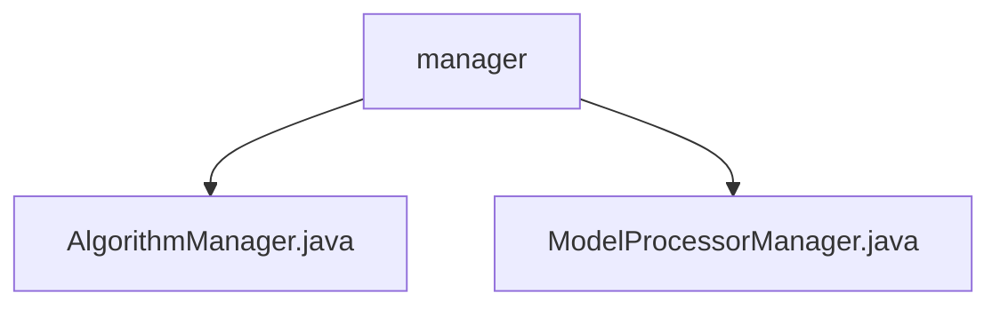

# Basic Information

|      |      |
|------|------|
| Name | manager |
| Language | .java |
| Code Path | WeFe/serving/serving-sdk-java/src/main/java/com/welab/wefe/serving/sdk/manager |
| Package Name | docs.serving.serving-sdk-java.src.main.java.com.welab.wefe.serving.sdk.manager |
| Brief Description | The AlgorithmManager class manages algorithm classes through MAP and BATCH_MAP, supporting logistic regression and XGBoost, covering three federated learning modes and two roles. The ModelProcessorManager class manages model processors by scanning annotated classes via reflection to populate mapping tables, providing methods to obtain processor instances. |

# Description

## Overview  
The core responsibility of this module is to manage algorithm implementation classes and model processors through mapping tables, supporting dynamic instantiation and adaptation to federated learning scenarios. The interface specifications include: AlgorithmManager provides get/getBatch methods to retrieve algorithm instances based on BaseModel parameters; ModelProcessorManager provides getProcessor/getBatchProcessor methods to obtain processors according to model IDs. The key data structure is a dual mapping table (MAP/BATCH_MAP), with keys being the algorithm triple (name/federated type/role) and model ID, respectively. External dependencies only involve the Java reflection mechanism. For example, it supports logistic regression/XGBoost algorithms and fallback logic for empty processors.  

## Main Business Scenarios  
The module adopts a dual-track management system similar to the factory pattern, supporting both regular and batch processing scenarios. The complete workflow is as follows: dynamically load algorithm classes based on federated learning type (horizontal/vertical/hybrid) and role (initiator/provider), or match pre-scanned processor classes via model IDs. Typical applications include chained processor calls during model inference, such as retrieving an XGBoost processor via BATCH_MAP in batch processing scenarios. All APIs are query-based interfaces, with integration cases demonstrating runtime binding from BaseModel parameters to concrete implementations.

### Package Internal Structure View

This flowchart illustrates the file structure under the manager directory of the WeFe service SDK. The parent node "manager" contains two child nodes: AlgorithmManager.java and ModelProcessorManager.java. These two Java files represent distinct management functional modules. The structure is concise and clear, reflecting the core components of the manager module.

# File List

| Name   | Type  | Description |
|-------|------|-------------|
| [AlgorithmManager.java](AlgorithmManager.md) | file | The AlgorithmManager class manages algorithm mappings, including two types of mapping tables for regular and batch algorithms, dynamically obtaining corresponding algorithm instances based on model parameters. It supports different distributed types and roles for logistic regression and XGBoost. |
| [ModelProcessorManager.java](ModelProcessorManager.md) | file | The ModelProcessorManager manages model processors, loading annotated classes into a static Map via reflection, and provides methods to retrieve singleton or batch processors, returning an empty processor if none is found. |

