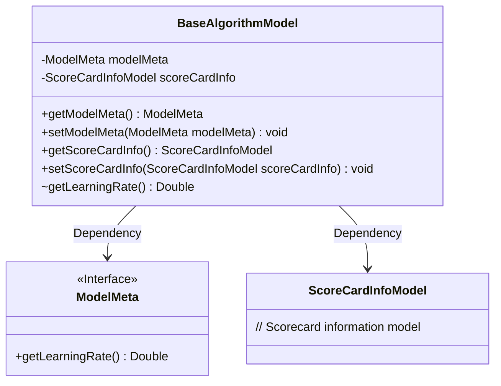
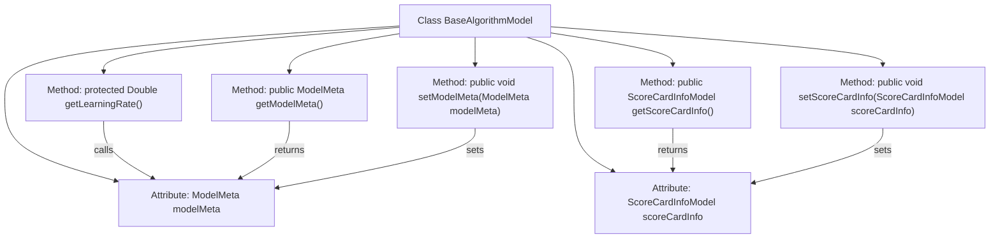

# Basic Information

|      |      |
|------|------|
| Name | BaseAlgorithmModel |
| Language | .java |
| Code Path | WeFe/serving/serving-sdk-java/src/main/java/com/welab/wefe/serving/sdk/model/BaseAlgorithmModel.java |
| Package Name | com.welab.wefe.serving.sdk.model |
| Dependencies | [] |
| Brief Description | The BaseAlgorithmModel class includes ModelMeta and ScoreCardInfoModel attributes, providing methods to obtain the learning rate and getter/setter methods for the attributes. |

# Description

BaseAlgorithmModel is a fundamental algorithm model class that contains two main attributes: modelMeta and scoreCardInfo. modelMeta stores model metadata and provides a method getLearningRate to retrieve the learning rate. The class defines public methods for getting and setting these two attributes, with getLearningRate being a protected method. This class is primarily used for managing the metadata of algorithm models and scorecard information.

# Class Summary

| Name   | Type  | Description |
|-------|------|-------------|
| BaseAlgorithmModel | class | The BaseAlgorithmModel class includes attributes such as ModelMeta and ScoreCardInfoModel, and provides getter/setter methods for obtaining learning rates and properties. |

## Class BaseAlgorithmModel

|      |      |
|------|------|
| Access Modifier | public |
| Type | class |
| Name | BaseAlgorithmModel |
| Description | The BaseAlgorithmModel class includes attributes such as ModelMeta and ScoreCardInfoModel, and provides getter/setter methods for obtaining learning rates and properties. |

### UML Class Diagram

This code demonstrates a base algorithm model class (BaseAlgorithmModel) that contains dependencies on model metadata (ModelMeta) and scorecard information (ScoreCardInfoModel). The BaseAlgorithmModel provides public methods for getting and setting these two attributes, as well as a protected method for obtaining the learning rate. ModelMeta is defined as an interface containing an abstract method for retrieving the learning rate. The class diagram clearly illustrates the dependency relationships between these classes and their primary member methods.

### Internal Method Call Graph

This flowchart illustrates the structure and internal relationships of the BaseAlgorithmModel class. The class contains two private attributes (modelMeta and scoreCardInfo) and five methods: one protected getLearningRate method (which retrieves the learning rate via modelMeta), along with two pairs of getter/setter methods for manipulating the private attributes. Arrows clearly indicate invocation relationships between methods, such as getLearningRate's dependency on the modelMeta attribute, while setter methods modify corresponding attribute values. The overall structure reflects a typical Java Bean design pattern, demonstrating clear encapsulation and controlled data access.

### Field List

| Name  | Type  | Description |
|-------|-------|------|
| modelMeta | ModelMeta | Private Model Metadata Object |
| scoreCardInfo | ScoreCardInfoModel | Private variable scoreCardInfo, of type ScoreCardInfoModel. |

### Method List

| Name  | Type  | Description |
|-------|-------|------|
| getLearningRate | Double | Methods to obtain the model learning rate, with a return type of Double, implemented by calling the getLearningRate method of modelMeta. |
| getModelMeta | ModelMeta | Methods to obtain model metadata, returning a modelMeta object. |
| setModelMeta | void | This is a Java method used to set the modelMeta property of a class, which accepts a parameter of type ModelMeta. |
| getScoreCardInfo | ScoreCardInfoModel | The method to obtain scorecard information, returns a ScoreCardInfoModel object. |
| setScoreCardInfo | void | This is a Java method used to set a `scoreCardInfo` object of type `ScoreCardInfoModel`. The method is named `setScoreCardInfo`, which accepts one parameter and assigns it to the member variable. |

